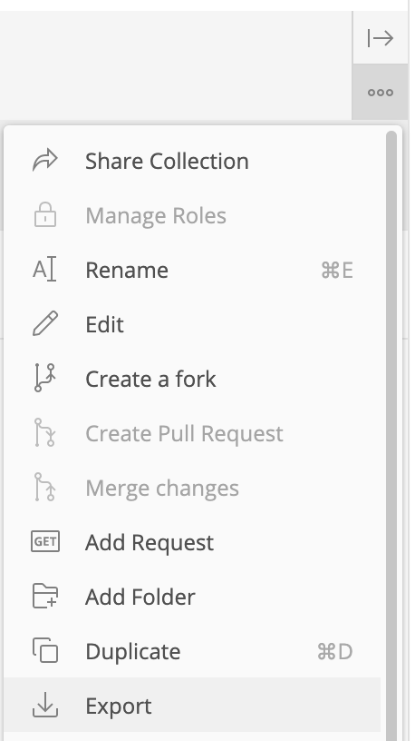
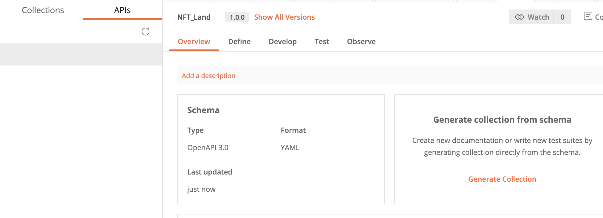
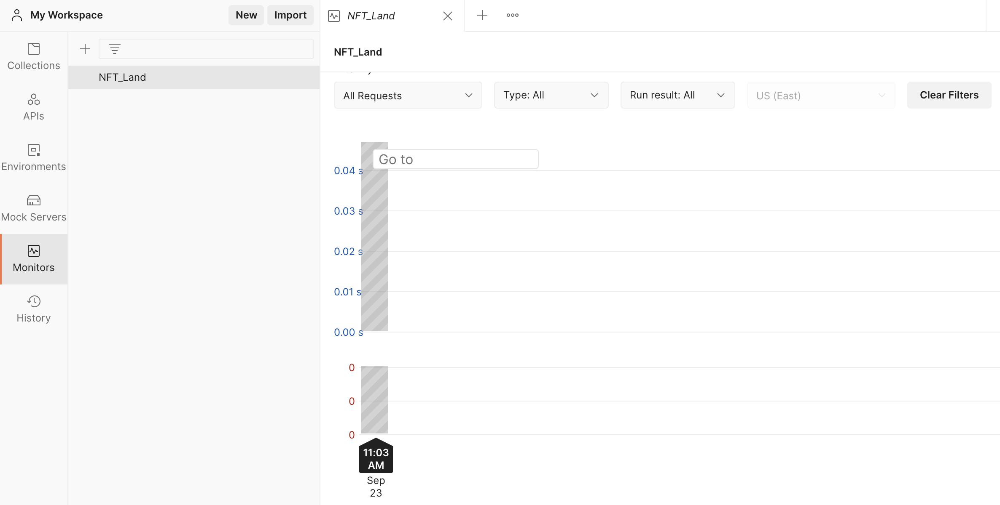
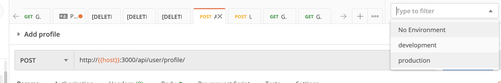

# Postman

### 簡介

包含了一些 API 測試功能，可發送測試請求。

1. 也可以 export 出來讓其他團隊成員測試，或是邀請團隊成員共筆。

2. 並且可以導入 OpenAPI 格式的 yml 後產生 collection。

3. 也可以使用以下來將 collection 轉為 OpenAPI 格式：[https://www.npmjs.com/package/postman-to-openapi](https://www.npmjs.com/package/postman-to-openapi)

4. 可以監控 API 是否正常

5. 創建環境變數

之後可以使用 {{變數名稱}} 來快速切換 

[https://learning.postman.com/docs/sending-requests/managing-environments/](https://learning.postman.com/docs/sending-requests/managing-environments/)

### Postman 歷史

[https://www.linkedin.com/feed/update/urn:li:activity:6777268372460728320/](https://www.linkedin.com/feed/update/urn:li:activity:6777268372460728320/)

