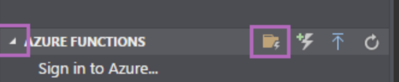
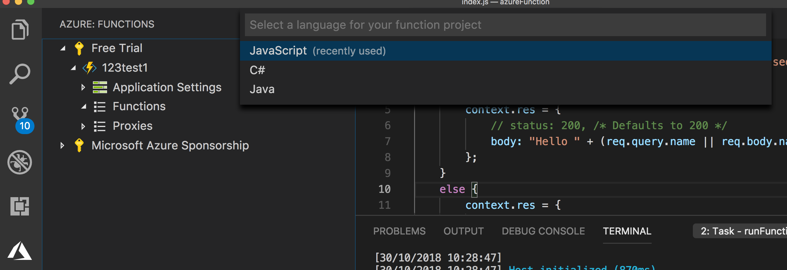
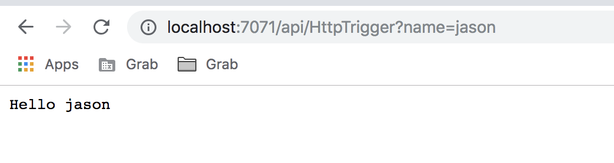
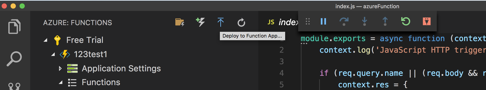
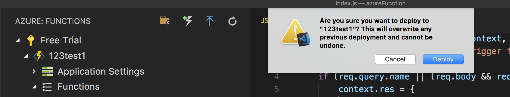
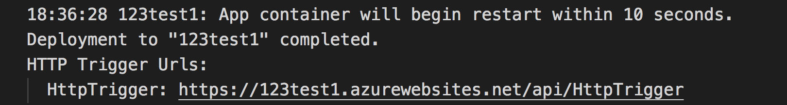
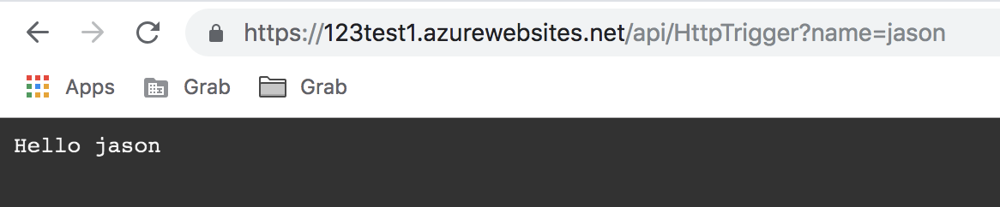

# Azure Serverless

這篇文章要講解如何使用 VS Code 的 plugin 來部署與測試 Azure Function。

[https://code.visualstudio.com/tutorials/functions-extension/getting-started](https://code.visualstudio.com/tutorials/functions-extension/getting-started)

## 前置步驟：

```text
1. 安裝 .NET SDK https://www.microsoft.com/net/download
2. 安裝 VS Code 編輯器
3. 安裝 VS Code Azure Function plugin
4. npm install -g azure-functions-core-tools@core
5. 在 Azure Portal 註冊好 Azure Function APP
```

## 創建檔案：

1.先點選到下圖左側最下方的 Azure Plugin ，然後如下圖點選閃電資料夾的標籤。



最後點選 Javascript 後會創建一個範例檔案。



## 本地測試：

```text
按住 fn 後按下 F5
```

之後會執行本地 Server，然後到 [http://localhost:7071/api/HttpTrigger?name=jason。](http://localhost:7071/api/HttpTrigger?name=jason。)

即可看到如下：



## 部署：

點選如下藍色向上箭頭按鈕：

之後會選擇要部署到的 Function 名稱，最後按下確定部署：



成功後即可看到回傳部署後的 Endpoint



即可把剛才本地的 URL 換為此正式的 URL



