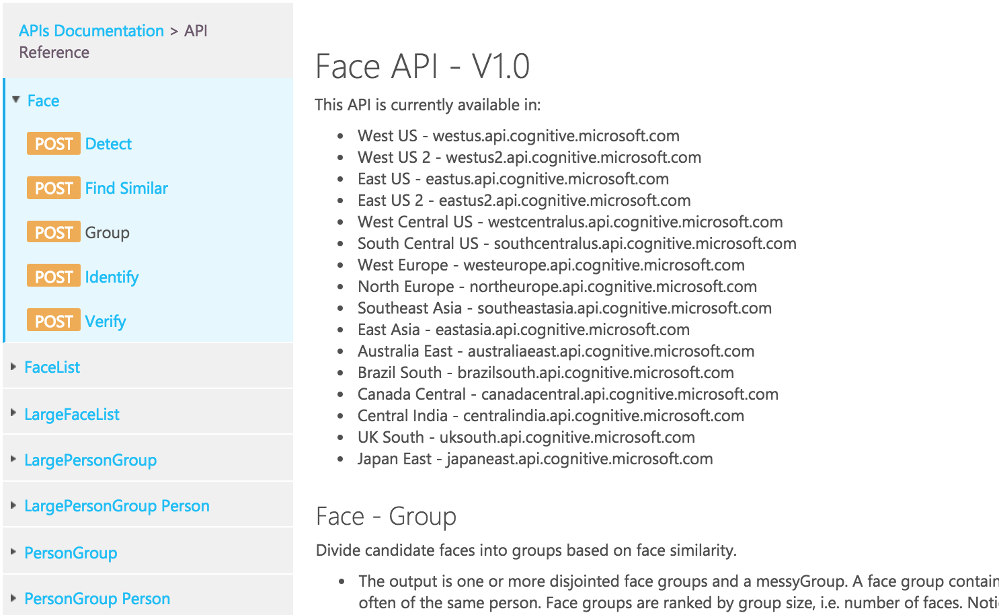
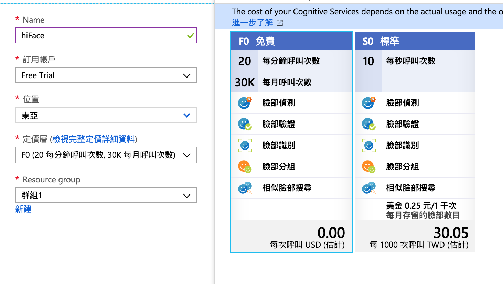
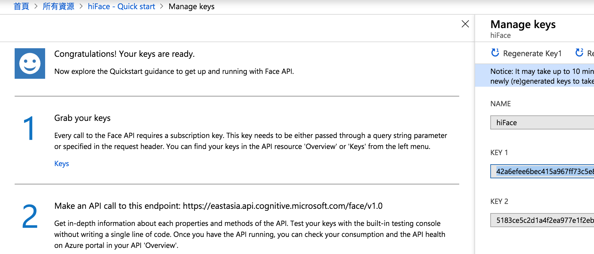
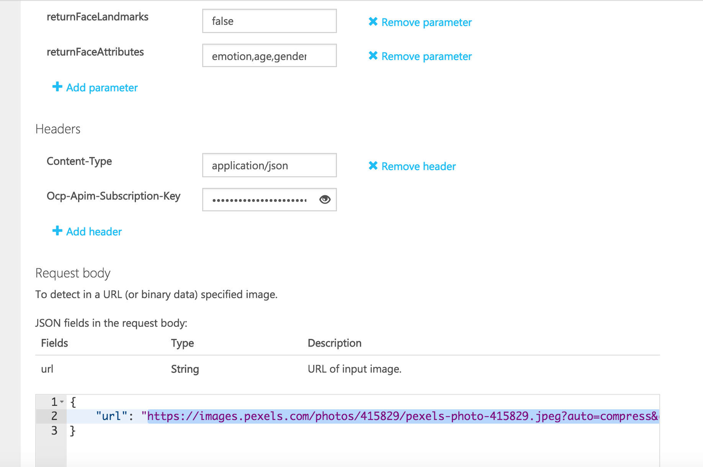
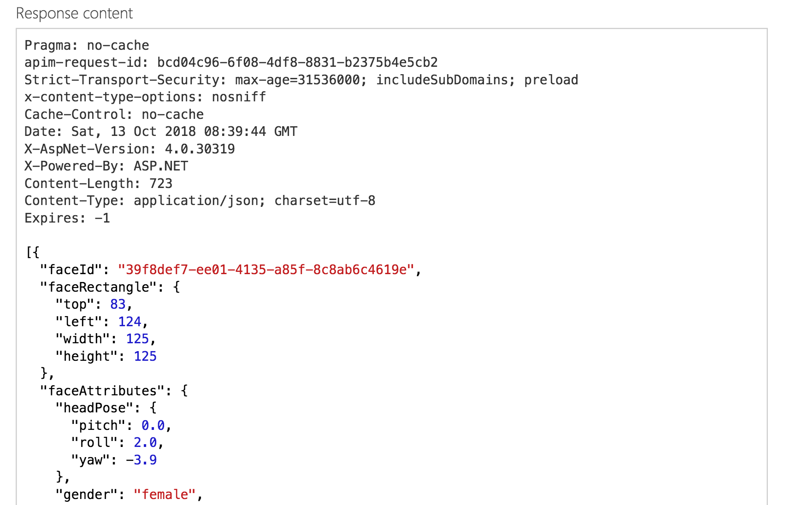
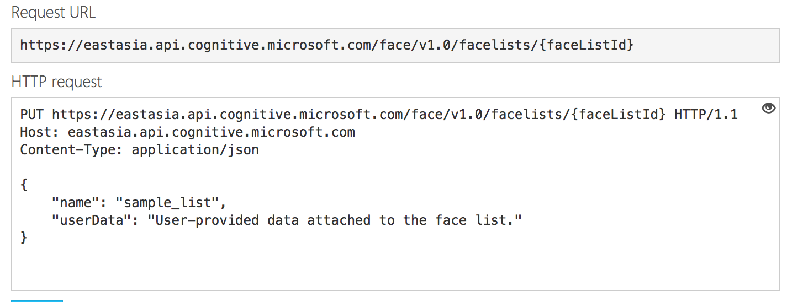
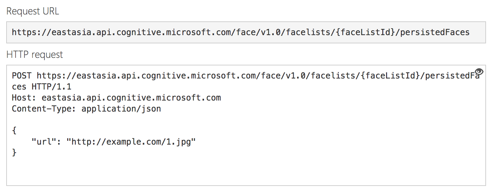
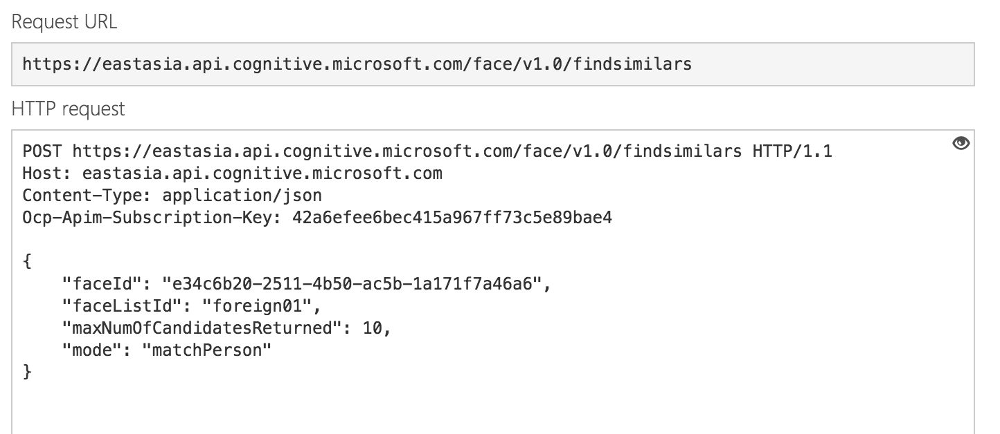

# Face API

## Face API

### 簡介：

FaceAPI包含許多服務：

> 分別有特徵識別、相似臉尋找、兩張臉驗證相似度、將相似的臉分群等功能。



### 開始使用

先到此處申請服務：[https://portal.azure.com/\#create/Microsoft.CognitiveServicesFace](https://portal.azure.com/#create/Microsoft.CognitiveServicesFace)

然後取得存取金鑰：



之後可以到此網站線上測試此API:

[https://eastasia.dev.cognitive.microsoft.com/docs/services/563879b61984550e40cbbe8d/operations/563879b61984550f30395236/console](https://eastasia.dev.cognitive.microsoft.com/docs/services/563879b61984550e40cbbe8d/operations/563879b61984550f30395236/console)

填入相關參數與圖片的URL即可：

> returnFaceAttributes 裡面填入想辨識的資料，使用逗點分隔，前面不可有空白。



下面為回傳的資訊：



### 也可以使用程式的方法來互叫

```javascript
const https = require("https");

const param =
  "?returnFaceId=true&returnFaceLandmarks=false&returnFaceAttributes=emotion,age,gender,exposure,headPose,hair,makeup,accessories";

var options = {
  host: "eastasia.api.cognitive.microsoft.com",
  port: 443,
  path: `/face/v1.0/detect${param}`,
  method: "POST",
  headers: {
    "Ocp-Apim-Subscription-Key": "42a6efee6bec415a967ff73c5e89bae3"
  }
};

const req = https.request(options, res => {
  res.on("data", function(data) {
    console.log(data.toString());
  });
});

req.on("error", e => {
  console.error(e);
});

req.write(
  JSON.stringify({
    url: "https://i.ytimg.com/vi/Lx5j_QhUULM/maxresdefault.jpg"
  })
);
req.end();
```

## 找尋相似的臉

> 每個請求記得都要有如下Header
>
> ```text
> Ocp-Apim-Subscription-Key: 存取金鑰
> ```

1.先建立一個FaceListId：[https://eastasia.dev.cognitive.microsoft.com/docs/services/563879b61984550e40cbbe8d/operations/563879b61984550f3039524b/console](https://eastasia.dev.cognitive.microsoft.com/docs/services/563879b61984550e40cbbe8d/operations/563879b61984550f3039524b/console)

> FaceListId和LargeFaceListId 類似，分別能存1000和1,000,000個臉。

參數如下：

> name為list的名稱，userData可隨意輸入。

2.在FaceListId加入臉

這個步驟可以輸入不同圖片URL來加入不同臉到List中。

參數就放入那張臉的圖片連結：

3.從第二步驟加入的圖中找相似的臉

在下圖參數的faceId放入我們要尋找的圖，他會從我們的faceListId中找尋所有類似的臉。

回傳結果如下：


