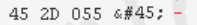

# Buffer

## Buffer

#### \# 先備知識

1. BE LE 分別代表big endian 與small endian\(大的數至小的數要從右或從左開始排列\)

   EX:

```text
Data=0x12345678    

Big Endian的系統：
存到記憶體會變成 0x12 0x34 0x56 0x78，最高位元組在位址最低位元，最低位元組在位址最高位元，依次排列

Little Endian的系統：
存到記憶體會變成 0x78 0x56 0x34 0x12，最低位元組在最低位元，最高位元組在最高位元，反序排列
```

## \#操作

buf會被分配隨機buffer

```text
buf = new Buffer(6)
```

我們自己初始化buffer

```text
buf = new Buffer([0,0,0,0,0,0])

<Buffer 00 00 00 00 00 00>
```

寫資料\(0到6為offset\)

```text
 buf.writeUIntBE(12345, 0 , 6)

 回傳為<Buffer 00 00 00 00 30 39>
```

> 3039為16進位，轉為10進位就是12345

試著改看看offset

```text
buf.writeUIntBE(12345, 0 , 2)

<Buffer 30 39 00 00 00 00>


buf.writeUIntBE(12345, 0 , 4)

<Buffer 00 00 30 39 00 00>
```

### 注意:buffer如重複write則原本其他offset的數字還是會存在

發現offset後面的數字先減2後的數字即為前面是00的長度

然後後面不足部分會自動重複最後一個buffer數字\(這裡後面重複39\)

> 根據官方說明:Where to start reading. Must satisfy:`0 <= offset <= buf.length - 4`

所以如果輸入以下會產生錯誤buf.writeUIntBE\(12345, 0 , 1\)，因為6位的buffer-4後至少要offset大於等於2

#### \#讀取

試試看以下

```text
buf = Buffer.from([0, 0, 0, 5]);
<Buffer 00 00 00 05>


> buf.readInt32BE(3,4).toString(16)
'5000000'
> buf.readInt32BE(2,4).toString(16)
'50000'
> buf.readInt32BE(1,4).toString(16)
'500'
> buf.readInt32BE(0,4).toString(16)
'5'
> buf.readInt32BE(4,4).toString(16)
'0'
```

> UInt 無號整數的型態名稱為 uint8、uint16、uint32、uint64，顧名思義，使用的長度分別為 8 位元、16 位元、32 位元與 64 位元。
>
> 舉例來說，uint8 可儲存的整數範圍為 0 到 255 ，共256個數 因為2\*\*8 \(二的八次方為256\)

### writeUInt8

> write如果第一個參數前面沒加0x 他會以為你填入的是十進位來看

因為buffer是以16進位表示，所以int8的意思是8bits的Big endian，一共是2個字 因為\(2\*4 = 8\) 一個16進位為4個bits

```javascript
var buffLen = 128;

var buffer = new Buffer(buffLen);
for (var i = 0; i < buffLen; i += 1) {
    buffer.writeUInt8(1, i);
}

console.log(buffer)
```

### writeUInt16BE

\(除了8以外其他後面都需要加上BE或LE，包含16和32（沒有64以及以上）\)

因為buffer是以16進位表示，所以16BE的意思是16bits的Big endian，一共是4個字 因為\(4\*4 = 16\) 一個16進位為4個bits

```javascript
var buffer = new Buffer(buffLen);
for (var i = 0; i < buffLen; i += 2) { // 因為buffer一次寫入會寫入2個bits，所以Int16的話共4個bits所以換下一個時要i += 2
    buffer.writeUInt16LE(0x0102, i); // 如果改為buffer.writeUInt16LE(0x010203, i); 會出現outbound錯誤
}

console.log(buffer)
```

### writeUInt32BE

因為buffer是以16進位表示，所以32BE的意思是32bits的Big endian，一共是8個字 因為\(8\*4 = 32\) 一個16進位為4個bits

```javascript
var buffLen = 12;  //記得要配給他4的倍數  因為Int32  在buffer一次寫入會寫四個字

var buffer = new Buffer(buffLen);
for (var i = 0; i < buffLen; i += 4) {
    buffer.writeUInt32BE(0x01020304, i);
}

console.log(buffer)
```

## 使用Uint或Int

\(sign 與 unsign\)

```javascript
var buffLen = 12;

var buffer = new Buffer(buffLen);
for (var i = 0; i < buffLen; i += 1) {
    buffer.writeInt8(-1, i);   //這裡可成功編譯
}

console.log(buffer)
```

但如果把它換成unsign，如同以下，將會因為unsign不可接受負數，所以出現out bound錯誤

```text
buffer.writeUInt8(-1, i);
```

## 關於[NodeJS Buffer to JavaScript ArrayBuffer](https://stackoverflow.com/questions/8609289/convert-a-binary-nodejs-buffer-to-javascript-arraybuffer) 的轉換可參考

[https://stackoverflow.com/questions/8609289/convert-a-binary-nodejs-buffer-to-javascript-arraybuffer](https://stackoverflow.com/questions/8609289/convert-a-binary-nodejs-buffer-to-javascript-arraybuffer)

## UTF8、ASCII、Node.js Buffer

ACSII table: http://www.asciitable.com/

UTF-8 table: https://www.utf8-chartable.de/

UTF-8, unicode 都是在擴充原本 ASCII 不夠的編碼。

以下面為例，分別為 ascii 與 utf-8




在原本 ascii 就有的編碼在utf-8也會是相同的 hex \(十六進位\), dec \(十進位\)

### 接著以 Node.js Buffer 來看

```javascript
> Buffer.from('-')
<Buffer 2d>
> Buffer.from('-')[0]
45
```

> 可以看到原本是以 16 進位表示，但最後把 buffer 單獨拿出來後會是以 10 進位

