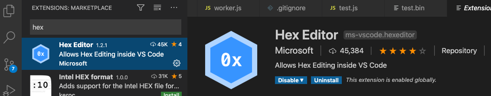
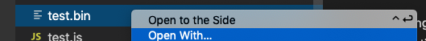
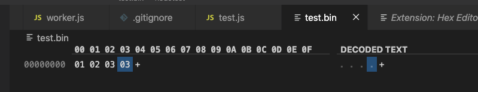

# 查看 Binary 檔案內容

## 使用 VSCode

1.下載插件



2.右鍵點擊檔案，點選 Open with，然後選擇 Hex Editor 開啟



3.查看內容



## Hexdump

[https://man7.org/linux/man-pages/man1/hexdump.1.html](https://man7.org/linux/man-pages/man1/hexdump.1.html)

```text
hexdump ./test.bin
```

## xxd

[http://manpages.ubuntu.com/manpages/trusty/zh\_TW/man1/xxd.1.html](http://manpages.ubuntu.com/manpages/trusty/zh_TW/man1/xxd.1.html)

```text
xxd ./test.bin
```

