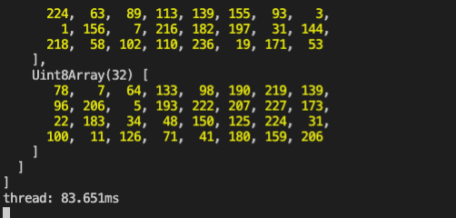
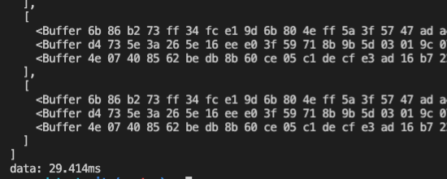

# Worker Thread



不能同時存取主程式相同變數，所以不會有 race condition 問題，透過 `postMessage` 互相溝通。

### 範例

app.js

```javascript
const { Worker } = require('worker_threads');
const path = require('path');

const worker1 = new Worker(path.resolve('./worker.js'));

worker1.on('message', (message) => {
  console.log(`Main thread got message: ${message}`);
});
worker1.postMessage('ping');
```

worker.js

```javascript
const { parentPort } = require('worker_threads');

parentPort.on('message', (message) => {
  console.log(`worker got message: ${message}`);
  parentPort.postMessage('pong');
});
```

之後執行 `node app.js`

```text
worker got message: ping
Main thread got message: pong
```

## Worker 搭配 Promise all

讓所有 worker 都執行完畢後再繼續程式

app.js

```javascript
const { Worker } = require("worker_threads");
const path = require("path");
console.time('thread')
let workerPool = [];
for (let i = 0; i < 5; i++) {
  const workerInstance = new Promise((resolve, reject) => {
    const worker = new Worker(path.resolve("./worker.js"));
    worker.on("message", ({ data }) => {
      resolve(data);
    });
    worker.postMessage({
      data: [1, 2, 3],
    });
  });
  workerPool.push(workerInstance);
}
Promise.all(workerPool)
  .then((values) => {
    console.log(values);
    console.timeEnd('thread')
  })
  .catch((err) => {
    console.log(err);
  });
```

worker.js

```javascript
const { parentPort } = require("worker_threads");
const crypto = require("crypto");
const sha256 = (s) => crypto.createHash("sha256").update(s).digest();

parentPort.on("message", ({ data }) => {
  const shaArray = Array.from(data).map((num) => sha256(String(num)));
  parentPort.postMessage({
    data: shaArray,
  });
});
```



## 但後來測試不用 worker 速度好像比較快

```javascript
const { Worker } = require("worker_threads");
const path = require("path");

const crypto = require("crypto");
const sha256 = (s) => crypto.createHash("sha256").update(s).digest();

console.time('data')
let dataPool = [];

for (let i = 0; i < 100; i++) {
  const dataInstance = new Promise((resolve, reject) => {
    const data = Array.from([1,2,3]).map((num) => sha256(String(num)))
    resolve(data);
  });
  dataPool.push(dataInstance);
}
Promise.all(dataPool)
  .then((values) => {
    console.log(values);
    console.timeEnd('data')
  })
  .catch((err) => {
    console.log(err);
  });
```



## 使用 microjob module

```javascript
(async () => {
  const { job, start, stop } = require("microjob");

  try {
    // start the worker pool
    console.time('microjob')
    await start();

    // this function will be executed in another thread
    const res = await job(() => {
      let i = 0;
      const result = [];
      for (i = 0; i < 100; i++) {
        // heavy CPU load ...
        const crypto = require("crypto");
        const sha256 = (s) => crypto.createHash("sha256").update(s).digest();
        const shaArray = Array.from([1, 2, 3]).map((num) =>
          sha256(String(num))
        );
        result.push(shaArray);
      }
      return result;
    });

    console.log(res);
    console.timeEnd('microjob')
  } catch (err) {
    console.error(err);
  } finally {
    // shutdown worker pool
    await stop();
  }
})();
```

稍微比自己寫的 worker\_thread 快一點，但還是比 single thread 慢。

