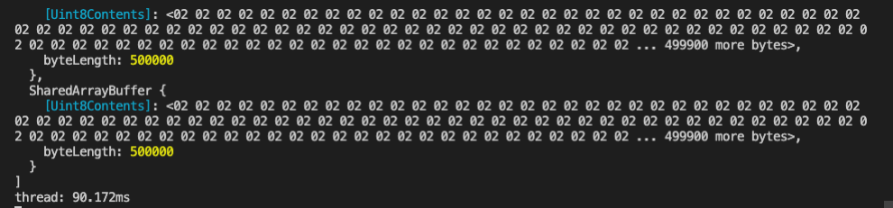
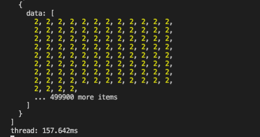

# Worker Thread



不能同時存取主程式相同變數，所以不會有 race condition 問題，透過 `postMessage` 互相溝通。

### 範例

app.js

```javascript
const { Worker } = require('worker_threads');
const path = require('path');

const worker1 = new Worker(path.resolve('./worker.js'));

worker1.on('message', (message) => {
  console.log(`Main thread got message: ${message}`);
});
worker1.postMessage('ping');
```

worker.js

```javascript
const { parentPort } = require('worker_threads');

parentPort.on('message', (message) => {
  console.log(`worker got message: ${message}`);
  parentPort.postMessage('pong');
});
```

之後執行 `node app.js`

```text
worker got message: ping
Main thread got message: pong
```

## Worker 搭配 Promise all

讓所有 worker 都執行完畢後再繼續程式

#### 我們先看一下原本的 single thread 程式

```javascript
const crypto = require("crypto");
const sha256 = (s) => crypto.createHash("sha256").update(s).digest();
const totalDataLength = 2000000;
console.time('single thread');
Array.from(Array(totalDataLength)).map(() => sha256(Math.random().toString()));
console.timeEnd('single thread');
```

> 耗時大約 10s

### 然後我們把它改成 worker\_thread 版本，並搭配 Promise

> 把原本的 2000000 個部分，分給四個 thread 計算。

app.js

```javascript
const { Worker } = require("worker_threads");
const path = require("path");
console.time('thread')
let workerPool = [];
const threadCount = 4;
const totalDataLength = 2000000;
for (let i = 0; i < threadCount; i++) {
  const workerInstance = new Promise((resolve, reject) => {
    const worker = new Worker(path.resolve("./worker.js"));
    worker.on("message", ({ data }) => {
      resolve(data);
    });
    worker.postMessage({
      arrayLength: totalDataLength / threadCount,
    });
  });
  workerPool.push(workerInstance);
}
Promise.all(workerPool)
  .then((values) => {
    console.log(values);
    console.timeEnd('thread')
  })
  .catch((err) => {
    console.log(err);
  });
```

worker.js

```javascript
const { parentPort } = require("worker_threads");
const crypto = require("crypto");
const sha256 = (s) => crypto.createHash("sha256").update(s).digest();

parentPort.on("message", ({ arrayLength }) => {
  const shaArray = Array.from(Array(arrayLength)).map((num) => sha256(String(num)));
  parentPort.postMessage({
    data: shaArray,
  });
});
```

耗時大約 5s

## 使用 microjob module

```javascript
(async () => {
  const { job, start, stop } = require("microjob");

  try {
    // start the worker pool
    console.time("microjob");
    await start();

    // this function will be executed in another thread
    const res = await job(() => {
      let i = 0;
      const result = [];
      const threadCount = 4;
      const totalDataLength = 2000000;
      for (i = 0; i < threadCount; i++) {
        // heavy CPU load ...
        const crypto = require("crypto");
        const sha256 = (s) => crypto.createHash("sha256").update(s).digest();
        const shaArray = Array.from(Array(totalDataLength / threadCount)).map((num) =>
          sha256(String(num))
        );
        result.push(shaArray);
      }
      return result;
    });

    console.log(res);
    console.timeEnd("microjob");
  } catch (err) {
    console.error(err);
  } finally {
    // shutdown worker pool
    await stop();
  }
})();
```

發現比原本原生的更慢，可以查看issue: [https://github.com/wilk/microjob/issues/65](https://github.com/wilk/microjob/issues/65)

## Share memory

可以用 Share memory 的方法來傳遞參數，取代 postMessage，速度會比較快。

app.js

```javascript
const { Worker } = require("worker_threads");
const path = require("path");
console.time('thread')
let workerPool = [];
const threadCount = 4;
const totalDataLength = 2000000;
const shareMemory = Array(threadCount).fill(new SharedArrayBuffer(totalDataLength / threadCount))

for (let i = 0; i < threadCount; i++) {
  const workerInstance = new Promise((resolve, reject) => {
    const worker = new Worker(path.resolve("./worker.js"));
    worker.on("message", () => {
      resolve();
    });
    worker.postMessage({
      shareMemory: shareMemory[i],
      arrayLength: totalDataLength / threadCount,
    });
  });
  workerPool.push(workerInstance);
}
Promise.all(workerPool)
  .then(() => {
    console.log(shareMemory)
    console.timeEnd('thread')
  })
  .catch((err) => {
    console.log(err);
  });
```

worker.js

```javascript
const { parentPort } = require("worker_threads");

parentPort.on("message", ({ arrayLength, shareMemory }) => {
  let uint8Arr = new Uint8Array(shareMemory);
  const shaArray = Array.from(Array(arrayLength)).fill(1).map((num) => Number(num) * 2);
  uint8Arr.set(new Uint8Array(shaArray))
  parentPort.postMessage({});
});
```

平均速度約 90ms



#### 假設換回原本 postMessage方式

app.js

```javascript
const { Worker } = require("worker_threads");
const path = require("path");
console.time('thread')
let workerPool = [];
const threadCount = 4;
const totalDataLength = 2000000;

for (let i = 0; i < threadCount; i++) {
  const workerInstance = new Promise((resolve, reject) => {
    const worker = new Worker(path.resolve("./worker.js"));
    worker.on("message", (data) => {
      resolve(data);
    });
    worker.postMessage({
      arrayLength: totalDataLength / threadCount,
    });
  });
  workerPool.push(workerInstance);
}
Promise.all(workerPool)
  .then((data) => {
    console.log(data)
    console.timeEnd('thread')
  })
  .catch((err) => {
    console.log(err);
  });
```

worker.js

```javascript
const { parentPort } = require("worker_threads");

parentPort.on("message", ({ arrayLength }) => {
  const shaArray = Array.from(Array(arrayLength)).fill(1).map((num) => Number(num) * 2);
  parentPort.postMessage({
    data: shaArray,
  });
});
```

可發現需要耗時 150ms 左右，約為 share memory 的兩倍。



#### 資料序列化的時間

假設我們把原本 share memory 的 sharedArrayBuffer 轉為 array 可發現時間又變回 150ms 左右，可發現打大部分時先是花在資料的序列化。

```javascript
    const arr = Array.from(new Uint8Array(shareMemory[0]))
    console.log(arr)
```

