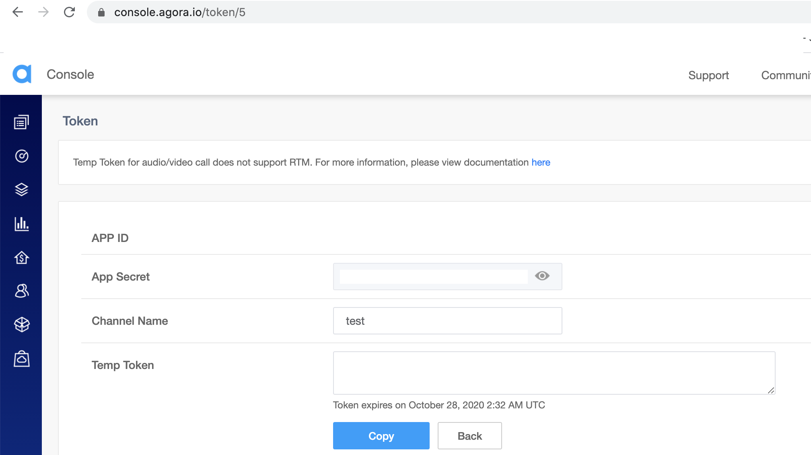

# Agora

### 文件：

[https://docs.agora.io/](https://docs.agora.io/)

### 收費方式：

[https://docs.agora.io/cn/Video/billing\_rtc?platform=All%20Platforms](https://docs.agora.io/cn/Video/billing_rtc?platform=All%20Platforms)

### Web API: 

[https://docs.agora.io/cn/Video/API%20Reference/web/interfaces/agorartc.stream.html](https://docs.agora.io/cn/Video/API%20Reference/web/interfaces/agorartc.stream.html)

### 範例：

[https://github.com/AgoraIO/Basic-Video-Call](https://github.com/AgoraIO/Basic-Video-Call)

建立帳戶後去取得相關開發金鑰：



簡單一對一視訊範例：

```javascript
import React, { useState, useEffect } from "react";
import StreamPlayer from "agora-stream-player";
import agora from "agora-rtc-sdk";
import enhanceAgoraRTC from "agoran-awe";

const AgoraRTC = enhanceAgoraRTC(agora); // 提供原本函數使用 async 功能

const streamID = null; // 不提供 streamId 他會隨機產生，如果提供相同 streamId會視為同一個client
function App() {
  const [localStream, setLocalStream] = useState("");
  const [remoteStreams, setRemoteStreams] = useState("");
  useEffect(() => {
    const init = async () => {
      const stream = AgoraRTC.createStream({
        streamID,
        video: true,
        audio: true,
      });
      await stream.init();
      // 記得要先創建 stream 再創 client 不然會有不顯示其他 stream 問題
      const client = AgoraRTC.createClient({ mode: "rtc", codec: "h264" });
      await client.init("輸入 appID");
      await client.join(
        "輸入token",
        "輸入 channel",
        streamID
      );

      // Stream 加入後 必須要訂閱
      client.on("stream-added", function (evt) {        
        var remoteStream = evt.stream;
        var id = remoteStream.getId();
        client.subscribe(remoteStream, function (err) {
          console.log("stream subscribe failed", err);
        });
        console.log("stream-added remote-uid: ", id);
      });
      client.on("stream-subscribed", function (evt) {
        var remoteStream = evt.stream;
        var id = remoteStream.getId();
        setRemoteStreams(remoteStream);
        console.log("stream-subscribed remote-uid: ", id);
      });

      await client.publish(stream);
      setLocalStream(stream);
    };
    init();
  }, []);
  return (
    <>
      {localStream && (
        <StreamPlayer
          style={{ width: "50px", height: "50px" }}
          key={1023}
          video={true}
          audio={true}
          stream={localStream}
          fit="contain"
        />
      )}
      {remoteStreams && (
        <StreamPlayer
          style={{ width: "50px", height: "50px" }}
          key={1024}
          video={true}
          audio={true}
          stream={remoteStreams}
          fit="contain"
        />
      )}
    </>
  );
}

export default App;
```

### 獲取可用相機與麥克風

```javascript
      const cameras = await client.getCameras();
      const audios = await client.getRecordingDevices();
      console.log(cameras, audios);
      
      // 設置
      localStream.switchDevice("video", cameras.deviceId);
      localStream.switchDevice("audio", audios.deviceId);
```

## 包含詳細設定的範例

```javascript
import React, { useState, useEffect } from "react";
import StreamPlayer from "agora-stream-player";
import agora from "agora-rtc-sdk";
import enhanceAgoraRTC from "agoran-awe";

const AgoraRTC = enhanceAgoraRTC(agora); // 提供原本函數使用 async 功能

const config = {
  appId: "",
  token: "",
  channel: "test",
};

function App() {
  const [UID, setUID] = useState("");
  const [mode, setMode] = useState("");
  const [codec, setCodec] = useState("");
  const [mutedAudio, setMutedAudio] = useState(false);
  const [mutedVideo, setMutedVideo] = useState(false);
  const [availableCamera, setAvailableCamera] = useState([]);
  const [availableMicrophone, setAvailableMicrophone] = useState([]);
  const [localStream, setLocalStream] = useState("");
  const [remoteStreams, setRemoteStreams] = useState("");
  const [clientInstance, setClientInstance] = useState("");

  const handleChangeCamera = (value) => {
    localStream.switchDevice("video", value);
  };

  const handleChangeMicrophone = (value) => {
    localStream.switchDevice("audio", value);
  };

  const handleMuteAudio = () => {
    if (!mutedAudio) {
      localStream.muteAudio();
    } else {
      localStream.unmuteAudio();
    }
    setMutedAudio(!mutedAudio);
  };

  const handleMuteVideo = () => {
    if (!mutedVideo) {
      localStream.muteVideo();
    } else {
      localStream.unmuteVideo();
    }
    setMutedVideo(!mutedVideo);
  };

  const handleDisconnect = () => {
    try {
      localStream.close();
      clientInstance.unpublish(localStream);
      clientInstance.leave();
      setLocalStream("");
      setRemoteStreams("");
    } catch(err) {
      console.error(err);
    }
  };

  const handlePeerDisconnect = () => {
    setRemoteStreams("");
  };
  
  const handleConnect = async () => {
    const streamID = UID || null;
    const { appId, token, channel } = config;
    const stream = AgoraRTC.createStream({
      streamID,
      video: true,
      audio: true,
    });
    await stream.init();
    // 記得要先創建 stream 再創 client 不然會有不顯示其他 stream 問題
    const client = AgoraRTC.createClient({ mode: mode || "rtc", codec: codec || "h264" });
    await client.init(appId);
    await client.join(token, channel, streamID);
    setClientInstance(client);


    client.on("stream-added", function (evt) {
      client.subscribe(evt.stream, function (err) {
        console.log("stream subscribe failed", err);
      });
    });
    client.on("stream-subscribed", function (evt) {
      setRemoteStreams(evt.stream);
    });
    // 另一方離開視訊
    client.on("peer-leave", handlePeerDisconnect);
    // 本地離開視訊
    client.on("stream-removed", handleDisconnect);

    await client.publish(stream);
    setLocalStream(stream);

    // 獲取可用媒體
    const cameras = await client.getCameras();
    const audios = await client.getRecordingDevices();
    setAvailableCamera([...cameras]);
    setAvailableMicrophone([...audios]);
  };
  return (
    <>
      <button onClick={handleMuteAudio}>
        {mutedAudio ? "Unmute Audio" : "Mute Audio"}
      </button>
      <button onClick={handleMuteVideo}>
        {mutedVideo ? "Unmute Video" : "Mute Video"}
      </button>
      <div>
        <select onChange={(e) => handleChangeCamera(e.target.value)}>
          {availableCamera.map((camera) => (
            <option key={camera.deviceId} value={camera.deviceId}>
              {camera.label}
            </option>
          ))}
        </select>
        <select onChange={(e) => handleChangeMicrophone(e.target.value)}>
          {availableMicrophone.map((microphone) => (
            <option key={microphone.deviceId} value={microphone.deviceId}>
              {microphone.label}
            </option>
          ))}
        </select>
      </div>
      <div>
        <input
          onChange={(e) => setUID(e.target.value)}
          placeholder="UID"
        ></input>
      </div>
      <div>
        <span>mode</span>
        <select onChange={(e) => setMode(e.target.value)}>
          <option value="live">live</option>
          <option value="rtc">rtc</option>
        </select>
      </div>
      <div>
        <span>codec</span>
        <select onChange={(e) => setCodec(e.target.value)}>
          <option value="vp8">vp8</option>
          <option value="h264">h264</option>
        </select>
      </div>
      <div>
        <button disabled={localStream} onClick={handleConnect}>Connect</button>
        <button onClick={handleDisconnect}>Disconnect</button>
      </div>
      {localStream && (
        <StreamPlayer
          style={{ width: "50px", height: "50px" }}
          key={1023}
          video={true}
          audio={true}
          stream={localStream}
          fit="contain"
        />
      )}
      {remoteStreams && (
        <StreamPlayer
          style={{ width: "50px", height: "50px" }}
          key={1024}
          video={true}
          audio={true}
          stream={remoteStreams}
          fit="contain"
        />
      )}
    </>
  );
}

export default App;

```

## 常見問題：

目前 3.2 SDK 版本如果有給 streamID\(UID\) 則其他 client 也要給，不然會無法與對方連線到。

如果都沒輸入則可以連線（自動隨機產生 ID）

[https://docs.agora.io/en/faq/string\#introduction](https://docs.agora.io/en/faq/string#introduction)

