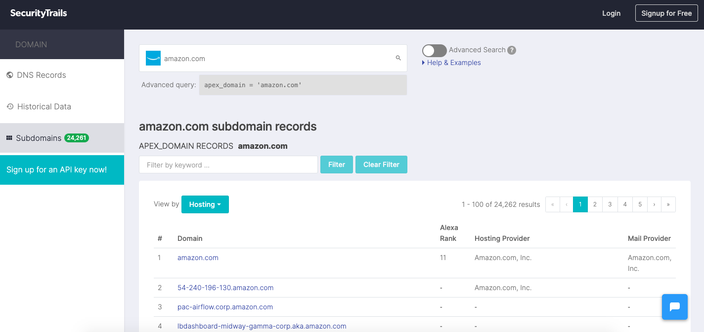

# DNS

## DNS 解析

1.我們可以在電腦更改 `/etc/hosts`直接指定哪個 domain 要對應哪個 IP。

2.但假設沒有指定的話就會到 `/etc/resolv.conf` 尋找裡面寫的 DNS server 做查詢。

> /etc/nsswitch.conf 這個檔案可以決定使用 /etc/hosts 還是 /etc/resolv.conf

3.目前台灣大多是 Hinet 中華電信的 DNS server `168.95.1.1` 他會再去查詢

4.假設找不到的話他會去找 **root name server \( 被** ICANN 旗下的 IANA 管轄**，全世界共有 13 個 root name server，各自又被不同的組織所營運\)**

> [https://zh.wikipedia.org/wiki/%E6%A0%B9%E7%B6%B2%E5%9F%9F%E5%90%8D%E7%A8%B1%E4%BC%BA%E6%9C%8D%E5%99%A8](https://zh.wikipedia.org/wiki/%E6%A0%B9%E7%B6%B2%E5%9F%9F%E5%90%8D%E7%A8%B1%E4%BC%BA%E6%9C%8D%E5%99%A8)
>
> [https://www.iana.org/domains/root/servers](https://www.iana.org/domains/root/servers)

5.如果是 .tw 之類的在 root dns server 沒記錄，會再往下找，可以輸入以下指令試看看

```
dig +trace https://www.webnode.tw/
```

## DNS Server 種類

1. Root Name server
2. TLDs Server
3. Authoritative name server

過程

* local ISP's DNS server will send a query to the root server. The root servers won’t have information on a specific IP address for www.securitytrails.com, but it will know where the name servers that serve that TLD\(.com\) are.
* Root servers will return the list of TLD servers so the provider or configured server can again send a query, this time to a TLD server.
* The TLD server will then return the authoritative name server where the desired domain is stored.
* Once the request has reached the authoritative server, it will respond to the requesting server with the IP address

## Resource Record \(RR\)

例如 NS; A; AAAA; PTR; CNAME; MX. SOA等。

## **DNSSEC**

類似於 IPSec 都是用來增強相關安全性。



[https://www.ithome.com.tw/tech/92685](https://www.ithome.com.tw/tech/92685)

## NS vs SOA

NS record 通常會有多個 DNS server 用來表示有哪些 DNS Server 可供查詢，SOA record 通常只有一個，指向 Master DNS Server，可讓其他 Slave DNS Server Sync 資料，並且 SOA record 後面會跟著一些數字代表 Master 與 Slave 的資料同步策略。

```bash
nslookup -type=soa stackoverflow.com
或是
dig +short SOA stackoverflow.com

nslookup -type=ns stackoverflow.com
或是
dig +short NS stackoverflow.com
```

> NS records are used to redirect DNS resolver to the next DNS server that is hosting the next level zone. And, SOA record is used by cluster of DNS servers to sync latest changes from the master to secondary servers
>
> 可參考：
>
> [http://dns-learning.twnic.net.tw/bind/intro6.html\#bb](http://dns-learning.twnic.net.tw/bind/intro6.html#bb)

## BIND

為一套開放原始碼 DNS 軟體，現行的 DNS Server 大家都在用，實作了 TSIG 與 rndc 等功能。







## TSIG、RNDC



## 1.1.1.1

cloudflare 提供的 DNS server




## 13 個 Root DNS Server

為什麼是 13 個?

> It’s because of the limitations of the original DNS infrastructure, which used only IPv4[¹](https://securitytrails.com/blog/dns-root-servers#reference-1) containing 32 bytes. The IP addresses needed to fit into a single packet, which was limited to 512 bytes at that time. So, each of the IPv4 addresses is 32 bits, and 13 of them come to 416 bytes, leaving the remaining 96 bytes for protocol information.
>
> [https://securitytrails.com/blog/dns-root-servers](https://securitytrails.com/blog/dns-root-servers)

## 查詢 subdomain

推薦以下不錯網站





## 推薦閱讀

[https://www.cloudflare.com/zh-tw/learning/](https://www.cloudflare.com/zh-tw/learning/)

