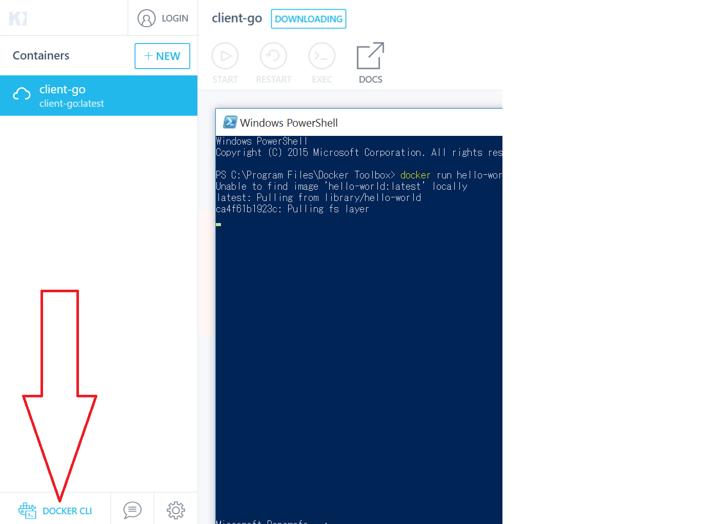

# Docker教學

## 安裝

OSX: [https://docs.docker.com/docker-for-mac/install/](https://docs.docker.com/docker-for-mac/install/)

> windows版本的docker建議可以使用kitemantic整合環境

windows: [https://kitematic.com/](https://kitematic.com)

[https://store.docker.com/search?type=edition\&offering=community](https://store.docker.com/search?type=edition\&offering=community)

windows使用kitemantic後點選右下角的DOCKER CLI

## 以下為Docker執行Redis與Node.js server並分別expose兩個PORT的範例

1.新增package.json

```
{
  "name": "docker_web_app",
  "version": "1.0.0",
  "description": "Node.js on Docker",
  "author": "First Last <first.last@example.com>",
  "main": "server.js",
  "scripts": {
    "start": "node server.js"
  },
  "dependencies": {
    "express": "^4.13.3"
  }
}
```

2.server.js

```javascript
'use strict';

const express = require('express');

// Constants
const PORT = 8080;
const HOST = '0.0.0.0';

// App
const app = express();
app.get('/', (req, res) => {
  res.send('Hello world\n');
});

app.listen(PORT, HOST);
console.log(`Running on http://${HOST}:${PORT}`);
```

3.Dockerfile

```
FROM node:boron

WORKDIR /usr/src/app

RUN apt-get update && apt-get install -y redis-server

COPY package.json .

RUN npm install

# Bundle app source
COPY . .

EXPOSE 8080 6379
CMD [ "npm", "start" ]
```

4\.

建立image

(-t 為tag 的意思即為這個image的名字)

```
docker build -t test/node-web-app .
```

5\.

執行image

(意思為把Node.js server之8080port開放給外面電腦的49160，與開放Redis的6379給外面電腦的49161)

> 開啟瀏覽器localhost:49160即可看到

```
 docker run -p 49160:8080 49161:6379 test/node-web-app
```

6.連線到Redis

記得先進去container開啟Redis-server

```
docker ps
```

之後會顯示如下

```
CONTAINER ID        IMAGE               COMMAND             CREATED             STATUS
          PORTS                                              NxAMESe
c7b4df8ebffb        test/node-web-app   "npm start"         11 minutes ago      Up 11 minu
```

然後用exec的方法進入docker的Process 之cli

```
docker exec -it c7b4df8ebffb /bin/bash
```

啟動Redis

```
redis-server
```

7.之後寫一個Node.js的程式來連Redis

```javascript
const redis = require('redis')
  RDS_PORT = 49161,
  RDS_HOST = '127.0.0.1',
  client = redis.createClient(RDS_PORT, RDS_HOST,{});

  client.on('ready', (res) => {
    console.log('ready');
  })
```

## 把image搬到其他電腦

把最後面參數名字的image(剛才tag名稱)存成 dockerImage 壓縮檔

```
docker save -o ./dockerImage test/node-web-app
```

然後把此image壓縮檔移到在別台電腦及可讀取

```
 docker load -i ./dockerImage
```

## PUSH Image到Docker Hub

1.先到[https://hub.docker.com/](https://hub.docker.com)註冊帳號

2.Create new repository

3.登入

```
docker login --username=<你的Dockerhub username> --password=<你的docker Hub密碼>
```

4.查看你要push的image的ID

```
docker images
```

5.把ID配上你的repository名稱

```
docker tag bb38976d03cf yourhubusername/repositoryName
```

6.推送

```
docker push yourhubusername/repositoryName
```

[https://ropenscilabs.github.io/r-docker-tutorial/04-Dockerhub.html](https://ropenscilabs.github.io/r-docker-tutorial/04-Dockerhub.html)

## 減少 Build 後 Image 檔案大小

使用 multistage build

[https://docs.docker.com/develop/develop-images/multistage-build/](https://docs.docker.com/develop/develop-images/multistage-build/)
