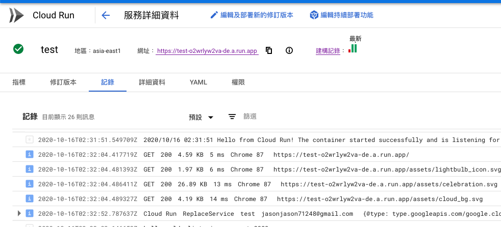

# Cloud Run

類似於 AWS lambda 的 serverless 架構。



官方教學：[https://cloud.google.com/run/docs/quickstarts/build-and-deploy\#node.js\_1](https://cloud.google.com/run/docs/quickstarts/build-and-deploy#node.js_1)

建議使用 github 專案搭配 dockerfile 進行部署，它會自動偵測專案 code 更新 push 上去後啟用 cloud build 然後快速部署，之後點擊 url 即可看到。

## 注意事項：

1.dockerfile 不用寫 expose port，因為寫在介面上定義即可

2.如果是抓取 github project 記得要設定 cloud build 的專案目錄

點選以下選取專案，然後點選藍字進入 cloud build 設定

3.記得設定 dockerfile 在專案的目錄

