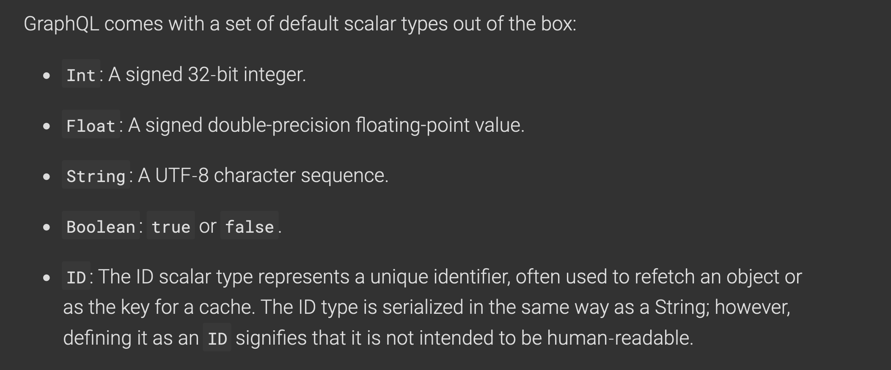
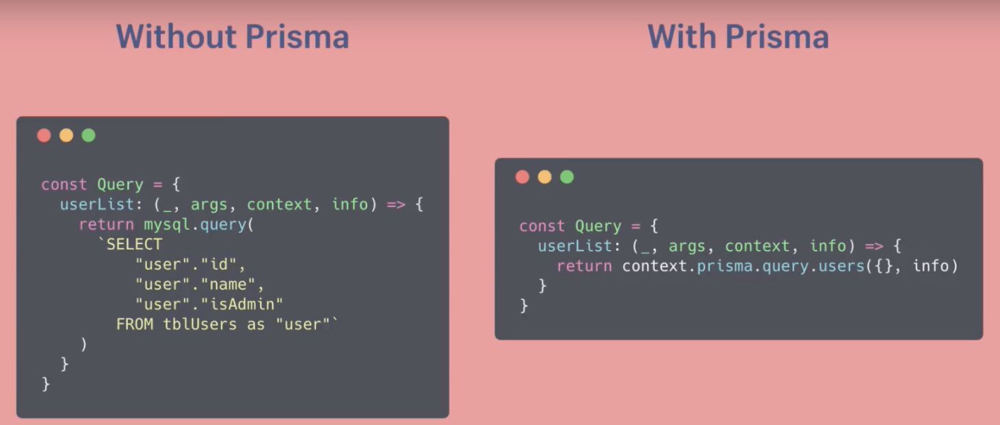

# GraphQL

## 與 RESTful、GRPC類似，均為 http 上層的後端與前端溝通方式

## Server 用法 

```javascript
const typeDefs = gql`
  """
  使用者
  """
  type User {
    "識別碼"
    id: ID
    "名字"
    name: String
    "年齡"
    age: Int
    "朋友"
    friends(a: Int): [User]
  }

  type Query {
    hello: String
    "取得當下使用者"
    me: User
    "取得所有使用者"
    users: [User]
  }

  type Mutation {
    "新增使用者"
    addUser(id: ID, name: String!, age: Int): User
  }
`;

const resolvers = {
  Query: {
    hello: () => "world",
    me: () => users[0],
    users: () => users,
  },
  Mutation: {
    addUser: (root, args, context) => {
      const { id, name, age } = args;
      // 新增 post
      users.push({
        id,
        name,
        age,
      });
      return users[3];
    },
  },
  User: {
    friends: (parent, args, context) => {
      const { friendIds } = parent;
      return users.filter((user) => friendIds.includes(user.id));
    },
  },
};

const server = new ApolloServer({
  typeDefs,
  resolvers,
  context: () => {
    return {a: ""}
  }
});
```

typeDefs 用來定義 type，內建有 query, mutation, subscribe 三種 type。

resolvers 用來處理當接收到 query 或 mutation 或 subscribe 時要做的對應處理，resolvers 包含三個預設參數 \(parent, args, context\)

context 讓 server 可以傳遞訊息讓 resolvers 第三個參數接收

## Query

```javascript
  query user{
    user {
      id
      name
      age
    }
  }
  
  等同於
  
    user {
      id
      name
      age
    }
```



React 範例：

> 記得要寫在 ApolloProvider 裡面的 component 內，如果直接在 ApolloProvider 同個 component 使用 useQuery 會無法

```javascript
import React from "react";
import { useQuery, gql } from "@apollo/client";

const getUsersQuery = gql`
  {
    users {
      id
      name
      age
    }
  }
`;

const Users = () => {
  const { loading, error, data } = useQuery(getUsersQuery);
  return <div>{data && data.users[0].name}</div>;
};

export default Users;
```



### Mutation



example: 

```javascript
import React from "react";
import { useQuery, useMutation, gql } from "@apollo/client";

const getUsersQuery = gql`
  {
    users {
      id
      name
      age
    }
  }
`;

const mutationUsers = gql`
  mutation {
    addUser(id: 12, name: "test", age: 15) {
      id
      name
      age
    }
  }
`;

const Users = () => {
  const { loading, error, data } = useQuery(getUsersQuery);
  const [addUser, { data: _data }] = useMutation(mutationUsers);

  const handleAddUser = () => {
    addUser();
    console.log(data)
  };
  return (
    <div>
      <button onClick={handleAddUser}>Add</button>
      <button onClick={() => console.log(_data)}>Add</button>
      <div>{data && data.users[0].name}</div>;
    </div>
  );
};
export default Users;

```

## typeDefs

1. 回傳 array 就用 \[\] 把其他 type 包住
2. 直接在名稱上方可寫註解
3. ! 代表必填參數 `post(id: ID!): Post`

#### 預設 types





#### 自定義 scalar type

> 也是寫在 resolver 然後使用 `new GraphQLScalarType()`

[https://ithelp.ithome.com.tw/articles/10206366](https://ithelp.ithome.com.tw/articles/10206366)

## resolvers

parent: 使用參數可以存取client 下指令時的function 上一層資料，但只能存取最多上一層，無法使用 `parent.parent`

args: 可存取使用者在 client 下指令時 function 後的參數

context: 存取傳進 Apollo Server 初始化時 context 的資料

> 還有第四個參數叫 info 但因為不常用，可以查看：
>
> [https://www.prisma.io/blog/graphql-server-basics-demystifying-the-info-argument-in-graphql-resolvers-6f26249f613a](https://www.prisma.io/blog/graphql-server-basics-demystifying-the-info-argument-in-graphql-resolvers-6f26249f613a)

## Authorization

[https://ithelp.ithome.com.tw/articles/10205426](https://ithelp.ithome.com.tw/articles/10205426)

## 其他工具

#### [Prisma](https://www.prisma.io/)

GraphQL 後端專用的 ORM，方便資料庫溝通



#### Graphql-tag

parse gql string to AST \( 在 apollo-boost 內也有 \)



#### @apollo/client

取代了 react-apollo, apollo-boost 等，將一些 client 要用到的在 Apollo Client 3.0 都包含了進去。

[https://www.apollographql.com/docs/react/migrating/apollo-client-3-migration/](https://www.apollographql.com/docs/react/migrating/apollo-client-3-migration/)

#### React hook

[https://www.apollographql.com/docs/react/development-testing/static-typing/](https://www.apollographql.com/docs/react/development-testing/static-typing/)

