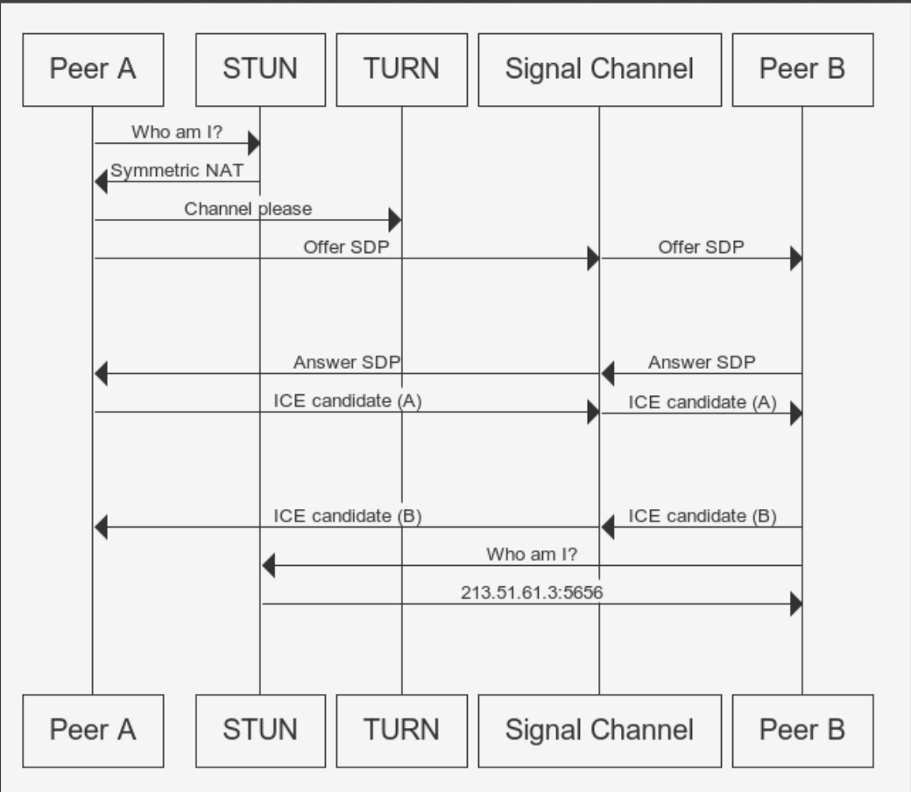

# HTML5 Video 與 WebRTC

## HTML5 Video

### 1.有關canvas串流

參考此  
[https://github.com/EasonWang01/Node.js-stream-video/tree/master/Desktop/Node.js-stream-video-master](https://github.com/EasonWang01/Node.js-stream-video/tree/master/Desktop/Node.js-stream-video-master)

但其原理為使用canvas擷取影像，並使用websocket傳遞canvas資料，所以只有影像，這種做法client端用來顯示的 dataURL會持續改變，所以雖然是串流，但畫面會有閃爍問題

### 2.從HTML5錄製影片並下載

教學

[https://developers.google.com/web/updates/2016/01/mediarecorder](https://developers.google.com/web/updates/2016/01/mediarecorder)

Source code

[https://github.com/webrtc/samples/blob/gh-pages/src/content/getusermedia/record/js/main.js](https://github.com/webrtc/samples/blob/gh-pages/src/content/getusermedia/record/js/main.js)

其原理為使用 `navigator.mediaDevices.getUserMedia`存取網頁攝影機後使用`new MediaRecorder`錄製

而MediaRecorder接到資料後要存入blob

```javascript
const haveLoadedMetadata = stream => {
      const video = document.querySelector("#localVideo");
      video.srcObject = stream;
      video.play();
      return new Promise(resolve => video.onloadedmetadata = () => resolve(stream)); 
    };
    var constraints = { audio: true, video: { width: 400, height: 200 } };

    navigator.mediaDevices
      .getUserMedia(constraints)
      .then(mediaStream => haveLoadedMetadata(mediaStream))
      .then((mediaStream) => {
          var options = { mimeType: "video/webm; codecs=vp9" };
          const recorder = new MediaRecorder(mediaStream, options);
          recorder.ondataavailable = (e) => {
            console.log(e) //這裡記得要呼叫 recorder.stop() 才會有  ondataavailable
          }
          recorder.start();
      setTimeout(() => {
        recorder.stop()
      }, 2000);
     })
    .catch(function (err) {
      console.log(err.name + ": " + err.message);
    });
    
    
//或是可以用第三方模組 msr
import MediaStreamRecorder from "msr";
var multiStreamRecorder = new MediaStreamRecorder.MultiStreamRecorder(
   mediaStream // from getUserMedia
);
multiStreamRecorder.ondataavailable = function (blob) {
  // POST/PUT "Blob" using FormData/XHR2
  ws.send(blob.video);
};
multiStreamRecorder.start(3000);
```

之後再把blob轉格式

`var superBuffer = new Blob(blob1, {type: 'video/webm'});`

最後轉為可用在url的型態

```text
window.URL.createObjectURL(superBuffer)
```

把他放到video的src即可

> 可參考mediaSource 模式：
>
> [https://github.com/webrtc/samples/blob/gh-pages/src/content/getusermedia/record/js/main.js](https://github.com/webrtc/samples/blob/gh-pages/src/content/getusermedia/record/js/main.js)

### 3. getUserMedia streaming with WebSocket

後來想到可以使用將影片擷取10秒一格並分開連續傳送給client達到串流的效果，但一樣因為最後要在前端將video.srcObject 改為blob，只要更改video src都會造成畫面閃爍

client

```javascript
import React, { useEffect } from "react";
import MediaStreamRecorder from "msr";
import "./App.css";

const ws = new WebSocket("ws://localhost:3003");

function App() {
  useEffect(() => {
    const video = document.querySelector("#clientVideo");
    video.onloadedmetadata = function (e) {
      video.play();
    };
    ws.onopen = () => {
      console.log("open");
    };
    ws.onmessage = (msg) => {
      if (msg.data instanceof Blob) {
        const video = document.querySelector("#clientVideo");
        video.src = window.URL.createObjectURL(msg.data);
      }
    };
  });
  const send = () => {
    var constraints = { audio: true, video: { width: 400, height: 200 } };

    navigator.mediaDevices
      .getUserMedia(constraints)
      .then((mediaStream) => {
        const video = document.querySelector("#localVideo");
        video.srcObject = mediaStream;
        video.onloadedmetadata = function (e) {
          video.play();
        };

        var multiStreamRecorder = new MediaStreamRecorder.MultiStreamRecorder(
          mediaStream
        );
        multiStreamRecorder.ondataavailable = function (blob) {
          // POST/PUT "Blob" using FormData/XHR2
          ws.send(blob.video);
        };
        multiStreamRecorder.start(7000);
      })
      .catch(function (err) {
        console.log(err.name + ": " + err.message);
      });
  };
  return (
    <div className="App">
      <video id="localVideo"></video>
      <button onClick={() => send()}>send stream</button>
      <div style={{ width: 400, border: "1px solid black", margin: "0 auto" }}>
        <div>client</div>
        <video id="clientVideo" autoPlay></video>
      </div>
    </div>
  );
}

export default App;

```

server

```javascript
const WebSocket = require('ws');

const wss = new WebSocket.Server({ port: 3003 });

wss.on('connection', function connection(ws) {
  ws.on('message', (message) => {
    try {
      console.log(message);
      console.log(Buffer.isBuffer(message))
      ws.send(message);
    } catch(err) {
      console.log(err)
    }
  });
  ws.send('something');
});
```

> 但因為video src 每次更新後畫面會閃爍


### 4. 之後有了mediaSource API

[https://developer.mozilla.org/zh-TW/docs/Web/API/MediaSource](https://developer.mozilla.org/zh-TW/docs/Web/API/MediaSource)

## MediaSource 串流範例

> `video.src = URL.createObjectURL(mediaSource);` 後`mediaSource.addEventListener("sourceopen")` 才會觸發

[https://stackoverflow.com/a/52379544](https://stackoverflow.com/a/52379544)



Async & 加上 websocket 版本:

> socket.io 版本參照bitbucket

```javascript
import React, { useEffect } from "react";
import "./App.css";
const ws = new WebSocket("ws://localhost:3003");

function App() {
  const start = () => {
    ws.onopen = () => {
      console.log("open");
    };
    ws.onmessage = async (msg) => {
      console.log(msg.data)
      const remoteBuf = await msg.data.arrayBuffer();
      // TODO receive remoteBuf
    };
    (async function() {
      const devices = await navigator.mediaDevices.enumerateDevices();
      console.table(devices);

      const stream = await navigator.mediaDevices.getUserMedia({
        video: true,
        audio: true,
      });

      const rec = new MediaRecorder(stream, {
        mimeType: 'video/webm; codecs="opus,vp8"',
      });

      const ms = new MediaSource();

      const video = document.querySelector("#video");

      //video.srcObject = ms;
      video.src = URL.createObjectURL(ms);
      video.volume = 0;
      video.controls = true;
      video.autoplay = true;

      await new Promise((resolve, reject) => {
        ms.addEventListener("sourceopen", () => resolve(), { once: true });
      });

      const sb = ms.addSourceBuffer(rec.mimeType);

      rec.ondataavailable = ({ data }) => {
        (async function () {
          try {
            if (data.size === 0) {
              console.warn("empty recorder data");
              throw new Error("empty recorder data");
            }

            const buf = await data.arrayBuffer();
            sb.appendBuffer(buf);
            ws.send(buf);

            if (video.buffered.length > 1) {
              console.warn("MSE buffered has a gap!");
              throw new Error("MSE buffered has a gap!");
            }
          } catch (err) {
            console.error(err);
          }
        })();
      };

      rec.start(1000);
      console.info("start");
    })();
  };

  return (
    <div id="container">
      <video id="video"></video>
      <button onClick={() => start()}>start</button>
    </div>
  );
}

export default App;


```

## WebRTC串流



## WebRTC 可用範例：



## Debug

chrome://webrtc-internals

## 名詞:



## WebRTC 流程：

[https://developer.mozilla.org/en-US/docs/Web/API/WebRTC\_API/Signaling\_and\_video\_calling](https://developer.mozilla.org/en-US/docs/Web/API/WebRTC_API/Signaling_and_video_calling)

## 範例:

[https://shanetully.com/2014/09/a-dead-simple-webrtc-example/](https://shanetully.com/2014/09/a-dead-simple-webrtc-example/)

[https://github.com/shanet/WebRTC-Example](https://github.com/shanet/WebRTC-Example)

以上兩個為很好且簡單的範例，上面是文章下面是程式碼。

Client 過程

```javascript
1. 初始化連線: 
```
new RTCPeerConnection({
  iceServers: [
    { urls: "stun:stun.stunprotocol.org:3478" },
    { urls: "stun:stun.l.google.com:19302" },
  ]
})
```
並加入本地影像 
```
peerConnection.addStream(localStream);
```

2. 發起人利用 createOffer 產生 description 後設定 setLocalDescription 後傳送 SDP 給其他人: 
```
peerConnection.createOffer().then(createdDescription);
```

```
function createdDescription(description) {
  peerConnection
    .setLocalDescription(description)
    .then(function () {
      serverConnection.send(
        JSON.stringify({ sdp: peerConnection.localDescription, uuid: uuid })
      );
    })
}
```

3. 其他人收到對方的 sdp 後呼叫 setRemoteDescription，
之後用 createAnswer 產生 description 後也用 createdDescription 傳給發起人
```
  if (signal.sdp) {
    peerConnection
      .setRemoteDescription(new RTCSessionDescription(signal.sdp))
      .then(function () {
        if (signal.sdp.type === "offer") {
          peerConnection
            .createAnswer()
            .then(createdDescription)
        }
      })
  }
```  

4. 在本地蒐集到ice後傳送給另一個peer: onicecandidate 並且傳送 serverConnection.send
(ICE candidate可能接收到多個)
https://developer.mozilla.org/en-US/docs/Web/API/RTCIceCandidate
```
peerConnection.onicecandidate = gotIceCandidate;
serverConnection.send(JSON.stringify({ ice: event.candidate, uuid: uuid }));
```

4. 另一個peer接到ice後把ice加入： peerConnection.addIceCandidate
```
if (signal.ice) {
    peerConnection
      .addIceCandidate(new RTCIceCandidate(signal.ice))
}
```

5. 接收到視訊：peerConnection.ontrack = gotRemoteStream

6. 顯示遠端視訊： 
```
function gotRemoteStream(event) {
  remoteVideo.srcObject = event.streams[0];
}
```
```

Server

> 單純廣播所有接收到的訊息給連線的client

```javascript
const wss = new WebSocketServer({server: httpsServer});

wss.on('connection', function(ws) {
  ws.on('message', function(message) {
    // Broadcast any received message to all clients
    console.log('received: %s', message);
    wss.broadcast(message);
  });
});

wss.broadcast = function(data) {
  this.clients.forEach(function(client) {
    if(client.readyState === WebSocket.OPEN) {
      client.send(data);
    }
  });
};
```

## video.src vs srcObject

> Older versions of the Media Source specification required using [`createObjectURL()`](https://developer.mozilla.org/en-US/docs/Web/API/URL/createObjectURL) to create an object URL then setting [`src`](https://developer.mozilla.org/en-US/docs/Web/API/HTMLMediaElement/src) to that URL. Now you can just set `srcObject` to the [`MediaStream`](https://developer.mozilla.org/en-US/docs/Web/API/MediaStream) directly.
>
> [https://developer.mozilla.org/en-US/docs/Web/API/HTMLMediaElement/srcObject](https://developer.mozilla.org/en-US/docs/Web/API/HTMLMediaElement/srcObject)

## 可能錯誤

1. Failed to execute 'appendBuffer' on 'SourceBuffer': This SourceBuffer has been removed from the parent media source

> 解法：將recorder.start\(2000\); 錄影間隔毫秒縮短即可

## Video 屬性

1. video.autoplay = true; 等同於

```text
    video.onloadedmetadata = function (e) {
      video.play();
    };
```

## WebRTC 錄製



[https://stackoverflow.com/questions/16571044/how-to-record-webcam-and-audio-using-webrtc-and-a-server-based-peer-connection](https://stackoverflow.com/questions/16571044/how-to-record-webcam-and-audio-using-webrtc-and-a-server-based-peer-connection)

## React Native WebRTC

[https://github.com/react-native-webrtc/react-native-webrtc](https://github.com/react-native-webrtc/react-native-webrtc)

0.6 版本以後需要配置如下，不然 Android 啟動後會 crash

[https://github.com/react-native-webrtc/react-native-webrtc/issues/885\#issuecomment-723116643](https://github.com/react-native-webrtc/react-native-webrtc/issues/885#issuecomment-723116643)

