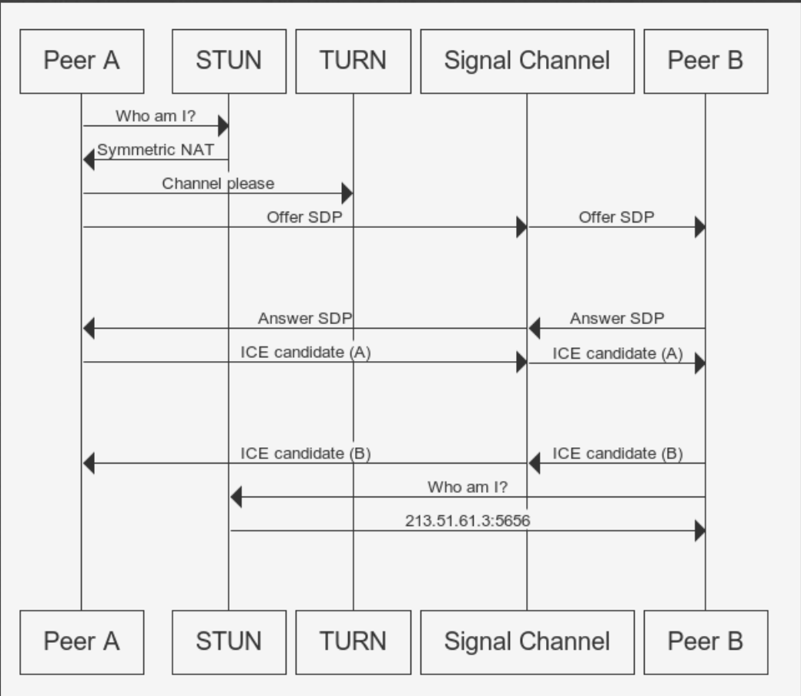

# HTML5 Video 與 WebRTC

## HTML5 Video

### 1.有關canvas串流

參考此  
[https://github.com/EasonWang01/Node.js-stream-video/tree/master/Desktop/Node.js-stream-video-master](https://github.com/EasonWang01/Node.js-stream-video/tree/master/Desktop/Node.js-stream-video-master)

但其原理為使用canvas擷取影像，並使用websocket傳遞canvas資料，所以只有影像，這種做法client端用來顯示的 dataURL會持續改變，所以雖然是串流，但畫面會有閃爍問題

### 2.從HTML5錄製影片並下載

教學

[https://developers.google.com/web/updates/2016/01/mediarecorder](https://developers.google.com/web/updates/2016/01/mediarecorder)

Source code

[https://github.com/webrtc/samples/blob/gh-pages/src/content/getusermedia/record/js/main.js](https://github.com/webrtc/samples/blob/gh-pages/src/content/getusermedia/record/js/main.js)

其原理為使用 `navigator.mediaDevices.getUserMedia`存取網頁攝影機後使用`new MediaRecorder`錄製

而MediaRecorder接到資料後要存入blob

```javascript
const haveLoadedMetadata = stream => {
      const video = document.querySelector("#localVideo");
      video.srcObject = stream;
      video.play();
      return new Promise(resolve => video.onloadedmetadata = () => resolve(stream)); 
    };
    var constraints = { audio: true, video: { width: 400, height: 200 } };

    navigator.mediaDevices
      .getUserMedia(constraints)
      .then(mediaStream => haveLoadedMetadata(mediaStream))
      .then((mediaStream) => {
          var options = { mimeType: "video/webm; codecs=vp9" };
          const recorder = new MediaRecorder(mediaStream, options);
          recorder.ondataavailable = (e) => {
            console.log(e) //這裡記得要呼叫 recorder.stop() 才會有  ondataavailable
          }
          recorder.start();
      setTimeout(() => {
        recorder.stop()
      }, 2000);
     })
    .catch(function (err) {
      console.log(err.name + ": " + err.message);
    });
    
    
//或是可以用第三方模組 msr
import MediaStreamRecorder from "msr";
var multiStreamRecorder = new MediaStreamRecorder.MultiStreamRecorder(
   mediaStream // from getUserMedia
);
multiStreamRecorder.ondataavailable = function (blob) {
  // POST/PUT "Blob" using FormData/XHR2
  ws.send(blob.video);
};
multiStreamRecorder.start(3000);
```

之後再把blob轉格式

`var superBuffer = new Blob(blob1, {type: 'video/webm'});`

最後轉為可用在url的型態

```text
window.URL.createObjectURL(superBuffer)
```

把他放到video的src即可

> 可參考mediaSource 模式：
>
> [https://github.com/webrtc/samples/blob/gh-pages/src/content/getusermedia/record/js/main.js](https://github.com/webrtc/samples/blob/gh-pages/src/content/getusermedia/record/js/main.js)

### 3. getUserMedia streaming with WebSocket

後來想到可以使用將影片擷取10秒一格並分開連續傳送給client達到串流的效果，但一樣因為最後要在前端將video.srcObject 改為blob，只要更改video src都會造成畫面閃爍

client

```javascript
import React, { useEffect } from "react";
import MediaStreamRecorder from "msr";
import "./App.css";

const ws = new WebSocket("ws://localhost:3003");

function App() {
  useEffect(() => {
    const video = document.querySelector("#clientVideo");
    video.onloadedmetadata = function (e) {
      video.play();
    };
    ws.onopen = () => {
      console.log("open");
    };
    ws.onmessage = (msg) => {
      if (msg.data instanceof Blob) {
        const video = document.querySelector("#clientVideo");
        video.src = window.URL.createObjectURL(msg.data);
      }
    };
  });
  const send = () => {
    var constraints = { audio: true, video: { width: 400, height: 200 } };

    navigator.mediaDevices
      .getUserMedia(constraints)
      .then((mediaStream) => {
        const video = document.querySelector("#localVideo");
        video.srcObject = mediaStream;
        video.onloadedmetadata = function (e) {
          video.play();
        };

        var multiStreamRecorder = new MediaStreamRecorder.MultiStreamRecorder(
          mediaStream
        );
        multiStreamRecorder.ondataavailable = function (blob) {
          // POST/PUT "Blob" using FormData/XHR2
          ws.send(blob.video);
        };
        multiStreamRecorder.start(7000);
      })
      .catch(function (err) {
        console.log(err.name + ": " + err.message);
      });
  };
  return (
    <div className="App">
      <video id="localVideo"></video>
      <button onClick={() => send()}>send stream</button>
      <div style={{ width: 400, border: "1px solid black", margin: "0 auto" }}>
        <div>client</div>
        <video id="clientVideo" autoPlay></video>
      </div>
    </div>
  );
}

export default App;

```

server

```javascript
const WebSocket = require('ws');

const wss = new WebSocket.Server({ port: 3003 });

wss.on('connection', function connection(ws) {
  ws.on('message', (message) => {
    try {
      console.log(message);
      console.log(Buffer.isBuffer(message))
      ws.send(message);
    } catch(err) {
      console.log(err)
    }
  });
  ws.send('something');
});
```

> 但因為video src 每次更新後畫面會閃爍


### 4. 之後有了mediaSource API

```javascript
import React, { useEffect } from "react";
import MediaStreamRecorder from "msr";
import "./App.css";

const ws = new WebSocket("ws://localhost:3003");

function App() {
  useEffect(() => {
    const video = document.querySelector("#clientVideo");
    video.onloadedmetadata = function (e) {
      video.play();
    };
    var mediaSource = new MediaSource();
    var mediaBuffer;
    var queue = [];
    video.src = window.URL.createObjectURL(mediaSource);

    mediaSource.addEventListener(
      "sourceopen",
      function (e) {
        mediaBuffer = mediaSource.addSourceBuffer('video/mp4; codecs="avc1.64001E"');
        mediaBuffer.addEventListener("update", function () {
          // wait for mediaBuffer update to fire before setting the new duration
          if (queue.length > 0 && !mediaBuffer.updating) {
            mediaBuffer.appendBuffer(queue.shift());
          }
        });
      },
      false
    );

    ws.onopen = () => {
      console.log("open");
    };
    ws.onmessage = (msg) => {
      if (msg.data instanceof Blob) {
        if (mediaBuffer.updating || queue.length > 0) {
          (msg.data).arrayBuffer().then((buffer) => {
            queue.push(buffer);
          });
        } else {
          (msg.data).arrayBuffer().then((buffer) => {
            console.log(buffer)
            mediaBuffer.appendBuffer(buffer);
          });
        }
      }
    };
  });
  const send = () => {
    var constraints = { audio: true, video: { width: 400, height: 200 } };

    navigator.mediaDevices
      .getUserMedia(constraints)
      .then((mediaStream) => {
        const video = document.querySelector("#localVideo");
        video.srcObject = mediaStream;
        video.onloadedmetadata = function (e) {
          video.play();
        };

        var multiStreamRecorder = new MediaStreamRecorder.MultiStreamRecorder(
          mediaStream
        );
        multiStreamRecorder.ondataavailable = function (blob) {
          // POST/PUT "Blob" using FormData/XHR2
          ws.send(blob.video);
        };
        multiStreamRecorder.start(7000);
      })
      .catch(function (err) {
        console.log(err.name + ": " + err.message);
      });
  };
  return (
    <div className="App">
      <video id="localVideo"></video>
      <button onClick={() => send()}>send stream</button>
      <div style={{ width: 400, border: "1px solid black", margin: "0 auto" }}>
        <div>client</div>
        <video id="clientVideo" autoPlay></video>
      </div>
    </div>
  );
}

export default App;

```

但接著會出現以下問題



> 問題在於使用
>
> ```text
> video/webm; codecs="vp8"
>
> 將其改為
>
> video/mp4; codecs="avc1.64001E"
>
> 就不會有錯誤
> ```

## WebRTC串流



## 名詞:

[https://blog.mozilla.com.tw/posts/3261/webrtc-相關縮寫名詞簡介](https://blog.mozilla.com.tw/posts/3261/webrtc-相關縮寫名詞簡介)

## 範例:

[https://shanetully.com/2014/09/a-dead-simple-webrtc-example/](https://shanetully.com/2014/09/a-dead-simple-webrtc-example/)

[https://github.com/shanet/WebRTC-Example](https://github.com/shanet/WebRTC-Example)

以上兩個為很好且簡單的範例，上面是文章下面是程式碼。

Client 過程

```text
1. 初始化連線: new RTCPeerConnection，並加入本地影像 peerConnection.addStream(localStream);

2. 設定SDP: peerConnection.setLocalDescription

3. 在本地蒐集到ice後傳送給另一個peer: onicecandidate 並且傳送 serverConnection.send
(ICE candidate可能接收到多個)

4. 另一個peer接到ice後把ice加入： peerConnection.addIceCandidate

5. 接收到視訊：peerConnection.ontrack = gotRemoteStream

6. 顯示遠端視訊： remoteVideo.srcObject = event.streams[0]
```

Server

> 單純廣播所有接收到的訊息給連線的client

```javascript
const wss = new WebSocketServer({server: httpsServer});

wss.on('connection', function(ws) {
  ws.on('message', function(message) {
    // Broadcast any received message to all clients
    console.log('received: %s', message);
    wss.broadcast(message);
  });
});

wss.broadcast = function(data) {
  this.clients.forEach(function(client) {
    if(client.readyState === WebSocket.OPEN) {
      client.send(data);
    }
  });
};
```

