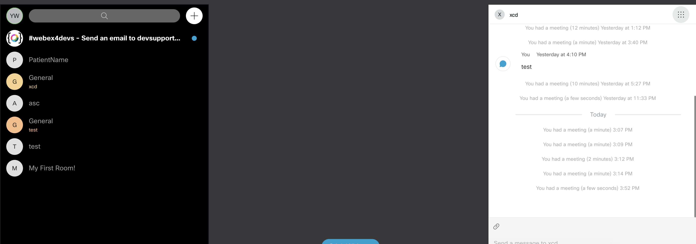

# WebEX API

## 前言

WebEx 是 Cisco 旗下的影音串流服務，包含webex meeting 和 webex Teams。

目前webex 許多 API response time都稍微久，不過他在跨平台上還是做得不錯的。

webex meeting 目前 API 許久沒維護，所以以下教學以 webex Teams 為主。

## 連結：

網頁版teams: [https://teams.webex.com/signin](https://teams.webex.com/signin)

開發者頁面:[https://developer.webex.com/](https://developer.webex.com/)

互動式教學:[https://developer.cisco.com/learning/](https://developer.cisco.com/learning/)

詳細 JS SDK 文件:[https://github.com/webex/webex-js-sdk/blob/master/packages/node\_modules/%40webex/plugin-meetings/README.md](https://github.com/webex/webex-js-sdk/blob/master/packages/node_modules/%40webex/plugin-meetings/README.md)

Restful API 文件:[https://developer.webex.com/docs/api/v1/](https://developer.webex.com/docs/api/v1/)

Widge文件：[https://code.s4d.io/widget-demo/production/index.html](https://code.s4d.io/widget-demo/production/index.html)

## 開發

1.創建 access token: 註冊帳號後到此拉下去一點即可看到 [https://developer.webex.com/docs/api/getting-started](https://developer.webex.com/docs/api/getting-started)

2.或是可以創建guest issuer 之後發請求取得access token，但是guest issuer必須要付費帳號才能創建

以下為取得 guest issuer  取得access token 的過程

```javascript
const https = require('https');
const jwt = require('jsonwebtoken');

const payload = {
  sub: 'patientId',
  name: 'PatientName',
  iss: 'Y2lzY29zcGFyazovL3VzL09SR0FOSVpBVElPTi9mYTVjODdjZS02ODcwLTRjOWQtYWM3Yi03ZWFhY2QxZTZjMTM',
};

const guestToken = jwt.sign(payload, Buffer.from('SnLNSN9HGwnDa2ZttWPwCVA6kgZ8+GrwOGMJEcYr2l0==', 'base64'), {
  expiresIn: '8h',
});

const options = {
  hostname: 'api.ciscospark.com',
  port: 443,
  path: '/v1/jwt/login',
  method: 'POST',
  headers: {
    Authorization: `Bearer ${guestToken}`,
  },
};

function generateAccessToken() {
  return new Promise((resolve, reject) => {
    const req = https.request(options, res => {
      let body = '';

      res.on('data', function (chunk) {
        body = body + chunk;
      });

      res.on('end', function () {
        const { token } = JSON.parse(body);
        resolve(token);
      });
    });

    req.on('error', e => {
      console.error(e);
    });
    req.end();
  });
}

module.exports = {
  generateAccessToken,
};
```

## 測試

1. 可以開啟webex teams APP，如果有人打過去，不論是用email 或是 房間ID 都會在APP顯示


## React Widget

 [https://github.com/webex/react-widgets](https://github.com/webex/react-widgets)

> 使用React Widget demo local 會有錯誤，要輸入 `npm rebuild node-sass` 與使用`Node.js v10.16.0`

包含space widget \(右\) 與 Recents Widget \(左\)




## 可能錯誤

1. API 錯誤

```text
1.Unhandled Rejection (BadRequest): (6400007) incompatible device: reasons are received invalid message type 'ANSWER' in state 'ROAP_STATE_INIT'

2.state: LEFT invalid for current operation.

3.Unhandled Rejection (Conflict): Conflict PUT

4.User has excessive device registrations POST
```

> 以上錯誤都建議先更換guest issuer token 試試，第四個錯誤官方建議清除session [https://idbroker.webex.com/idb/profile\#/tokens](https://idbroker.webex.com/idb/profile#/tokens) 不過測試後無效

2. 開發頁面登入 session錯誤

時常登入使用者後又說頁面找不到404，或是使用者重登後卻沒有更新的情況，建議 瀏覽器硬加載

