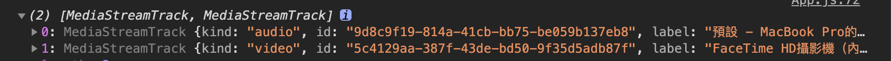

# WebRTC 進階

## 串流中關閉與開啟視訊

```javascript
  let localVideoEnabled = true;
  let localAudioEnabled = true;
  
  function handleVideoDisconnect() {
    localVideoEnabled = !localVideoEnabled;
    localStream.getTracks()[1].enabled = localVideoEnabled;
  }
  
  function handleAudioDisconnect() {
    localAudioEnabled = !localAudioEnabled;
    localStream.getTracks()[0].enabled = localAudioEnabled;
  }
  
  // 如果用 track.stop() 會永久關閉
```

> 可選擇關音訊或視訊。



