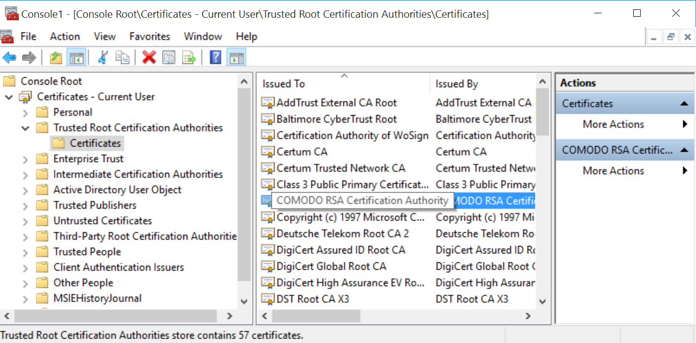

# HTTPS原理

## HTTPS 範例

```javascript
const https = require('https')

const data = JSON.stringify({
  todo: 'Buy the milk'
})

const options = {
  hostname: 'test.com',
  port: 443,
  path: '/todos',
  method: 'POST',
  headers: {
    'Content-Type': 'application/json',
    'Content-Length': data.length
  }
}

const req = https.request(options, (res) => {
  console.log(`statusCode: ${res.statusCode}`)

  res.on('data', (d) => {
    process.stdout.write(d)
  })
})

req.on('error', (error) => {
  console.error(error)
})

req.write(data)
req.end()
```

## HTTPS 原理

### 流程可參考

[https://en.wikipedia.org/wiki/HTTPS](https://en.wikipedia.org/wiki/HTTPS)

### 如何驗證 server 證書

[https://www.zhihu.com/question/37370216/answer/74060132](https://www.zhihu.com/question/37370216/answer/74060132)

### windows中可以如下查看在認證列表內的機構證書

> [http://www.thewindowsclub.com/manage-trusted-root-certificates-windows](http://www.thewindowsclub.com/manage-trusted-root-certificates-windows)
>
> [https://www.youtube.com/watch?v=03DEqScfXlc](https://www.youtube.com/watch?v=03DEqScfXlc)



### TLS handshake

[https://www.cloudflare.com/zh-tw/learning/ssl/what-happens-in-a-tls-handshake/](https://www.cloudflare.com/zh-tw/learning/ssl/what-happens-in-a-tls-handshake/)

