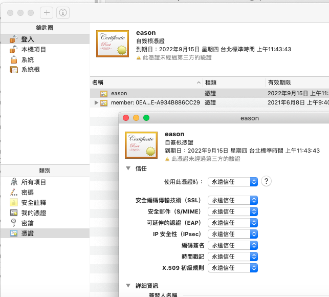

# 建立自簽發 HTTPS 證書

以下會包含建立自己的 Root Certificate Authority 並且簽發證書後給瀏覽器使用。

每個 OS 在作業系統安裝時會自帶一系列的 root 憑證：

[https://support.apple.com/en-us/HT202858](https://support.apple.com/en-us/HT202858) 

## 原理

**憑證中心** \( certificate authority \)，也稱為 CA，來幫公鑰做認證。**憑證中心**用自己的私鑰，對 A 的公鑰和一些相關資訊一起加密，生成**數位憑證**（Digital Certificate），之後 A 在傳遞訊息時需要同時附上此**數位憑證**。

B 收到 A 傳來的訊息後訊息後用 CA 的公鑰解開**數位憑證**，就可以拿到 A 真正的公鑰。就不怕再被壞人替換公鑰了。

當 B 想私密傳送訊息給 A 時，可以用 A 的公鑰將訊息加密，A 收到加密訊息後用自己的私鑰再將訊息解密。以上也是目前瀏覽器之HTTPS 運作之簡單原理。

## 實作

1.建立 Root Certificate Authority，產生私鑰

```text
openssl genrsa -des3 -out myCA.key 2048
```

2.產生證書

```text
openssl req -x509 -new -nodes -key myCA.key -sha256 -days 825 -out myCA.pem
```

3.將證書放入 keychain ，並設定為信任



3.5

產生另一組 private key 與 csr

```text
openssl genrsa -out localhost.key 2048
openssl req -new -key localhost.key -out localhost.csr
```


4.新增 Subject Alternative Name \(SAN\) extension  

localhost.ext

```text
authorityKeyIdentifier=keyid,issuer
basicConstraints=CA:FALSE
keyUsage = digitalSignature, nonRepudiation, keyEncipherment, dataEncipherment
subjectAltName = @alt_names
[alt_names]
DNS.1 = localhost
```

5.產生簽發過的 certificate

```text
openssl x509 -req -in localhost.csr -CA myCA.pem -CAkey myCA.key -CAcreateserial \
-out localhost.crt -days 825 -sha256 -extfile localhost.ext
```

6. 寫一個 localhost server 來測試

```javascript
const https = require('https');
const fs = require('fs');
const options = {
  key: fs.readFileSync('./localhost.key'),
  cert: fs.readFileSync('./localhost.crt')
};
https
  .createServer(options, (req, res) => {
    res.writeHead(200);
    res.end('Testing certificate');
  })
  .listen(8080);
```

即可看到瀏覽器不會再跳出不安全的警告。

## 完整的 script

```bash
#!/bin/sh

openssl genrsa -des3 -out myCA.key 2048
[ -s ./myCA.key ] && echo "Generate pem from key\n" && openssl req -x509 -new -nodes -key myCA.key -sha256 -days 825 -out myCA.pem
echo "Adding cert to keychain\nPlease type in computer password" && sudo security add-trusted-cert -d -r trustRoot -k /Library/Keychains/System.keychain ./myCA.pem
echo "authorityKeyIdentifier=keyid,issuer
basicConstraints=CA:FALSE
keyUsage = digitalSignature, nonRepudiation, keyEncipherment, dataEncipherment
subjectAltName = @alt_names
[alt_names]
DNS.1 = localhost" >> localhost.ext
echo "Generate client key\n" && openssl genrsa -out localhost.key 2048
echo "Gererate csr from key\n" && openssl req -new -key localhost.key -out localhost.csr
echo "Generate signed certficate\n" && openssl x509 -req -in localhost.csr -CA myCA.pem -CAkey myCA.key -CAcreateserial \
-out localhost.crt -days 825 -sha256 -extfile localhost.ext
```

## 注意事項

因為 macOS 的憑證限制為 825 天，所以簽發證書時要注意



## 參考資料:



## Chain of Trust

{% embed url="https://medium.com/@clu1022/%E9%82%A3%E4%BA%9B%E9%97%9C%E6%96%BCssl-tls%E7%9A%84%E4%BA%8C%E4%B8%89%E4%BA%8B-%E5%8D%81%E4%BA%8C-chain-of-trust-f00da1f2cc15" %}

## 申請加入 root CA

Chrome 是會去找電腦OS內的預設



Ｍozilla 是自己有一套trust root CA列表



## Websocket ERR\_CERT\_AUTHORITY\_INVALID

先用瀏覽器開啟 https 的 URL 然後點選不安全下面的繼續前往，之後該 wss URL 就可以正常使用。


