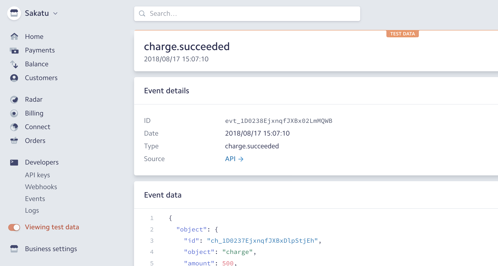
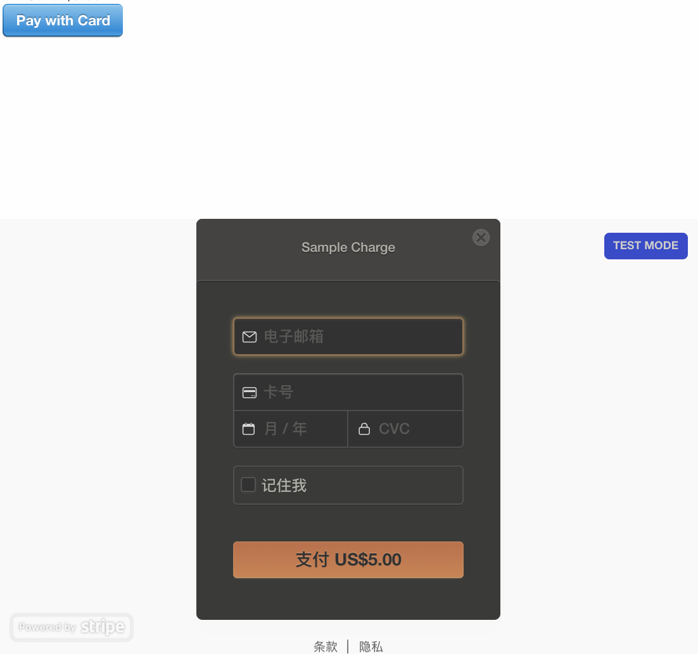
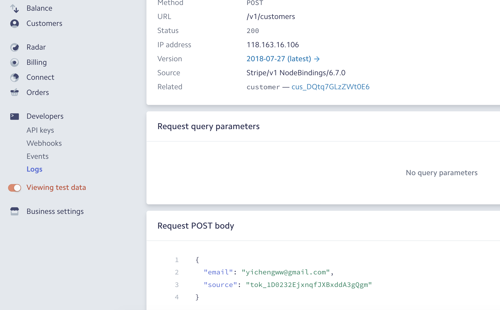
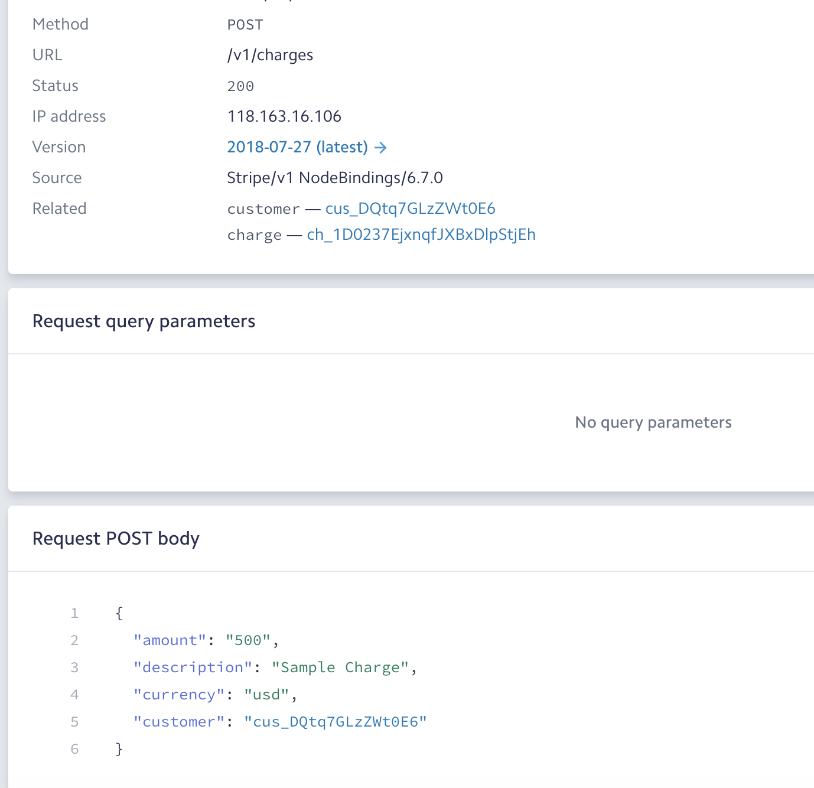
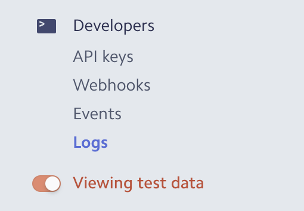

# Stripe 串接

## Stripe

stripe為一個金流串接服務提供者，其特點在於串接簡單。

#### 1.先到其網站註冊帳號：[https://stripe.com](https://stripe.com)

> 需要具有其許可國家內的銀行帳號與手機。

#### 2.接著就是試著串接API

* 程式範例:[https://stripe.com/docs/checkout/express](https://stripe.com/docs/checkout/express)
* 商店Dashboard:[https://dashboard.stripe.com](https://dashboard.stripe.com)

> 建立商店後會可以進入一個Dashboard介面，在左下方把Test打開即可進入測試模式。
>
> 

#### 3.程式範例：

Server.js

```javascript
const keyPublishable = process.env.PUBLISHABLE_KEY;
const keySecret = process.env.SECRET_KEY;

const app = require("express")();
const stripe = require("stripe")(keySecret);

app.set("view engine", "pug");
app.use(require("body-parser").urlencoded({extended: false}));

app.get("/", (req, res) =>
  res.render("index.pug", {keyPublishable}));

app.post("/charge", (req, res) => {
  let amount = 500;

  stripe.customers.create({
     email: req.body.stripeEmail,
    source: req.body.stripeToken
  })
  .then(customer => {
    stripe.charges.create({
      amount,
      description: "Sample Charge",
         currency: "usd",
         customer: customer.id
    })
    console.log(req.body.stripeToken)
    console.log(req.body.stripeToken)
  }
  )
  .then(charge => res.render("charge.pug"));
});

app.listen(4567);
```

views/index.pug

```text
<html>
<head>
<script src="https://checkout.stripe.com/v2/checkout.js"></script></head>

<body>
    <form action="/charge" method="post">
        <article><label>Amount: $5.00</label></article>
        <script class="stripe-button" data-key="pk_test_nk4UQNZM8NWjfvmhKjfZnWav" src="//checkout.stripe.com/v2/checkout.js" data-locale="auto" data-description="Sample Charge" data-amount="500"></script>
    </form>
</body>

</html>
```

views/charge.pug

```markup
h2 You successfully paid <strong>$5.00</strong>!
```

### 原理：

要求客戶付款的都在checkout文件：[https://stripe.com/docs/checkout](https://stripe.com/docs/checkout)

#### 1.引入stripe的官方script後，加入一個元件

```markup
    <form action="/charge" method="post">
        <article><label>Amount: $5.00</label></article>
        <script class="stripe-button" data-key="pk_test_nk4UQNZM8NWjfvmhKjfZnWav" src="//checkout.stripe.com/v2/checkout.js" data-locale="auto" data-description="Sample Charge" data-amount="500"></script>
    </form>
```

> 此元件會產生官方的付款按鈕

#### 2.之後點擊按鈕後會要求填入信用卡資訊與email



#### 3.送出後會發送Request給stripe

然後stripe成功後回傳request給剛才元件上寫的Endpoint，也就是form上寫的action位置

#### 4.接著我們後端App.js接到後會執行

```javascript
  stripe.customers.create({
     email: req.body.stripeEmail,
    source: req.body.stripeToken
  })
```

產生如下請求

#### 5.最後前一個請求返回後會進行確認請求

```javascript
    stripe.charges.create({
      amount,
      description: "Sample Charge",
         currency: "usd",
         customer: customer.id
    })
```



> 以上的請求詳細內容都可以在左側log tab看到
>
> 

## 使用React

可使用此模組：

[https://github.com/azmenak/react-stripe-checkout](https://github.com/azmenak/react-stripe-checkout)

```text
npm install react-stripe-checkout --save
```

```javascript
import StripeCheckout from 'react-stripe-checkout';

....

<StripeCheckout
  stripeKey="pubkey"
  token={this.onToken}
/>
```

```javascript
  onToken = (res) => {
    axios.post(`${window.API_HOST}/stripepay`, res)
      .then((response) => {
        window.alert('成功', '', 'success');
      })
      .catch(err => {
        window.alert('失敗，請重試');
      })
  }
```

Server.js

```javascript
app.post("/stripepay", (req, res) => {
    const stripe = require("stripe")("sk_test_LtpwSuF1PsGKLLv3rlVCTZlN");
    let amount = 500;
    stripe.customers.create({
       email: req.body.email,
      source: req.body.id
    })
    .then(customer =>
      stripe.charges.create({
        amount,
        description: "Sample Charge",
           currency: "usd",
           customer: customer.id
      }))
    .then(charge => {
      console.log(charge)
      res.end('ok');
    });
});
```

## 客製化按鈕

[https://github.com/stripe/elements-examples](https://github.com/stripe/elements-examples)

