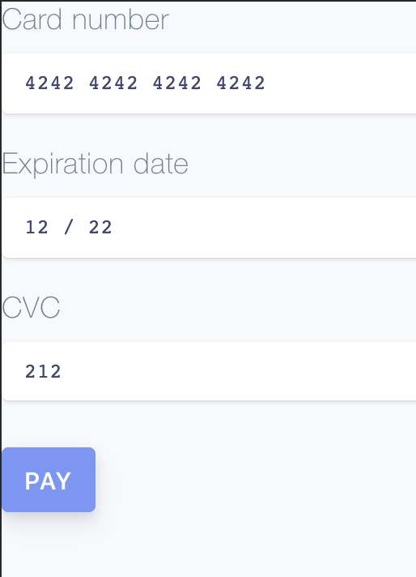

# Stripe 串接

## Stripe

stripe為一個金流串接服務提供者，其特點在於串接簡單。

API文件：[https://stripe.com/docs/api](https://stripe.com/docs/api)

#### 1.先到其網站註冊帳號：[https://stripe.com](https://stripe.com)

> 需要具有其許可國家內的銀行帳號與手機。

#### 2.接著就是試著串接API

* 程式範例:[https://stripe.com/docs/checkout/express](https://stripe.com/docs/checkout/express)
* 商店Dashboard:[https://dashboard.stripe.com](https://dashboard.stripe.com)

> 建立商店後會可以進入一個Dashboard介面，在左下方把Test打開即可進入測試模式。
>
> 

#### 3.程式範例：

Server.js

```javascript
const keyPublishable = process.env.PUBLISHABLE_KEY;
const keySecret = process.env.SECRET_KEY;

const app = require("express")();
const stripe = require("stripe")(keySecret);

app.set("view engine", "pug");
app.use(require("body-parser").urlencoded({extended: false}));

app.get("/", (req, res) =>
  res.render("index.pug", {keyPublishable}));

app.post("/charge", (req, res) => {
  let amount = 500;

  stripe.customers.create({
     email: req.body.stripeEmail,
    source: req.body.stripeToken
  })
  .then(customer => {
    stripe.charges.create({
      amount,
      description: "Sample Charge",
         currency: "usd",
         customer: customer.id
    })
    console.log(req.body.stripeToken)
    console.log(req.body.stripeToken)
  }
  )
  .then(charge => res.render("charge.pug"));
});

app.listen(4567);
```

views/index.pug

```text
<html>
<head>
<script src="https://checkout.stripe.com/v2/checkout.js"></script></head>

<body>
    <form action="/charge" method="post">
        <article><label>Amount: $5.00</label></article>
        <script class="stripe-button" data-key="pk_test_nk4UQNZM8NWjfvmhKjfZnWav" src="//checkout.stripe.com/v2/checkout.js" data-locale="auto" data-description="Sample Charge" data-amount="500"></script>
    </form>
</body>

</html>
```

views/charge.pug

```markup
h2 You successfully paid <strong>$5.00</strong>!
```

### 原理：

要求客戶付款的都在checkout文件：[https://stripe.com/docs/checkout](https://stripe.com/docs/checkout)

#### 1.引入stripe的官方script後，加入一個元件

```markup
    <form action="/charge" method="post">
        <article><label>Amount: $5.00</label></article>
        <script class="stripe-button" data-key="pk_test_nk4UQNZM8NWjfvmhKjfZnWav" src="//checkout.stripe.com/v2/checkout.js" data-locale="auto" data-description="Sample Charge" data-amount="500"></script>
    </form>
```

> 此元件會產生官方的付款按鈕

#### 2.之後點擊按鈕後會要求填入信用卡資訊與email


#### 3.送出後會發送Request給stripe

然後stripe成功後回傳request給剛才元件上寫的Endpoint，也就是form上寫的action位置

#### 4.接著我們後端App.js接到後會執行

```javascript
  stripe.customers.create({
     email: req.body.stripeEmail,
    source: req.body.stripeToken
  })
```

產生如下請求

#### 5.最後前一個請求返回後會進行確認請求

```javascript
    stripe.charges.create({
      amount,
      description: "Sample Charge",
         currency: "usd",
         customer: customer.id
    })
```


> 以上的請求詳細內容都可以在左側log tab看到
>
> 

## 使用React

可使用此模組：

[https://github.com/stripe/react-stripe-js](https://github.com/stripe/react-stripe-js)

文件：[https://stripe.com/docs/stripe-js/react](https://stripe.com/docs/stripe-js/react)

> 測試用信用卡：4242 4242 4242 4242
>
> 測試用的key也不同

#### 流程：

1.使用官方的元件輸入信用卡號碼與資訊，然後前端呼叫`stripe.createPaymentMethod` 傳給後端

2.後端呼叫並產生`stripe.paymentIntents` 然後將`paymentIntent.client_secret` 傳給前端

3.前端使用`stripe.confirmCardPayment` 加上剛才的`paymentIntent.client_secret`確認交易

4.成功後再發一個request給後端更新使用者購買狀態

```text
yarn add @stripe/react-stripe-js @stripe/stripe-js
```

```javascript
import React from "react";
import { loadStripe } from "@stripe/stripe-js";
import axios from "axios";
import {
  CardElement,
  Elements,
  ElementsConsumer
} from "@stripe/react-stripe-js";

class CheckoutForm extends React.Component {
  handleSubmit = async event => {
    const billing_details = {
      email: "Jenny@gmail.com",
      name: "Jenny Rosen"
    };
    event.preventDefault();
    const { stripe, elements } = this.props;
    const { error, paymentMethod } = await stripe.createPaymentMethod({
      type: "card",
      card: elements.getElement(CardElement),
      billing_details,
    });
    if (!error) {
      axios
        .post(`http://localhost:8081/stripepay`, paymentMethod)
        .then(async response => {
          const { client_secret } = response.data;
          if (client_secret) {
            const result = await stripe.confirmCardPayment(client_secret, {
              payment_method: {
                card: elements.getElement(CardElement),
                billing_details,
              }
            });
            if (result.paymentIntent.status === "succeeded") {
              window.alert("成功", "", "success");
              //TODO send another request to update backend customer status
            } else {
              window.alert("付款失敗");
            }
          }
        })
        .catch(err => {
          console.log(err);
        });
    } else {
      console.log(error);
    }
  };

  render() {
    const { stripe } = this.props;
    return (
      <form onSubmit={this.handleSubmit}>
        <CardElement />
        <button type="submit" disabled={!stripe}>
          Pay
        </button>
      </form>
    );
  }
}

const InjectedCheckoutForm = () => (
  <ElementsConsumer>
    {({ stripe, elements }) => (
      <CheckoutForm stripe={stripe} elements={elements} />
    )}
  </ElementsConsumer>
);

const stripePromise = loadStripe("pk_test_....");

const App = () => (
  <Elements stripe={stripePromise}>
    <InjectedCheckoutForm />
  </Elements>
);

export default App;
```

Server.js

```javascript
const express = require('express');
const app = express();
const bodyParser = require('body-parser');
const cors = require('cors')

// create application/json parser
app.use(bodyParser.json());
// create application/x-www-form-urlencoded parser
app.use(bodyParser.urlencoded({ extended: false }));
app.use(cors())

app.post("/stripepay", async (req, res) => {
  console.log(req.body)
  const stripe = require("stripe")("sk_test_....");
  let amount = 1700;
  const paymentIntent = await stripe.paymentIntents.create({
    amount,
    description: 'Im description',
    currency: 'twd',
    payment_method_types: ['card'],
    metadata: {
      order_id: 6735,
    },
  });
  res.end(JSON.stringify({
    client_secret: paymentIntent.client_secret,
  }))
});

app.listen(8081, () => console.log('app start'));
```

## 確認付款

使用`stripe.paymentIntents.create` 回傳的client secret 並丟給前端，然後前端使用`stripe.confirmCardPayment(clientSecret)`

來判斷

[https://stripe.com/docs/payments/payment-intents/verifying-status](https://stripe.com/docs/payments/payment-intents/verifying-status)

## 客製化按鈕

[https://github.com/stripe/elements-examples](https://github.com/stripe/elements-examples)

[https://stripe.com/docs/stripe-js](https://stripe.com/docs/stripe-js)

可直接加上css

```css
input, 
.StripeElement {
  display: block;
  margin: 10px 0 20px 0;
}

.StripeElement.PaymentRequestButton {
  height: 40px;
}
```

## 前端完整版範例:

App.js

```javascript
import React, { useMemo } from "react";
import {
  useStripe,
  useElements,
  ElementsConsumer,
  Elements,
  CardNumberElement,
  CardCvcElement,
  CardExpiryElement
} from "@stripe/react-stripe-js";
import { loadStripe } from "@stripe/stripe-js";
import "./App.css";
import axios from "axios";

const useOptions = () => {
  const options = useMemo(() => ({
    style: {
      base: {
        color: "#424770",
        letterSpacing: "0.025em",
        fontFamily: "Source Code Pro, monospace",
        "::placeholder": {
          color: "#aab7c4"
        }
      },
      invalid: {
        color: "#9e2146"
      }
    }
  }));

  return options;
};

const SplitForm = () => {
  const stripe = useStripe();
  const elements = useElements();
  const options = useOptions();

  const handleSubmit = async event => {
    const billing_details = {
      email: "Jenny@gmail.com",
      name: "Jenny Rosen"
    };
    event.preventDefault();
    const { error, paymentMethod } = await stripe.createPaymentMethod({
      type: "card",
      card: elements.getElement(CardNumberElement),
      billing_details
    });
    if (!error) {
      axios
        .post(`http://localhost:8081/stripepay`, paymentMethod)
        .then(async response => {
          const { client_secret } = response.data;
          if (client_secret) {
            const result = await stripe.confirmCardPayment(client_secret, {
              payment_method: {
                card: elements.getElement(CardNumberElement),
                billing_details
              }
            });
            if (result.paymentIntent.status === "succeeded") {
              window.alert("成功", "", "success");
              //TODO send another request to update backend customer status
            } else {
              window.alert("付款失敗");
            }
          }
        })
        .catch(err => {
          console.log(err);
        });
    } else {
      console.log(error);
    }
  };
  return (
    <form className="StripeForm" onSubmit={handleSubmit}>
      <label>
        Card number
        <CardNumberElement
          options={options}
          onReady={() => {
            console.log("CardNumberElement [ready]");
          }}
          onChange={event => {
            console.log("CardNumberElement [change]", event);
          }}
          onBlur={() => {
            console.log("CardNumberElement [blur]");
          }}
          onFocus={() => {
            console.log("CardNumberElement [focus]");
          }}
        />
      </label>
      <label>
        Expiration date
        <CardExpiryElement
          options={options}
          onReady={() => {
            console.log("CardNumberElement [ready]");
          }}
          onChange={event => {
            console.log("CardNumberElement [change]", event);
          }}
          onBlur={() => {
            console.log("CardNumberElement [blur]");
          }}
          onFocus={() => {
            console.log("CardNumberElement [focus]");
          }}
        />
      </label>
      <label>
        CVC
        <CardCvcElement
          options={options}
          onReady={() => {
            console.log("CardNumberElement [ready]");
          }}
          onChange={event => {
            console.log(event);
            console.log("CardNumberElement [change]", event);
          }}
          onBlur={() => {
            console.log("CardNumberElement [blur]");
          }}
          onFocus={() => {
            console.log("CardNumberElement [focus]");
          }}
        />
      </label>
      <button type="submit" disabled={!stripe}>
        Pay
      </button>
    </form>
  );
};

const InjectedCheckoutForm = () => (
  <ElementsConsumer>
    {({ stripe, elements }) => (
      <SplitForm stripe={stripe} elements={elements} />
    )}
  </ElementsConsumer>
);

const stripePromise = loadStripe("pk_test_");

const App = () => (
  <Elements stripe={stripePromise}>
    <InjectedCheckoutForm />
  </Elements>
);

export default App;
```

App.css

```css
* {
  box-sizing: border-box;
}

body,
html {
  background-color: #f6f9fc;
  font-size: 18px;
  font-family: Helvetica Neue, Helvetica, Arial, sans-serif;
  margin: 0;
}

.DemoPickerWrapper {
  padding: 0 12px;
  font-family: "Source Code Pro", monospace;
  box-shadow: 0 4px 6px rgba(50, 50, 93, 0.11), 0 1px 3px rgba(0, 0, 0, 0.08);
  border-radius: 3px;
  background: white;
  margin: 24px 0 48px;
  width: 100%;
}

label {
  color: #6b7c93;
  font-weight: 300;
  letter-spacing: 0.025em;
}

input,
.StripeElement {
  display: block;
  margin: 10px 0 20px 0;
  max-width: 500px;
  padding: 10px 14px;
  font-size: 1em;
  font-family: "Source Code Pro", monospace;
  box-shadow: rgba(50, 50, 93, 0.14902) 0px 1px 3px,
    rgba(0, 0, 0, 0.0196078) 0px 1px 0px;
  border: 0;
  outline: 0;
  border-radius: 4px;
  background: white;
}

input::placeholder {
  color: #aab7c4;
}

input:focus,
.StripeElement--focus {
  box-shadow: rgba(50, 50, 93, 0.109804) 0px 4px 6px,
    rgba(0, 0, 0, 0.0784314) 0px 1px 3px;
  -webkit-transition: all 150ms ease;
  transition: all 150ms ease;
}

.StripeElement.IdealBankElement,
.StripeElement.FpxBankElement,
.StripeElement.PaymentRequestButton {
  padding: 0;
}

.StripeElement.PaymentRequestButton {
  height: 40px;
}

.StripeForm button {
  white-space: nowrap;
  border: 0;
  outline: 0;
  display: inline-block;
  height: 40px;
  line-height: 40px;
  padding: 0 14px;
  box-shadow: 0 4px 6px rgba(50, 50, 93, 0.11), 0 1px 3px rgba(0, 0, 0, 0.08);
  color: #fff;
  border-radius: 4px;
  font-size: 15px;
  font-weight: 600;
  text-transform: uppercase;
  letter-spacing: 0.025em;
  background-color: #6772e5;
  text-decoration: none;
  -webkit-transition: all 150ms ease;
  transition: all 150ms ease;
  margin-top: 10px;
}

.StripeForm button:hover {
  color: #fff;
  cursor: pointer;
  background-color: #7795f8;
  transform: translateY(-1px);
  box-shadow: 0 7px 14px rgba(50, 50, 93, 0.1), 0 3px 6px rgba(0, 0, 0, 0.08);
}
```




## 訂閱機制



## 存入卡片資料供後續使用

#### 1.在前端使用`createPaymentMethod` 並發請求給後端之後在後端使用

server.js

```javascript
  const customer = await stripe.customers.create({
    name: 'Jenny',
    email: 'Jenny@gmail.com'
  });
// 記得把 customer.id 存入 DB 

// 並且在paymentIntent加入custom id 欄位

  const paymentIntent = await stripe.paymentIntents.create({
    // .....,
    customer: customer.id,
  });
```

web.js

```javascript
// 新增 setup_future_usage 欄位在confirmCardPayment
const result = await stripe.confirmCardPayment(client_secret, {
  // .....,
 setup_future_usage: 'off_session'
});
```

之後客戶成功刷卡後的付款資訊就會存入stripe

#### 2. 讀取先前存入的付款資訊

```javascript
  const customerId = // 從DB讀取先前 stripe.customers.create 並付款的使用者ID
  const paymentMethods = await stripe.paymentMethods.list({
    customer: customerId,
    type: 'card',
  });
  const paymentIntentSaved = await stripe.paymentIntents.create({
    amount: 1200,
    currency: 'sgd',
    customer: customerId,
    payment_method: paymentMethods.data[0].id,
    off_session: true,
    confirm: true,
  });
  // sending paymentIntentSaved's client_secret to frontend
```

最後把 `paymentIntentSaved` 中的 `client_secret` 給前端然後 `confirmPayment` 即可


[https://stripe.com/docs/payments/save-during-payment](https://stripe.com/docs/payments/save-during-payment)

