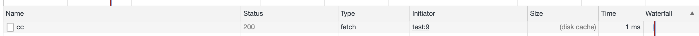

# 瀏覽器快取與緩存（Expires, Last-modified, Cache-Control）

## 瀏覽器快取與緩存（Expires, Last-modified, Cache-Control）

Server 端總共有三種用時間來設定的 cache：

## Expires

我們一樣使用 Node.js server，然後把回應改為以下：

```javascript
res.setHeader("Expires", new Date("2025-02-10").toUTCString())
res.end('123');
```

只要 Expires 後面的參數是未來的時間都會進行緩存。（disk cache）



## Last-modified

與 Expires 相反，只要是日期是過去式都會被快取。

```javascript
res.setHeader("Last-modified", new Date("2005-02-10").toUTCString())
```

> 記得要用UTCString

## Cache-Control

max-age 單位為秒。

```text
res.setHeader('Cache-Control', 'public, max-age=3');
```

超過三秒後要重新去取資料，所以可以一直按重新整理網頁，可以發現三秒後會重新要資料。

> ```text
> private cache (瀏覽器快取)
> public cache (CDN )
> ```

[https://developers.google.com/web/fundamentals/performance/optimizing-content-efficiency/http-caching?hl=zh-tw](https://developers.google.com/web/fundamentals/performance/optimizing-content-efficiency/http-caching?hl=zh-tw)

