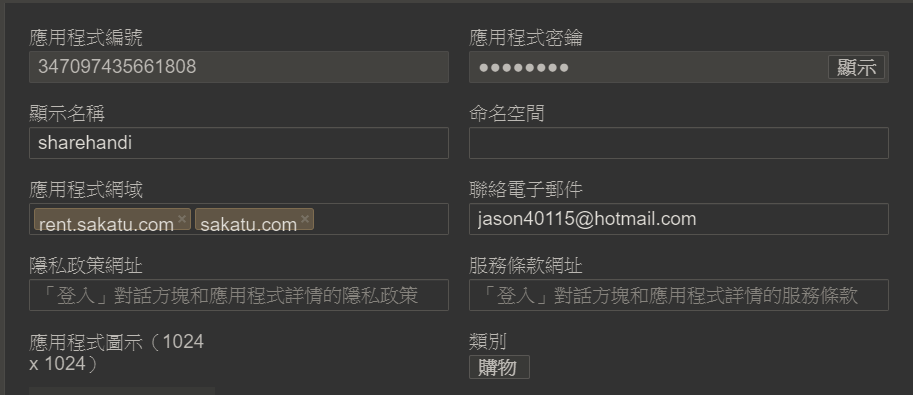

# facebook oauth

## facebook oauth

## 使用流程

1.使用者從UI登入後會回傳access token

2.用access token到 [https://graph.facebook.com/me?access\_token=&lt;...&gt;](https://graph.facebook.com/me?access_token=EAAEZBU9UdDfYBAECdk1FZAyeHpgmYbhL5yGbmqE5om58AVprJrN2xgDh90QMVxNSfH97mIoRTdRK0GHjyPbFZAbMipy7O1tXS8z7pOQRJlIdWqFdj0QuZBiOegV1ZCfXjR0YdaeXagm4H0bXSAEKHWQGqFqWIBz2ViSZBLBpb1VVA9K3ZBCZBeKnYo6aW8a9DcYfW4Ce6n5uaQZDZD) 進行驗證，成功會回傳id, name.

3.取得user id後即可取得其他資訊。

e.g.

```text
curl -i -X GET \
  "https://graph.facebook.com/{your-user-id}/photos
    ?fields=height,width
    &access_token={your-user-access-token}"
```

## 網頁安裝

1.先到此創建  
[https://developers.facebook.com/apps/](https://developers.facebook.com/apps/)

2.點選完後點選choose your platform  
即可依照指示完成步驟

加入sdk

```text
window.fbAsyncInit = function() {
    FB.init({
      appId      : '259990304339055',
      xfbml      : true,
      version    : 'v2.5'
    });
  };

  (function(d, s, id){
     var js, fjs = d.getElementsByTagName(s)[0];
     if (d.getElementById(id)) {return;}
     js = d.createElement(s); js.id = id;
     js.src = "//connect.facebook.net/en_US/sdk.js";
     fjs.parentNode.insertBefore(js, fjs);
   }(document, 'script', 'facebook-jssdk'));
```

在dashboard上填寫網域\[[http://localhost:3000\]與最下方\(http://localhost:3000](http://localhost:3000]與最下方%28http://localhost:3000)\)

如果使用react記得在component加上`const FB = window.FB;`

現在有中文版doc直接看即可

[https://developers.facebook.com/docs/facebook-login/web](https://developers.facebook.com/docs/facebook-login/web)

## \#取得個人資料

在這個網址測試，然後跟根據封包內容來傳

[https://developers.facebook.com/tools/explorer?method=GET&path=me%3Ffields%3Did%2Cname%2Cpicture%2Cemail%2Cfriendlists&version=v2.8](https://developers.facebook.com/tools/explorer?method=GET&path=me%3Ffields%3Did%2Cname%2Cpicture%2Cemail%2Cfriendlists&version=v2.8)

或是直接在網址輸入

```text
https://graph.facebook.com/v2.8/me?access_token=EAADsdbW8NG8BADYzO7XPZCtGpDZC5cuWOZCHBnNhscoZA0hLZBhbaZBgIcB4mN5ZBt4FtivyOENqK6H8eylhk5ywZCraxYQn6QrZAmi4w6Dy8OtVUKSAvZBjii4y91JH2B0s3kTI2xPcXWOlO3t027UnZBWRWnUSHRYWTzKZBlrz7E1BAgZDZD
&fields=id,name,picture,email,friendlists
```

fields可在此查詢

[https://developers.facebook.com/docs/graph-api/reference/user](https://developers.facebook.com/docs/graph-api/reference/user)

如果後端要存入使用著識別，可存入使用者ID，因accessToken會改變

```text
FB.api('/me', {
      access_token : 'EAADsdbW8NG8BAE4mn6HXNGurHew2tW36drhzfA0nZBlxuJUILyQip8M92zt77B8rrXq2o4D3pcZC7sNP5KNgfiLBZCVVYBqKUp5xofZBsvMzFmSpt0c9KWcmmdHugUZBQtVNpoerKj4G0yaVm49vtis34iSPlCZAnEswMTNZCzwwwZDZD',
      fields: 'name,id,email,picture.width(640)'
    },(res) => {
      console.log(res)
    });
```

注意:

> 如果要存入使用者圖片要存入如下`"https://graph.facebook.com" + "/v2.8/" + userID + "/picture"`不可存入`scontent`的連結，因為過一段時間後會失效

ＡＰＩ詳細DOC

[https://developers.facebook.com/docs/javascript/reference/FB.init/v2.8](https://developers.facebook.com/docs/javascript/reference/FB.init/v2.8)

＃產生按鈕

[https://developers.facebook.com/docs/facebook-login/web/login-button](https://developers.facebook.com/docs/facebook-login/web/login-button)

注意:上面產生的按鈕無法綁定onclick事件，如要綁定要自己客製化按鈕

點擊按鈕後並呼叫 `FB.login()`會產生登入框

```text
FB.login((response) => {
            this.testAPI(response.authResponse.accessToken);
          })
```

## 以下為自訂Login 按鈕範例

```text
  <RaisedButton onClick={() => this.FBlogin()} labelColor="white" label="臉書登入" style={style.FBbutton} backgroundColor="#31589c" />
```

點擊後

```text
  FBlogin() {
    const context = this;
    this.setState({ loading: true });
      FB.getLoginStatus(function(response) {
        context.statusChangeCallback(response);
      });
  }
```

觸發事件

```text
    function checkLoginState() {
      FB.getLoginStatus(function(response) {
        statusChangeCallback(response);
      });
    }

    window.fbAsyncInit = function() {
      FB.init({
        appId      : '350004755369462',
        cookie     : true,  // enable cookies to allow the server to access
        xfbml      : true,  // parse social plugins on this page
        version    : 'v2.8' // use graph api version 2.8
      });
    };


    ///////////////////////////////
  }

  statusChangeCallback = (response) => {
        console.log(response);

        if (response.status === 'connected') {
          // Logged into your app and Facebook.
          console.log('connett FB')
          this.testAPI(response.authResponse.accessToken);
        } else if (response.status === 'not_authorized') {
          console.log('not_authorized')
          FB.login((response) => {
            this.testAPI(response.authResponse.accessToken);
          });
          // The person is logged into Facebook, but not your app.
        } else {
          FB.login((response) => {
            this.testAPI(response.authResponse.accessToken);
          })
          // The person is not logged into Facebook, so we're not sure if
          console.log('not login')
        }
      }

  testAPI = (token) => {
    const context = this;
    FB.api('/me', {
      access_token : token,
      fields: 'name,id,email,picture.width(640)'
    },(res) => {
      // 把資料先傳給後端，看使用者是否註冊過，如第一次則註冊使用者並登入，之後則直接登入
      console.log(res)
      axios.post('/FBlogin' ,res)
      .then(response => {
        console.log(response.data)
        if (response.data.result === 'ok') {
          if(localStorage.getItem('reloadFlag') === 'false') {
            localStorage.setItem('reloadFlag', true);
            browserHistory.push('/main');
            axios.post('/getUser',{})
              .then(function (response) {
                context.setState({loading: false});
                console.log(response.data)
                  if (response.data.result !== -1) {
                  //login時先把其他登入的裝置登出
                  socket.emit('logout',context.state.account);
                  //自己登入
                  socket.emit('login',response.data);
                  context.props.userInfoAction(response.data);
                  browserHistory.push('/main');
                }
              })
            //location.reload();
          }
        }
      })
    });
  }
```

## \#新增其他Domain



## \#注意事項：

1.一開始設定應用程式時，要先選下方新增平台在設定網域，  
不然使用localhost時可能會發生`top domain not allow`的問題  
兩者均輸入`http://localhost:{port}`即可，網域會自動轉換`localhost`

2.如果應用程式上線後仍想在`localhost`測試，需要再開一個FB應用程式專案  
，因為網域跟應用程式網址沒辦法輸入兩個

