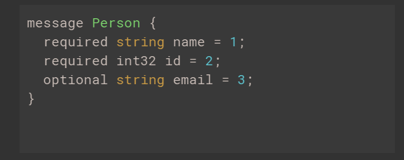

# Protocol Buffers

## Protocal Buffer

[https://developers.google.com/protocol-buffers](https://developers.google.com/protocol-buffers)

> Protocol buffers are Google's language-neutral, platform-neutral, extensible mechanism for serializing structured data – think XML, but smaller, faster, and simpler. You define how you want your data to be structured once, then you can use special generated source code to easily write and read your structured data to and from a variety of data streams and using a variety of languages.

## 

## gRPC

[https://grpc.io/docs/guides/](https://grpc.io/docs/guides/)

> By default gRPC uses Google’s mature open source mechanism for serializing structured data \(although it can be used with other data formats such as JSON\).

## Node.js API Reference

[https://grpc.io/grpc/node/index.html](https://grpc.io/grpc/node/index.html)

## 範例:

[https://github.com/EasonWang01/gRPC-Example](https://github.com/EasonWang01/gRPC-Example)

getInfo.proto

```text
syntax = "proto3";

package getInfo;

service getInfoService {
  rpc getAccountBalance (account) returns (payload) {}
  rpc getLastestBlock (empty) returns (payload) {}
}


message account {
  string account = 1;
}
message payload {
  string payload = 1;
}

message empty {}
```

server.js

```javascript
const PROTO_PATH = './protos/getInfo.proto';

const grpc = require('grpc');
const https = require('https');

const getInfo_proto = grpc.load(PROTO_PATH).getInfo;

/**
 * Implements the SayHello RPC method.
 */
function getAccountBalance(call, callback) {
  https.get({
    host: 'blockchain.info',
    path: `/balance?active=${call.request.account}`
  }, function (response) {
    var body = '';
    response.on('data', function (d) {
      body += d;
    });
    response.on('end', function () {
      callback(null, { payload: 'Account ' + body });
    });
  });
}

function getLastestBlock(call, callback) {
  https.get({
    host: 'blockchain.info',
    path: '/latestblock'
  }, function (response) {
    var body = '';
    response.on('data', function (d) {
      body += d;
    });
    response.on('end', function () {
      console.log(body)
      callback(null, { payload: 'Latestblock ' + body });
    });
  });
}


function main() {
  var server = new grpc.Server();
  server.addService(getInfo_proto.getInfoService.service, { getAccountBalance, getLastestBlock });
  server.bind('0.0.0.0:50051', grpc.ServerCredentials.createInsecure());
  server.start();
}

main();
```

client.js

```javascript
var PROTO_PATH = './protos/getInfo.proto';

var grpc = require('grpc');
var getInfo_proto = grpc.load(PROTO_PATH).getInfo;

var client = new getInfo_proto.getInfoService('localhost:50051',
  grpc.credentials.createInsecure());

//Read command Line  
const readline = require('readline');
const rl = readline.createInterface({
  input: process.stdin,
  output: process.stdout
});

rl.question('What do you want to know? ', (answer) => {
  switch (answer) {
    case 'getAccountBalance':
      getAccountBalance();
      break;
    case 'getLastestBlock':
      getLastestBlock();
      break;
    default:
      break;
  }
  rl.close();
});


function getAccountBalance() {
  var account;
  if (process.argv.length >= 3) {
    account = process.argv[2];
  } else {
    account = '12Vji8DJLgPEowfcEaGqjopueTCH9EsFim'; //default sample account
  }
  client.getAccountBalance({ account }, function (err, response) {
    console.log('Balance:', response.payload);
  });
}


function getLastestBlock() {
  client.getLastestBlock({}, function (err, response) {
    console.log('LastestBlock:', response.payload);
  });
}
```

實驗步驟:

1.node server

2.node client

3.彈出提示訊息後輸入，getAccountBalance或是getLastestBlock

## 注意

> 1. .proto文件內如果有RPC的參數不需要則不可以不寫，還是要寫一個空的message然後填入括號
> 2. server 有新的RPC function記得要在server.addService 寫上
> 3. client呼叫的function如果不需要參數則還是要在第一個參數寫上空的{}
>
> ```text
> client.getLastestBlock({}, function(err, response) {
>     console.log('Balance:', response);
>   });
> ```

