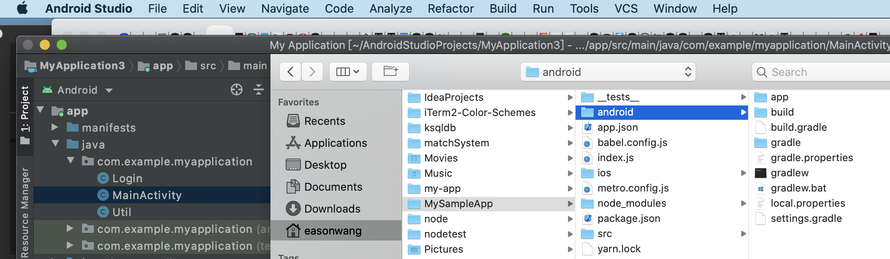
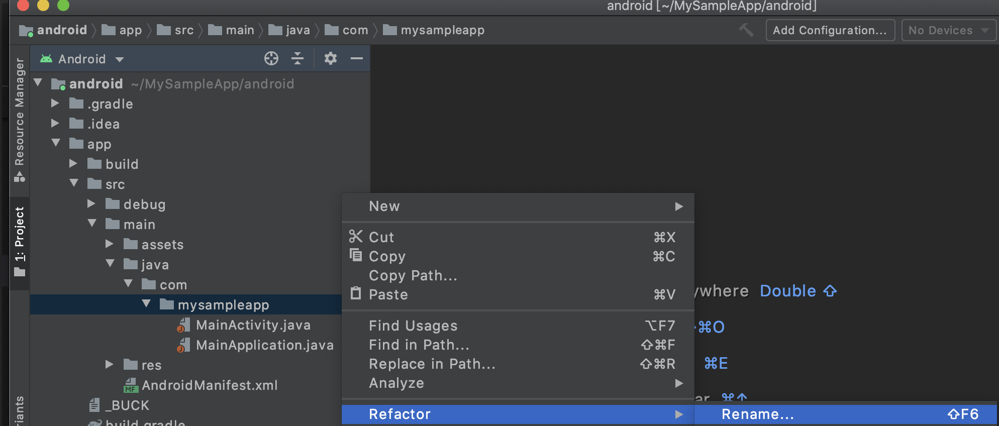
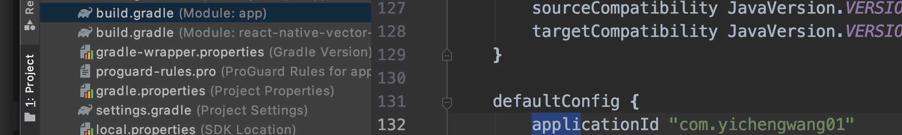
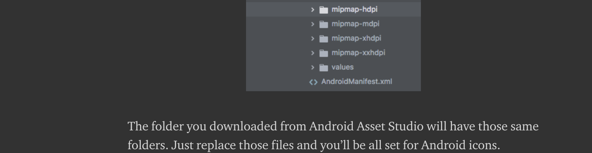
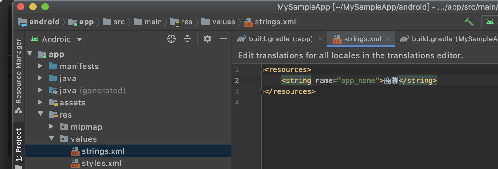
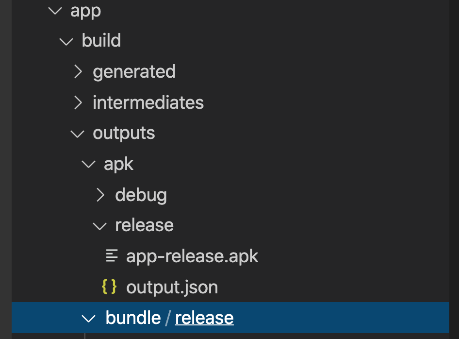
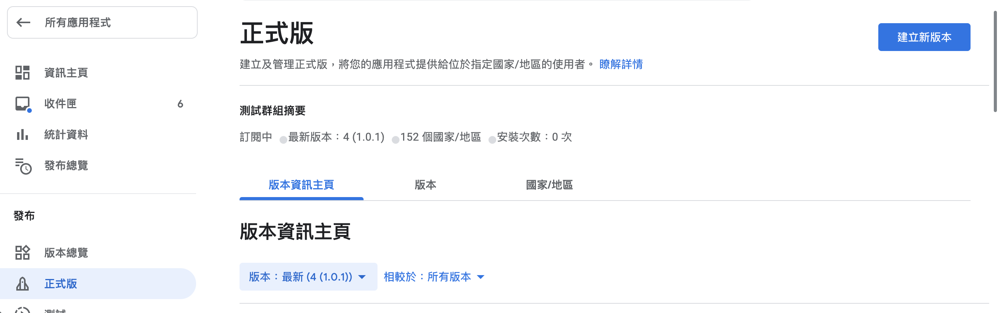

# Android 上架步驟

## 1.更改package name

> 上架時會要求package name必須和上次相同

1.用 Android Studio 打開專案的 android 目錄



2.在資料夾上點右鍵，然後按 Refactor



之後上方會跳出藍色的長條 Bar 記得點 Sync now

3.也要更改 build.gradle \(module:app\) 的 applicationId




## 2.更換ICON

用 Android Asset Studio 工具產生不同大小的圖片後 替換 mipmap 的四個目錄即可。



[https://medium.com/@scottianstewart/react-native-add-app-icons-and-launch-screens-onto-ios-and-android-apps-3bfbc20b7d4c](https://medium.com/@scottianstewart/react-native-add-app-icons-and-launch-screens-onto-ios-and-android-apps-3bfbc20b7d4c)

## 3.更改APP Name

```text
android/app/src/main/res/values/strings.xml
```



## 4. 打包成 APK

1.輸入以下產生金鑰，除了密碼外其他可以不用輸入直接按 enter

```text
keytool -genkeypair -v -keystore my-upload-key.keystore -alias my-key-alias -keyalg RSA -keysize 2048 -validity 10000
```

2.之後把剛才產生的金鑰放在 android/app 目錄下

3.修改 android/gradle.properties ，新增以下，並把 \*\*\* 改為你剛輸入的密碼

```text
MYAPP_UPLOAD_STORE_FILE=my-upload-key.keystore
MYAPP_UPLOAD_KEY_ALIAS=my-key-alias
MYAPP_UPLOAD_STORE_PASSWORD=*****
MYAPP_UPLOAD_KEY_PASSWORD=*****
```

4.修改 android/app/build.gradle

```text
android {
    ...
    defaultConfig { ... }
    signingConfigs {
        release {
            if (project.hasProperty('MYAPP_UPLOAD_STORE_FILE')) {
                storeFile file(MYAPP_UPLOAD_STORE_FILE)
                storePassword MYAPP_UPLOAD_STORE_PASSWORD
                keyAlias MYAPP_UPLOAD_KEY_ALIAS
                keyPassword MYAPP_UPLOAD_KEY_PASSWORD
            }
        }
    }
    buildTypes {
        release {
            ...
            signingConfig signingConfigs.release
        }
    }
}
```

5. 打包 成 aab file

```text
cd android
./gradlew bundleRelease
```

> 因為現在上架要求包含 32 與 64 位元版本，所以建議使用 bundleRelease 打包成 AAB \(Android App Bundle\)，但因為 aab 在手機無法測試，可以打包成 apk 先測試

如果想打包成 apk 可用如下

```text
./gradlew assembleRelease
```

打包完會看到如下檔案





6.去 Android developer console

登入之後並點選建立新版本。

> 如果登入後一直跳出另一個帳戶，記得把 cookie 清空後重新登入。



