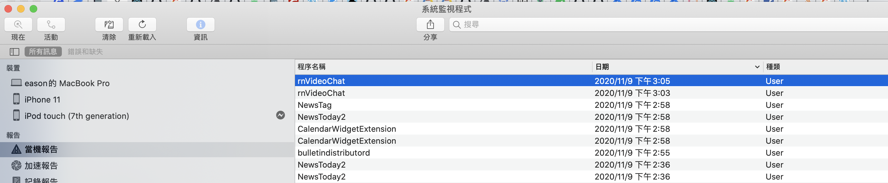
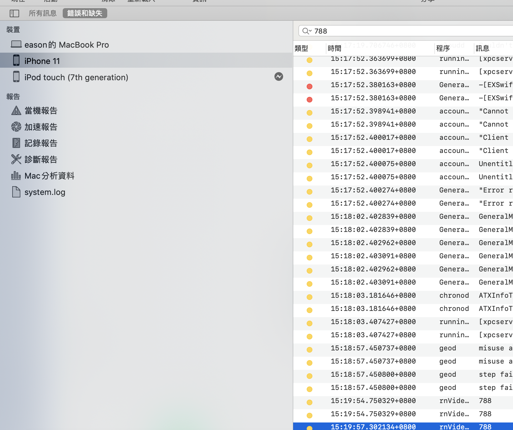

# IOS

info.plist 加上

```text
<key>CFBundleURLTypes</key> <array> <dict> <key>CFBundleURLSchemes</key> <array> <string>fb105575</string> </array> </dict> </array> <key>FacebookAppID</key> <string>1055746576805</string> <key>FacebookDisplayName</key> <string>RN-chat</string>
<key>LSApplicationQueriesSchemes</key> <array> <string>fbapi</string> <string>fb0130214</string> <string>fba0410</string> <string>fba2</string> <string>fb010</string> <string>fb31219</string> <string>fbapi200410</string> <string>fbapi2416</string> <string>fbapi20150313</string> <string>fbapi20150629</string> <string>fbapi20160328</string> <string>fbauth</string> <string>fb-messenger-share-api</string> <string>fbauth2</string> <string>fbshareextension</string> </array>
```

AppDelegate.m 加上

```text
@implementation AppDelegate


- (BOOL)application:(UIApplication *)application
   openURL:(NSURL *)url
   options:(NSDictionary<UIApplicationOpenURLOptionsKey,id> *)options
{
  if ([[FBSDKApplicationDelegate sharedInstance] application:application
                                                      openURL:url
                                                      options:options]) {
     return YES;
  }
  return [RCTLinkingManager application:application openURL:url options:options];
}


- (BOOL)application:(UIApplication *)application didFinishLaunchingWithOptions:(NSDictionary *)launchOptions
{
  ......
  [[FBSDKApplicationDelegate sharedInstance] application:application
                           didFinishLaunchingWithOptions:launchOptions];
  return yes     
}                                                  
```

## 常見問題

[https://github.com/facebook/react-native-fbsdk\#troubleshooting](https://github.com/facebook/react-native-fbsdk#troubleshooting)

### IOS:

1.Undefined symbols for architecture x86\_64:

> 在專案內新增一個 swift 檔案，之後 xcode 會幫你加上 bridge header




2.error No active iOS device found

目前官方的 bug，建議可用系統監控程式除錯

  




以及建議用 `console.error`



