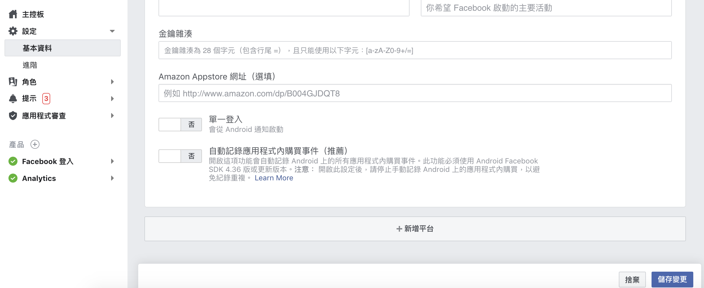
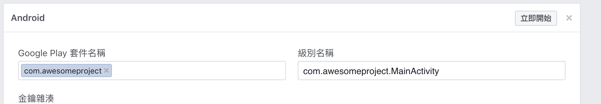

# Android

1.創建應用程式後，新增平台

[https://developers.facebook.com/quickstarts/](https://developers.facebook.com/quickstarts/)



輸入相關名稱



2.照著以下教學調整專案

[https://github.com/facebook/react-native-fbsdk](https://github.com/facebook/react-native-fbsdk)

MainApplication.java

```java
package com.awesomeproject;

import android.app.Application;

import com.facebook.react.ReactApplication;
import com.facebook.react.ReactNativeHost;
import com.facebook.react.ReactPackage;
import com.facebook.react.shell.MainReactPackage;
import com.facebook.soloader.SoLoader;
import com.facebook.CallbackManager;
import com.facebook.FacebookSdk;
import com.facebook.reactnative.androidsdk.FBSDKPackage;

import java.util.Arrays;
import java.util.List;

public class MainApplication extends Application implements ReactApplication {
  private static CallbackManager mCallbackManager = CallbackManager.Factory.create();
  protected static CallbackManager getCallbackManager() {
    return mCallbackManager;
  }
  private final ReactNativeHost mReactNativeHost = new ReactNativeHost(this) {
    @Override
    public boolean getUseDeveloperSupport() {
      return BuildConfig.DEBUG;
    }

    @Override
    protected List<ReactPackage> getPackages() {
      return Arrays.<ReactPackage>asList(
          new MainReactPackage()
          ,new FBSDKPackage(mCallbackManager)
      );
    }

    @Override
    protected String getJSMainModuleName() {
      return "index";
    }
  };

  @Override
  public ReactNativeHost getReactNativeHost() {
    return mReactNativeHost;
  }

  @Override
  public void onCreate() {
    super.onCreate();
    SoLoader.init(this, /* native exopackage */ false);
  }
}
```

MainActivity.java

```java
package com.awesomeproject;
import android.content.Intent;
import com.facebook.react.ReactActivity;

public class MainActivity extends ReactActivity {

    /**
     * Returns the name of the main component registered from JavaScript.
     * This is used to schedule rendering of the component.
     */
    @Override
    public void onActivityResult(int requestCode, int resultCode, Intent data) {
        super.onActivityResult(requestCode, resultCode, data);
        MainApplication.getCallbackManager().onActivityResult(requestCode, resultCode, data);
    }
    @Override
    protected String getMainComponentName() {
        return "AwesomeProject";
    }

}
```

strings.xml

```markup
<resources>
    <string name="app_name">AwesomeProject</string>
    <string name="facebook_app_id">350004755369462</string>
</resources>
```

AndroidManifest.xml

```markup
<manifest xmlns:android="http://schemas.android.com/apk/res/android"
  package="com.awesomeproject">

    <uses-permission android:name="android.permission.INTERNET" />

    <application
      android:name=".MainApplication"
      android:label="@string/app_name"
      android:icon="@mipmap/ic_launcher"
      android:roundIcon="@mipmap/ic_launcher_round"
      android:allowBackup="false"
      android:theme="@style/AppTheme">
      <activity
        android:name=".MainActivity"
        android:label="@string/app_name"
        android:configChanges="keyboard|keyboardHidden|orientation|screenSize"
        android:windowSoftInputMode="adjustResize">
        <intent-filter>
            <action android:name="android.intent.action.MAIN" />
            <category android:name="android.intent.category.LAUNCHER" />
        </intent-filter>
      </activity>
      <meta-data android:name="com.facebook.sdk.ApplicationId" android:value="@string/facebook_app_id"/>
      <activity android:name="com.facebook.react.devsupport.DevSettingsActivity" />
    </application>

</manifest>
```

