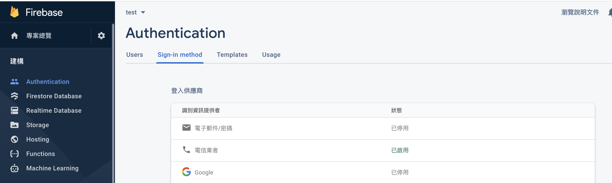
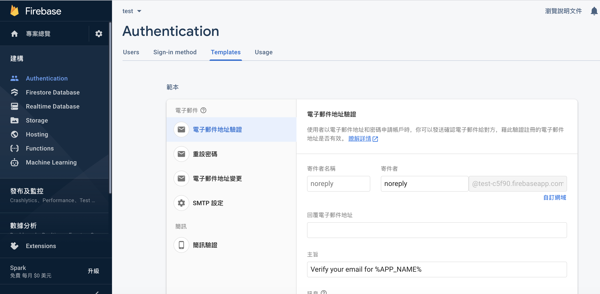

# Phone Auth



1.記得先去 Firebase console 開啟 phone auth 服務。



2.可以到下方改變簡訊內容與



### 範例：

```javascript
import React, {useState} from 'react';
import auth from '@react-native-firebase/auth';
import {Text, View, TextInput, Button} from 'react-native';

function PhoneSignIn() {
  // If null, no SMS has been sent
  const [confirm, setConfirm] = useState(false);

  const [code, setCode] = useState('');

  // Handle the button press
  async function signInWithPhoneNumber(phoneNumber) {
    const confirmation = await auth().signInWithPhoneNumber(phoneNumber);
    setConfirm(confirmation);
  }

  async function confirmCode() {
    try {
      let result = await confirm.confirm(code);
      console.log(result);
    } catch (error) {
      console.log('Invalid code.');
    }
  }

  if (!confirm) {
    return (
      <Button
        title="Phone Number Sign In"
        onPress={() => signInWithPhoneNumber('+886...')}
      />
    );
  }

  return (
    <>
      <Text>Phone Auth</Text>
      <TextInput
        style={{borderBottomWidth: 1, borderColor: 'black'}}
        value={code}
        onChangeText={text => setCode(text)}
      />
      <Button title="Confirm Code" onPress={() => confirmCode()} />
    </>
  );
}

const App = () => {
  return (
    <View style={{padding: '10%', paddingTop: '50%'}}>
      <Text style={{fontSize: 20, textAlign: 'center'}}>Phone Auth 範例</Text>
      <View>
        <PhoneSignIn />
      </View>
    </View>
  );
};

export default App;

```

之後你的手機會收到簡訊

