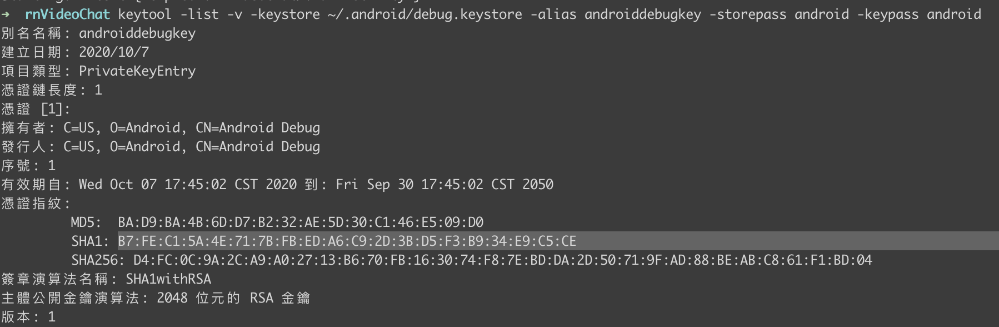
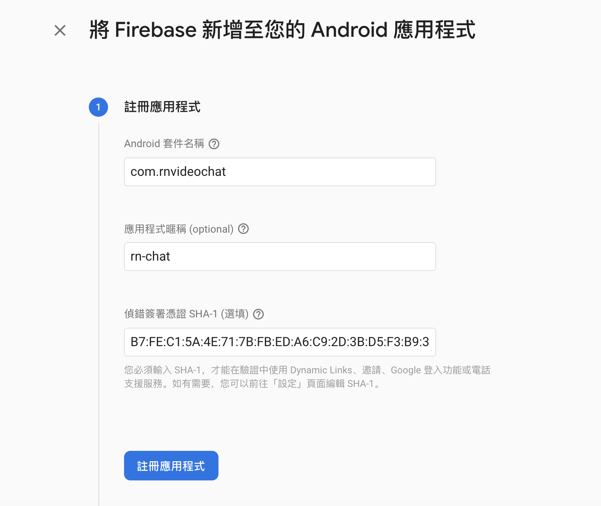

# Android

### 教學

[https://github.com/react-native-google-signin/google-signin/blob/master/docs/android-guide.md](https://github.com/react-native-google-signin/google-signin/blob/master/docs/android-guide.md)

1.新增 Firebase 專案，然後產生金鑰後填入

[https://stackoverflow.com/questions/15727912/sha-1-fingerprint-of-keystore-certificate](https://stackoverflow.com/questions/15727912/sha-1-fingerprint-of-keystore-certificate)





之後按下一步加上必要的 build.gradle 參數。

2.app/build.gradle

```text
dependencies {
    implementation platform('com.google.firebase:firebase-bom:26.0.0')
    implementation 'com.google.firebase:firebase-analytics'
    implementation(project(":react-native-google-signin"))
    ....
```

3.外層的 project/build.gradle

```text
    ext {
        ...
        googlePlayServicesAuthVersion = "16.0.1"
    }
    repositories {
        ...
        google()
    }
    dependencies {
        ....
        classpath("com.android.tools.build:gradle:3.5.3")
        classpath 'com.google.gms:google-services:4.3.4'
```

4. setting.gradle 加上

```text
include ':react-native-google-signin', ':app'
project(':react-native-google-signin').projectDir = new File(rootProject.projectDir, '../node_modules/@react-native-community/google-signin/android')
```

5.MainApplication.java

```java
        @Override
        protected List<ReactPackage> getPackages() {
          @SuppressWarnings("UnnecessaryLocalVariable")
          List<ReactPackage> packages = new PackageList(this).getPackages();
          // Packages that cannot be autolinked yet can be added manually here, for example:
          // 加上下面這行
          packages.add(new RNGoogleSigninPackage());
          return packages;
        }
```

