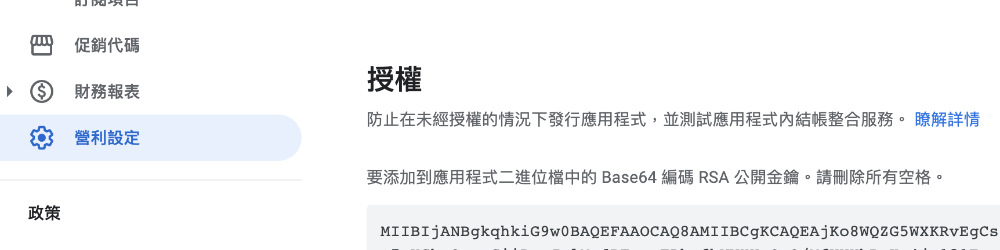
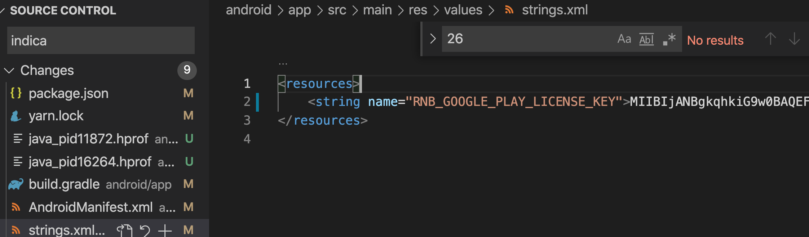
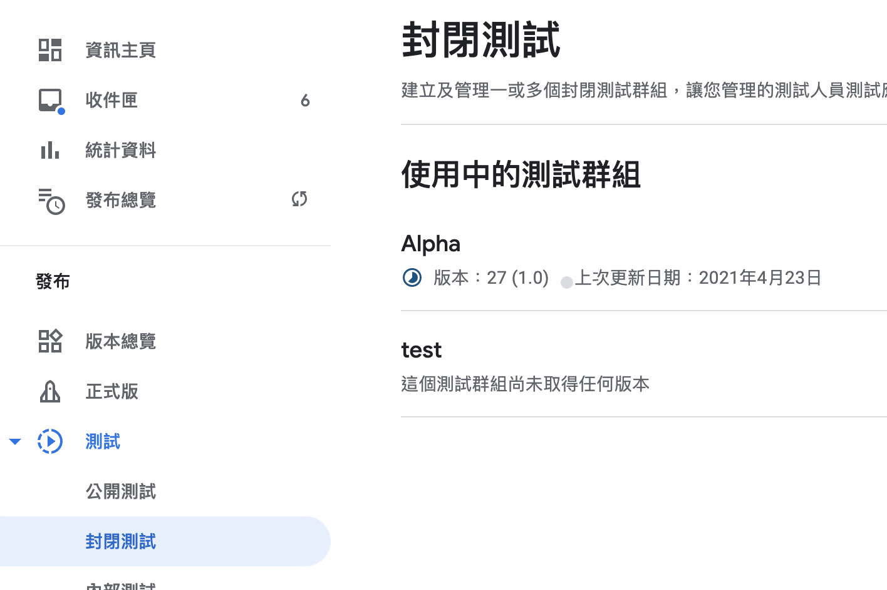
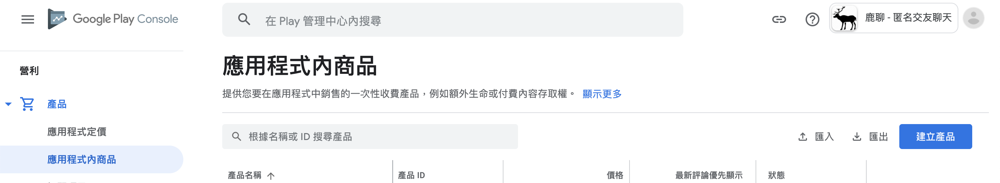
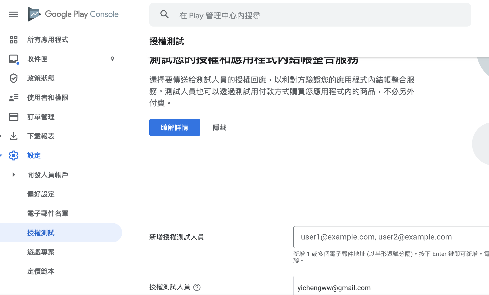
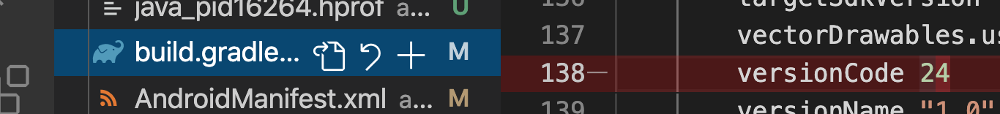

# InApp Billing

使用此模組：



> 必須使用真實設備測試

### Android

```text
1. 連上後選擇檔案傳輸，並在手機設定開啟 USB debug
2. 電腦 terminal 輸入： adb devices
3. 執行： npx react-native run-android --variant=release
4. 移除 app: adb uninstall <app 套件名稱 com 開頭>
```

> 安裝完 release 版本後下次要安裝 dev 版本必須先移除 release 版本

官方範例：



## 安裝

```text
yarn add react-native-iap
```

### Android 設置

1.新增 license key





2.上傳 app 到封閉測試群組



3.新增產品



4.新建  License Testing 使用者，並且測試的手機 Google play 要登入並選擇使用該帳號



5.確保 build version 與 封閉測試的 APP 版本相同



6.使用 release key 測試， react-native 可用如下指令

```text
npx react-native run-android --variant=release
```

7. 將範例改為自己的 product id

> 在 developer console 輸入什麼 product id 這邊就輸入什麼

```text
const itemSkus = Platform.select({
  ios: [
    'com.cooni.point1000',
    'com.cooni.point5000',
  ],
  android: [
    'com.yicheng.paper',
    'android.test.canceled',
    'android.test.refunded',
    'android.test.item_unavailable',
  ],
});
```

> 之後即可開啟實體設備測試，通常遇到的問題都是回應 code 5，並且沒有詳細錯誤訊息，個人當時是沒有新增 License account 所導致

#### 其他問題可參考：







#### 如果要切換 inapp purchase account 必須要把手機內的 google 帳號移除

[https://android.stackexchange.com/questions/70215/change-gmail-account-to-make-in-app-purchase](https://android.stackexchange.com/questions/70215/change-gmail-account-to-make-in-app-purchase)

