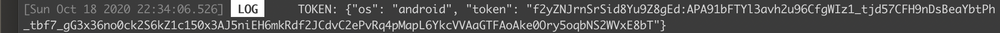
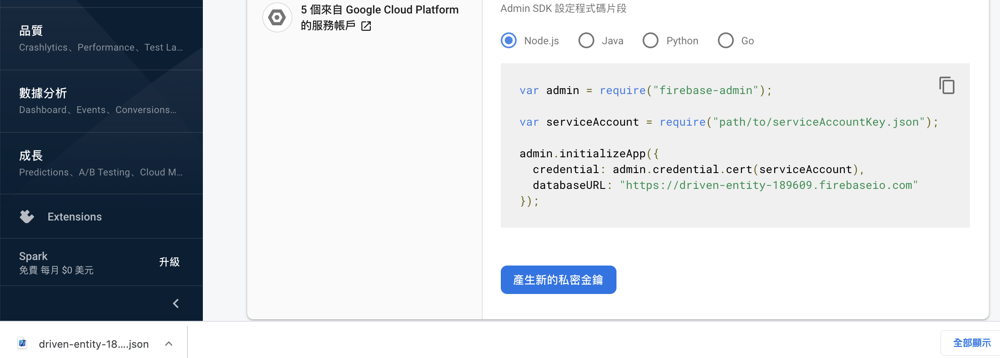
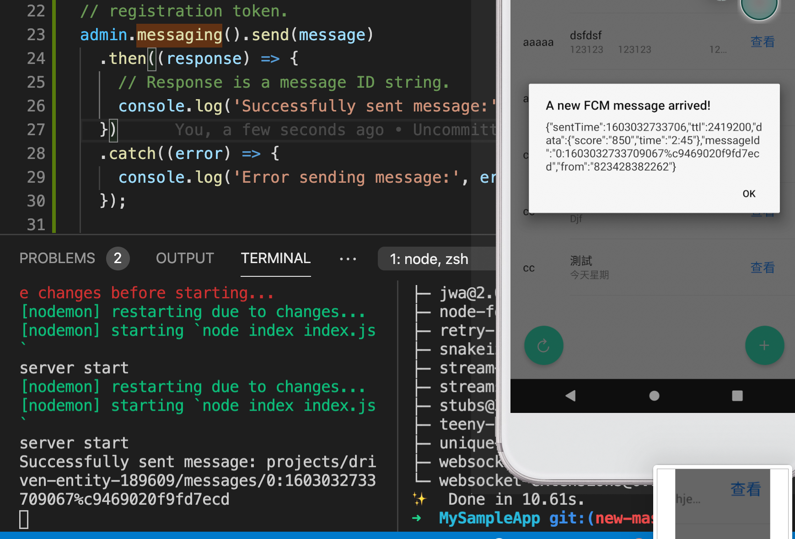
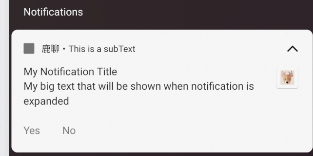
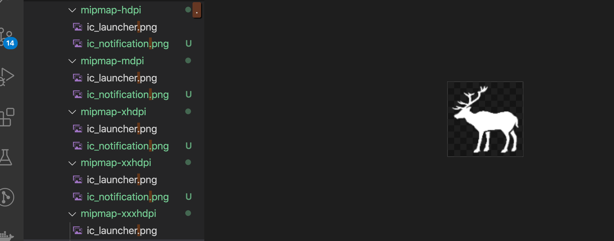
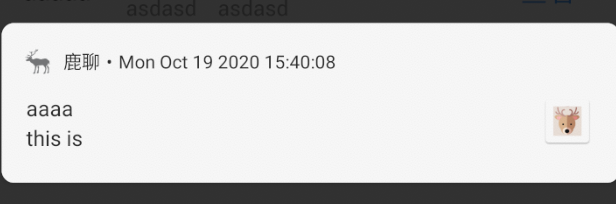
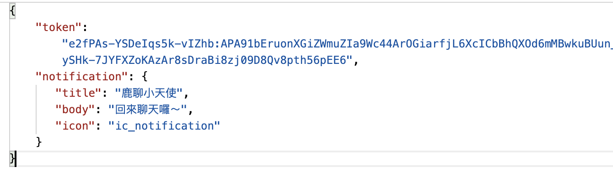
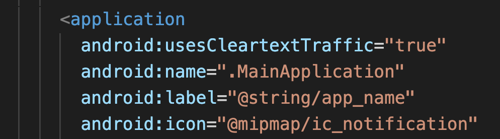

# Push notification

[https://github.com/zo0r/react-native-push-notification](https://github.com/zo0r/react-native-push-notification)

1.先去建立 firebase 專案，之後把  google-service.json 放進 android/app

2.`yarn add react-native-push-notification`

3.`npx react-native link react-native-push-notification`

## `另一模組為：`



## 範例

### Local notification

```javascript
const PushNotification = require("react-native-push-notification");

PushNotification.createChannel(
      {
        channelId: "channel-yasfasf123132", // (required)
        channelName: "My channel", // (required)
        channelDescription: "A channel to categorise your notifications", // (optional) default: undefined.
        soundName: "default", // (optional) See `soundName` parameter of `localNotification` function
        importance: 4, // (optional) default: 4. Int value of the Android notification importance
        vibrate: true, // (optional) default: true. Creates the default vibration patten if true.
      },
      (created) => console.log(`createChannel returned '${created}'`) // (optional) callback returns whether the channel was created, false means it already existed.
    );
    
    
PushNotification.localNotification({
      /* Android Only Properties */
      channelId: "channel-yasfasf123132", // (required) channelId, if the channel doesn't exist, it will be created with options passed above (importance, vibration, sound). Once the channel is created, the channel will not be update. Make sure your channelId is different if you change these options. If you have created a custom channel, it will apply options of the channel.
      ticker: "My Notification Ticker", // (optional)
      showWhen: true, // (optional) default: true
      autoCancel: true, // (optional) default: true
      largeIcon: "ic_launcher", // (optional) default: "ic_launcher". Use "" for no large icon.
      largeIconUrl: "https://www.example.tld/picture.jpg", // (optional) default: undefined
      smallIcon: "ic_notification", // (optional) default: "ic_notification" with fallback for "ic_launcher". Use "" for default small icon.
      bigText: "My big text that will be shown when notification is expanded", // (optional) default: "message" prop
      subText: "This is a subText", // (optional) default: none
      bigPictureUrl: "https://www.example.tld/picture.jpg", // (optional) default: undefined
      color: "red", // (optional) default: system default
      vibrate: true, // (optional) default: true
      vibration: 300, // vibration length in milliseconds, ignored if vibrate=false, default: 1000
      tag: "some_tag", // (optional) add tag to message
      group: "group", // (optional) add group to message
      groupSummary: false, // (optional) set this notification to be the group summary for a group of notifications, default: false
      ongoing: false, // (optional) set whether this is an "ongoing" notification
      priority: "high", // (optional) set notification priority, default: high
      visibility: "private", // (optional) set notification visibility, default: private
      ignoreInForeground: false, // (optional) if true, the notification will not be visible when the app is in the foreground (useful for parity with how iOS notifications appear)
      shortcutId: "shortcut-id", // (optional) If this notification is duplicative of a Launcher shortcut, sets the id of the shortcut, in case the Launcher wants to hide the shortcut, default undefined
      onlyAlertOnce: false, // (optional) alert will open only once with sound and notify, default: false
      
      when: null, // (optionnal) Add a timestamp pertaining to the notification (usually the time the event occurred). For apps targeting Build.VERSION_CODES.N and above, this time is not shown anymore by default and must be opted into by using `showWhen`, default: null.
      usesChronometer: false, // (optional) Show the `when` field as a stopwatch. Instead of presenting `when` as a timestamp, the notification will show an automatically updating display of the minutes and seconds since when. Useful when showing an elapsed time (like an ongoing phone call), default: false.
      timeoutAfter: null, // (optional) Specifies a duration in milliseconds after which this notification should be canceled, if it is not already canceled, default: null
    
      messageId: "google:message_id", // (optional) added as `message_id` to intent extras so opening push notification can find data stored by @react-native-firebase/messaging module. 
    
      actions: ["Yes", "No"], // (Android only) See the doc for notification actions to know more
      invokeApp: true, // (optional) This enable click on actions to bring back the application to foreground or stay in background, default: true
    
      /* iOS only properties */
      alertAction: "view", // (optional) default: view
      category: "", // (optional) default: empty string
    
      /* iOS and Android properties */
      id: 0, // (optional) Valid unique 32 bit integer specified as string. default: Autogenerated Unique ID
      title: "My Notification Title", // (optional)
      message: "My Notification Message", // (required)
      userInfo: {}, // (optional) default: {} (using null throws a JSON value '<null>' error)
      playSound: false, // (optional) default: true
      soundName: "default", // (optional) Sound to play when the notification is shown. Value of 'default' plays the default sound. It can be set to a custom sound such as 'android.resource://com.xyz/raw/my_sound'. It will look for the 'my_sound' audio file in 'res/raw' directory and play it. default: 'default' (default sound is played)
      number: 10, // (optional) Valid 32 bit integer specified as string. default: none (Cannot be zero)
      repeatType: "day", // (optional) Repeating interval. Check 'Repeating Notifications' section for more info.
    });
```

### Remote notification

要先設定 App firebase init 



1.安裝模組

```text
yarn add @react-native-firebase/app
```

2.建立專案並放入 google-services.json

android/app/google-services.json

3.

In `android/build.gradle`

```text
buildscript {
    ...
    dependencies {
        ...
        classpath('com.google.gms:google-services:4.3.3')
        ...
    }
}
```

In `android/app/build.gradle`

```text
dependencies {
  ...
  implementation 'com.google.firebase:firebase-analytics:17.3.0'
  ...
}

apply plugin: 'com.google.gms.google-services'
```

4. 重啟後即可

```text
npx react-native run-android
```

5.新增 config code

```javascript
const PushNotification = require("react-native-push-notification");

PushNotification.configure({
  // (optional) Called when Token is generated (iOS and Android)
  onRegister: function (token) {
    console.log("TOKEN:", token);
  },

  // (required) Called when a remote is received or opened, or local notification is opened
  onNotification: function (notification) {
    console.log("NOTIFICATION:", notification);

    // process the notification

    // (required) Called when a remote is received or opened, or local notification is opened
    notification.finish(PushNotificationIOS.FetchResult.NoData);
  },

  // (optional) Called when Registered Action is pressed and invokeApp is false, if true onNotification will be called (Android)
  onAction: function (notification) {
    console.log("ACTION:", notification.action);
    console.log("NOTIFICATION:", notification);

    // process the action
  },

  // (optional) Called when the user fails to register for remote notifications. Typically occurs when APNS is having issues, or the device is a simulator. (iOS)
  onRegistrationError: function(err) {
    console.error(err.message, err);
  },

  // IOS ONLY (optional): default: all - Permissions to register.
  permissions: {
    alert: true,
    badge: true,
    sound: true,
  },

  // Should the initial notification be popped automatically
  // default: true
  popInitialNotification: true,

  /**
   * (optional) default: true
   * - Specified if permissions (ios) and token (android and ios) will requested or not,
   * - if not, you must call PushNotificationsHandler.requestPermissions() later
   * - if you are not using remote notification or do not have Firebase installed, use this:
   *     requestPermissions: Platform.OS === 'ios'
   */
  requestPermissions: true,
});
```

之後就會看到 token





## 監聽 foreground message

加上 onmessage 監聽前台訊息

`yarn add @react-native-firebase/messaging`

```javascript
import messaging from '@react-native-firebase/messaging';

componentDidMount() {
    messaging().onMessage(async remoteMessage => {
      Alert.alert('A new FCM message arrived!', JSON.stringify(remoteMessage));
    });
    ...
}   
```



7. server 加上推送

要先初始化 server



完整文件：[https://firebase.google.com/docs/cloud-messaging/send-message](https://firebase.google.com/docs/cloud-messaging/send-message)

```javascript
yarn add firebase-admin
```

然後加上



完整如下：

```javascript
const admin = require('firebase-admin');
var serviceAccount = require("./driven-entity-firebase-adminsdk-d7oiu-47bf13bcf6.json");

admin.initializeApp({
  credential: admin.credential.cert(serviceAccount),
  databaseURL: "https://driven-entity-18909.firebaseio.com"
});

// 從 app init 出的 token
const deviceToken = "u9Z8gEd:APA91bFTYl3avh2u96CfgWIz1_tjd57CFH9nDsBeaYbtPh_tbf7_gG3x36no0ck2S6kZ1c150x3AJ5niEH6mkRdf2JCdvC2ePvRq4pMapL6YkcVVAaGTFAoAke0Ory5oqbNS2WVxE8bT";
var message = {
  data: {
    score: '850',
    time: '2:45'
  },
  token: deviceToken
};

// registration token.
admin.messaging().send(message)
  .then((response) => {
    // Response is a message ID string.
    console.log('Successfully sent message:', response);
  })
  .catch((error) => {
    console.log('Error sending message:', error);
  });

```



有關 postman 發送訊息可參考



## Background notification

> 如果關閉 app 後沒有跳通知可以把後端送的 notification payload 移除，或是不使用 setBackgroundMessageHandler 直接只加上 後端送的 notification payload 也會觸發背景與關閉 app 後的通知。

[https://rnfirebase.io/messaging/usage\#background--quit-state-messages](https://rnfirebase.io/messaging/usage#background--quit-state-messages)

在最外層 index.js 加上如下即可

> 不用去 Androidmanifest.xml 新增 permission

```javascript
import messaging from '@react-native-firebase/messaging';

// Register background handler
messaging().setBackgroundMessageHandler(async remoteMessage => {
  console.log('Message handled in the background!', remoteMessage);
});

.... 
AppRegistry.registerComponent(appName, () => App);
```

如果想要產生在手機桌面跳出 APP 通知的效果，只要把 local notification 放入 裡面即可

> 記得要先在 component 內建立好 channel

```javascript
    PushNotification.createChannel(
      {
        channelId: "channel-yasfasf123132", // (required)
        channelName: "My channel", // (required)
        channelDescription: "A channel to categorise your notifications", // (optional) default: undefined.
        soundName: "default", // (optional) See `soundName` parameter of `localNotification` function
        importance: 4, // (optional) default: 4. Int value of the Android notification importance
        vibrate: true, // (optional) default: true. Creates the default vibration patten if true.
      },
      (created) => console.log(`createChannel returned '${created}'`) // (optional) callback returns whether the channel was created, false means it already existed.
    );
```

最外層 index.js

```javascript
messaging().setBackgroundMessageHandler(async remoteMessage => {
  PushNotification.localNotification({
    /* Android Only Properties */
    channelId: "channel-yasfasf123132", // (required) channelId, if the channel doesn't exist, it will be created with options passed above (importance, vibration, sound). Once the channel is created, the channel will not be update. Make sure your channelId is different if you change these options. If you have created a custom channel, it will apply options of the channel.
    ticker: "My Notification Ticker", // (optional)
    showWhen: true, // (optional) default: true
    autoCancel: true, // (optional) default: true
    largeIcon: "ic_launcher", // (optional) default: "ic_launcher". Use "" for no large icon.
    largeIconUrl: "https://www.example.tld/picture.jpg", // (optional) default: undefined
    smallIcon: "ic_notification", // (optional) default: "ic_notification" with fallback for "ic_launcher". Use "" for default small icon.
    bigText: "My big text that will be shown when notification is expanded", // (optional) default: "message" prop
    subText: "This is a subText", // (optional) default: none
    bigPictureUrl: "https://www.example.tld/picture.jpg", // (optional) default: undefined
    color: "red", // (optional) default: system default
    vibrate: true, // (optional) default: true
    vibration: 300, // vibration length in milliseconds, ignored if vibrate=false, default: 1000
    tag: "some_tag", // (optional) add tag to message
    group: "group", // (optional) add group to message
    groupSummary: false, // (optional) set this notification to be the group summary for a group of notifications, default: false
    ongoing: false, // (optional) set whether this is an "ongoing" notification
    priority: "high", // (optional) set notification priority, default: high
    visibility: "private", // (optional) set notification visibility, default: private
    ignoreInForeground: false, // (optional) if true, the notification will not be visible when the app is in the foreground (useful for parity with how iOS notifications appear)
    shortcutId: "shortcut-id", // (optional) If this notification is duplicative of a Launcher shortcut, sets the id of the shortcut, in case the Launcher wants to hide the shortcut, default undefined
    onlyAlertOnce: false, // (optional) alert will open only once with sound and notify, default: false
    
    when: null, // (optionnal) Add a timestamp pertaining to the notification (usually the time the event occurred). For apps targeting Build.VERSION_CODES.N and above, this time is not shown anymore by default and must be opted into by using `showWhen`, default: null.
    usesChronometer: false, // (optional) Show the `when` field as a stopwatch. Instead of presenting `when` as a timestamp, the notification will show an automatically updating display of the minutes and seconds since when. Useful when showing an elapsed time (like an ongoing phone call), default: false.
    timeoutAfter: null, // (optional) Specifies a duration in milliseconds after which this notification should be canceled, if it is not already canceled, default: null
  
    messageId: "google:message_id", // (optional) added as `message_id` to intent extras so opening push notification can find data stored by @react-native-firebase/messaging module. 
  
    actions: ["Yes", "No"], // (Android only) See the doc for notification actions to know more
    invokeApp: true, // (optional) This enable click on actions to bring back the application to foreground or stay in background, default: true
  
    /* iOS only properties */
    alertAction: "view", // (optional) default: view
    category: "", // (optional) default: empty string
  
    /* iOS and Android properties */
    id: 0, // (optional) Valid unique 32 bit integer specified as string. default: Autogenerated Unique ID
    title: "My Notification Title", // (optional)
    message: "My Notification Message", // (required)
    userInfo: {}, // (optional) default: {} (using null throws a JSON value '<null>' error)
    playSound: false, // (optional) default: true
    soundName: "default", // (optional) Sound to play when the notification is shown. Value of 'default' plays the default sound. It can be set to a custom sound such as 'android.resource://com.xyz/raw/my_sound'. It will look for the 'my_sound' audio file in 'res/raw' directory and play it. default: 'default' (default sound is played)
    number: 10, // (optional) Valid 32 bit integer specified as string. default: none (Cannot be zero)
    repeatType: "day", // (optional) Repeating interval. Check 'Repeating Notifications' section for more info.
  });
});
```

成果如下



### 左上角的灰色方形更改必須加上 ic\_notification

1.可使用產生器：

> 記得圖案必須是白色，然後透明底色
>
> 透明底色：[https://onlinepngtools.com/create-transparent-png](https://onlinepngtools.com/create-transparent-png)
>
> 轉為白色：[https://manytools.org/image/colorize-filter/](https://manytools.org/image/colorize-filter/)

之後把圖片放入以下產生器產生不同尺寸的圖片：



2.然後使用放入對應的 mipmap-\*資料夾



3.最後加入以下到 AndroidManifest

```text
<meta-data android:name="com.google.firebase.messaging.default_notification_icon" android:resource="@mipmap/ic_notification" />
```





## 點擊通知後跳轉到其他畫面

> 不建議用 getInitialNotification 可能會再開啟程式時觸發

```javascript
PushNotification.configure({ 
  onNotification: ...
})
```

記得要註冊

```javascript
const NotificationHandler = async (message) => {
  console.warn('RNFirebaseBackgroundMessage1: ', message);
  return Promise.resolve();
};
AppRegistry.registerHeadlessTask(
  'ReactNativeFirebaseMessagingHeadlessTask',
  () => NotificationHandler,
);
```

方法2: 

使用 admin message 傳入 click\_action

> 但因為要給 intent filter ，所以在 react native 只能用上面的方法

[https://firebase.google.com/docs/cloud-messaging/send-message\#example-notification-click-action](https://firebase.google.com/docs/cloud-messaging/send-message#example-notification-click-action)

## 常見問題

#### 1.local notification 沒反應

> 關掉模擬器，重啟即可

#### 2. server 發出訊息後 device onMessage 沒反應

> 曾經遇到過了十分鐘後連續跳出，發生在 android 模擬器上

#### 3. 關閉 app後沒收到通知

> 如果在傳送時加上 notification payload 則可以再關閉 app 後也跳出通知，如果一並帶上 data 屬性則 onmessage也會觸發（如果不加 notification payload 只加上 apns 或 android priority 不會有作用，可以不用加上 android priority）。



Notification payload 可設定參數：[https://firebase.google.com/docs/reference/admin/node/admin.messaging.NotificationMessagePayload](https://firebase.google.com/docs/reference/admin/node/admin.messaging.NotificationMessagePayload)

如果更改正方形 icon 可設定如下

> 但記得只有 sendToDevice 等具有 **options: MessagingOptions 才可使用**[**https://firebase.google.com/docs/reference/admin/node/admin.messaging.NotificationMessagePayload**](https://firebase.google.com/docs/reference/admin/node/admin.messaging.NotificationMessagePayload)\*\*\*\*

> **如果是 send 或** sendMulticast **必須參考** [**https://firebase.google.com/docs/reference/admin/node/admin.messaging.Notification**](https://firebase.google.com/docs/reference/admin/node/admin.messaging.Notification)\*\*\*\*



或是直接去 androidmanifest.xml 設定，則可以不用傳送 icon 參數，但這樣 原本的 app icon 會消失




#### 4. admin message 可用方法

[https://firebase.google.com/docs/reference/admin/node/admin.messaging.Messaging](https://firebase.google.com/docs/reference/admin/node/admin.messaging.Messaging)


