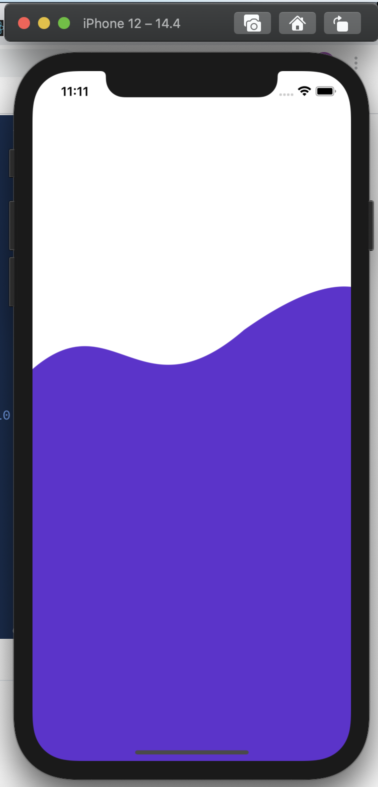

# SVG



> ```
> yarn add react-native-svg
> cd ios && pod install
> ```

## 範例：

```javascript
import React from 'react';

import {View, Dimensions} from 'react-native';
import Svg, {Path} from 'react-native-svg';

const WIDTH = Dimensions.get('screen').width;
const HEIGHT = Dimensions.get('screen').height;

const Login = () => {
  return (
    <View>
      <View style={{top: HEIGHT * 0.2}}>
        <Svg height={HEIGHT} width={WIDTH}>
          <Path
            d="M -116 358 C 87 -6 93 292 259 148 C 617 -105 400 610 524 939 H -84 C -155 637 -101 886 -137 447 Z" // put your path here
            fill="#6427d1"
          />
        </Svg>
      </View>
    </View>
  );
};

export default Login;

```



## 改路徑

貼到裡面，然後修改後貼回去

[https://yqnn.github.io/svg-path-editor/](https://yqnn.github.io/svg-path-editor/)

