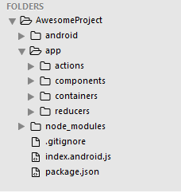

# React Native
----

###1.windows環境建置
>需求安裝:
>
>1.JDK   
>
>2.Android Studio 
>
>3.Genymotion
>
>4.Node.js


1.npm install -g react-native-cli    `安裝`

2.react-native init  AwesomeProject   `react native創建資料夾`

3.安裝JDK與android studio後，創建一個新專案

4.進到專案資料夾把local.properties 複製到AwesomeProject 的android資料夾內   `產生環境變數`

5.開啟android studio 點選上方圖案(SDK manger)，之後再點Launch Standalone SDK manger
  勾選build tool後安裝
  
  記得把android SDK 加入系統環境變數(ANDROID_HOME)

6.在cmd輸入react-native run-android(記得開好genymotion)，正常跑完會出現紅色底字，這時因為我們還沒啟動react-native的server

7.於cmd輸入 react-native start ，之後於genymotino點選Reload JS即可

8.正常啟動後，可點選index.android.js修改，之後點genymotion的右側menu，設定hot reload   `儲存後即立刻更改畫面`

```
未來啟動順序必須為

1. cd 專案資料夾根目錄

2.react-native run-android

3.react-native start
```

####可能的問題
```
1.watchman timeout
2.fbjs
```
解決方案
```
1.確保node.js的版本
2.確定watchmanconfig檔案存在(於一開始build時)
3.npm install in admin
4.如果沒有hot reload儲存沒反應，可先從emulator按上一頁，之後點選app重新進入，即可
5.如果hot reload跳出app或是無法reload JS，需重新compile app
```


#2.React native專案檔案介紹

####1.index.android.js

我們一般會在該檔案，寫為如下
```
'use strict';

import React, { AppRegistry } from 'react-native';
import App from './app/containers/app.js';

AppRegistry.registerComponent('AwesomeProject', () => App); 

```
特別要注意的地方為

`AppRegistry.registerComponent('AwesomeProject', () => App); `

`registerComponent`第一個參數要跟資料夾名稱相同，第二個參數要跟你的component enrty相同

####2.app目錄

我們假設你已經學過React跟redux的基礎，以下我們稱react-native簡稱為native

在native中，和一般node專案一樣使用npm安裝套件，接著再跟目錄創建app資料夾，將專案相關文件都寫於裡面

####3.buckconfig(給IOS用)
http://nuclide.io/docs/platforms/react-native/#buck-integration

####4.flowconfig
http://flowtype.org/
` Flow is not supported on Windows, so this integration is not yet available on that platform.`
#3.Implement with Redux

範例連結:
https://github.com/alinz/example-react-native-redux

下載後

1.將app資料夾放入你的project

2.`npm install redux react-redux redux-thunk --save`

3..將`index.android.js`改為如下即可運行
```
'use strict';

import React, { AppRegistry } from 'react-native';
import App from './app/containers/app.js';

AppRegistry.registerComponent('AwesomeProject', () => App);

```
目前專案結構長為這樣




#4.Layout

###1.flex介紹

1.父元素要有flex屬性，子元素flex才有作用

2.flex數字越高，占的空間越大
(主要為同一層元素之flex數字間的比例關係)

1.基本範例
```


import React, {
  AppRegistry,
  Component,
  StyleSheet,
  Text,
  View
} from 'react-native';

class nativereact extends Component {
  render() {
    return (
      <View style={{flex:1}}>
              <View style={styles.style_0}>

               </View>
                <View style={styles.style_1}>

                </View>
                <View style={{flex:100}}>

                </View>
      </View>
    );
  }
}

const styles = StyleSheet.create({
  style_0:{
            flex:20,
            height:40,
            borderWidth: 1,  
            borderColor: 'blue',
        },
   style_1:{
            flex:30,
            height:40,
            borderWidth: 1,  
            borderColor: 'green',
        }
});

AppRegistry.registerComponent('nativereact', () => nativereact);

```

2.改變layout 方向(flexDirection)

於父元素加入該屬性，其子元素會改變layout排列方向
```
class nativereact extends Component {
  render() {
    return (
      <View style={{flex:1,flexDirection: 'row'}}>
              <View style={styles.style_0}>

               </View>
                <View style={styles.style_1}>

                </View>
                <View style={{flex:100}}>

                </View>
      </View>
    );
  }
}
```
3.其他layout方法與CSS 的flexbox屬性用法相同
```
在container中的style
justifyContent:'center',
alignItems: 'center'

分別負責垂直及水平置中

```
#內建基本元件

須先於上方import進入js檔案

####1.View
```
用作container使用，包在其他元件外
```
####2.Text
```
產生文字
```
####3.Image
```
source 屬性 可指定來源

style中的`resizeMode:Image.resizeMode.contain`可讓圖片解析固定
```
####4.Touchable事件
**1.TouchableOpacity**
```
點擊時改變透明度
```
**
2.TouchableHighlight**
```
點擊時改變透明度、顏色，及其他(為TouchableOpacity的加強版)
```
PS:記得要有onPress屬性，才會有效果
```
 onPress={() => console.log('custom THW text - highlight')}
```
####5.DrawerLayoutAndroid

類似於隱藏選單，從邊緣拉入後顯示

```
render() {

     var navigationView = (
    <View style={{flex: 1, backgroundColor: '#fff'}}>
      <Text style={{margin: 10, fontSize: 15, textAlign: 'left'}}>I'm in the Drawer!</Text>
    </View>
  );

return (  <DrawerLayoutAndroid
      drawerWidth={300}
      drawerPosition={DrawerLayoutAndroid.positions.Left}
      renderNavigationView={() => navigationView}>

        <View>

        </View>
  </DrawerLayoutAndroid>
    );
  }
}
```
於最外層view外面加入DrawerLayoutAndroid Tag，且從`renderNavigationView`屬性寫出Drawer的外觀
####6.ListView
許多列組成的畫面
```
     <ListView
        dataSource={this.state.dataSource}
        renderRow={this.renderMovie}
        style={styles.listView}
      />
      
      datasource為資料來源
      renderRow為每列用資料產生的畫面
```
EX:
```

var REQUEST_URL = 'https://raw.githubusercontent.com/facebook/react-native/master/docs/MoviesExample.json';

class nativereact extends Component {
 constructor(props) {
    super(props);
    this.state = {
      dataSource: new ListView.DataSource({
        rowHasChanged: (row1, row2) => row1 !== row2,
      }),
      loaded: false,
    };
  }
  componentDidMount() {
    this.fetchData();
  }
   fetchData() {
    fetch(REQUEST_URL)
      .then((response) => response.json())
      .then((responseData) => {
        this.setState({
          dataSource: this.state.dataSource.cloneWithRows(responseData.movies),
          loaded: true,
        });
      })
      .done();
  }

/////////  
  render() {
    console.log(this.state)
    if (!this.state.loaded) {
      return this.renderLoadingView();
    }
  return (
      <ListView
        dataSource={this.state.dataSource}
        renderRow={this.renderMovie}
        style={styles.listView}
      />
    );
  }

  renderLoadingView() {
    return (
      <View style={styles.container}>
        <Text>
          正在加载電影數據……
        </Text>
      </View>
    );
  }

  renderMovie(movie) {
    return (
      <View style={styles.container}>
        <Image
          source={{uri: movie.posters.thumbnail}}
          style={styles.thumbnail}
        />
        <View style={styles.rightContainer}>
          <Text style={styles.title}>{movie.title}</Text>
          <Text style={styles.year}>{movie.year}</Text>
        </View>
      </View>
    );
  }
}
```


#產生APK

####1.使用JAVA工具產生keystore

```

使用admin開啟cmd後cd到C:\Program Files\Java\jre7\bin
```
再來輸入
```
keytool -genkey -v -keystore my-release-key.keystore -alias my-key-alias -keyalg RSA -keysize 2048 -validity 10000
```
之後依序填入資訊，記得:其中分別有兩次的密碼要你輸入，必須輸入不同的，最後會在bin資料夾下看到產生的keystore

####2.之後把剛才產生的keystore檔案放在react專案下的android\app路徑資料夾內

####3.修改android資料夾下的gradle.properties檔案

將星號改為你剛才輸入的store與key的密碼
````
MYAPP_RELEASE_STORE_FILE=my-release-key.keystore
MYAPP_RELEASE_KEY_ALIAS=my-key-alias
MYAPP_RELEASE_STORE_PASSWORD=*****
MYAPP_RELEASE_KEY_PASSWORD=*****
````

####4.在android/app/build.gradle 檔案中新增

1.先加入整個signingConfig如下
```
signingConfigs {
        release {
            storeFile file(MYAPP_RELEASE_STORE_FILE)
            storePassword MYAPP_RELEASE_STORE_PASSWORD
            keyAlias MYAPP_RELEASE_KEY_ALIAS
            keyPassword MYAPP_RELEASE_KEY_PASSWORD
        }
    }
```

2.之後在buildTypes的release系新增一條規則如下

```
    buildTypes的release系新增一挑規則 {
        release {
            ...
            signingConfig signingConfigs.release
        }
    }
```

加完後類似如下
```
...
android {
    ...
    defaultConfig { ... }
    signingConfigs {
        release {
            storeFile file(MYAPP_RELEASE_STORE_FILE)
            storePassword MYAPP_RELEASE_STORE_PASSWORD
            keyAlias MYAPP_RELEASE_KEY_ALIAS
            keyPassword MYAPP_RELEASE_KEY_PASSWORD
        }
    }
    buildTypes {
        release {
            ...
            signingConfig signingConfigs.release
        }
    }
}
...
```

####5.最後

先cd android 

之後輸入gradlew assembleReleas

即可

###6.確認與安裝

在C:\Users\yicheng\reactNative2\android\app\build\outputs\apk

即可發現產生了app-release.apk 檔案

(如產生的檔案為unsign，須確認上述的config內容是否正確)

之後可直接把該apk放入手機安裝及可

或是輸入`gradlew installRelease`會直接安裝在模擬器(記得先把之前dev時安裝在上面的app刪除，否則無法安裝)