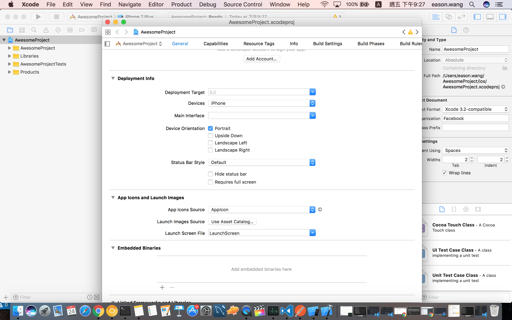

# 限制螢幕垂直與水平

開啟react native project之後如果是ios把資料夾裡面的ios資料夾拉到xcode圖案作開啟，之後點擊專案名稱兩下，並把相關選項取消打勾

android

[http://stackoverflow.com/questions/34078354/how-to-disable-landscape-mode-in-react-native-android-dev-mode](http://stackoverflow.com/questions/34078354/how-to-disable-landscape-mode-in-react-native-android-dev-mode)

