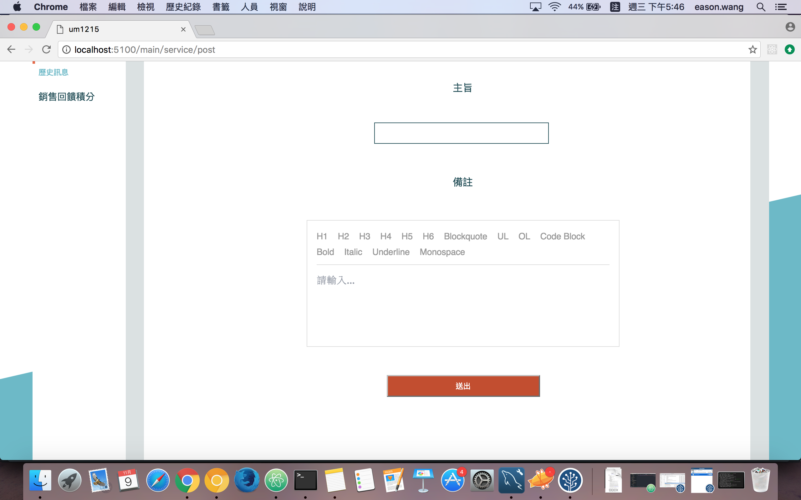

# React util


##1.如有一個共用的Component

不要於component的style 寫上如
```
Object.assign(props.style,style.item)
```
這樣共用元素的頁面會互相覆蓋style
因為react不會重新render元素

##2.使用Rich Editor
這裡使用Draft.js 做example

官方的usage只給了一般的editor

如要有上方按鈕需使用官方提供的richEditor範例

https://github.com/facebook/draft-js/blob/master/examples/rich/rich.html

我們使用時會先把它包成一個component在做引入

1.先新增RichEditor.js
```
import React, { Component, PropTypes as T } from 'react';
import { connect } from 'react-redux';
import radium from 'radium';
import { Editor, EditorState, RichUtils } from 'draft-js';

class RichEditor extends Component {


  constructor(props) {
    super(props);
    this.state = { editorState: EditorState.createEmpty() };

    this.focus = () => this.refs.editor.focus();
    this.onChange = (editorState) => this.setState({ editorState });

    this.handleKeyCommand = (command) => this._handleKeyCommand(command);
    this.onTab = (e) => this._onTab(e);
    this.toggleBlockType = (type) => this._toggleBlockType(type);
    this.toggleInlineStyle = (style) => this._toggleInlineStyle(style);
  }

  _handleKeyCommand(command) {
    const { editorState } = this.state;
    const newState = RichUtils.handleKeyCommand(editorState, command);
    if (newState) {
      this.onChange(newState);
      return true;
    }
    return false;
  }

  _onTab(e) {
    const maxDepth = 4;
    this.onChange(RichUtils.onTab(e, this.state.editorState, maxDepth));
  }

  _toggleBlockType(blockType) {
    this.onChange(
      RichUtils.toggleBlockType(
        this.state.editorState,
        blockType
      )
    );
  }

  _toggleInlineStyle(inlineStyle) {
    this.onChange(
      RichUtils.toggleInlineStyle(
        this.state.editorState,
        inlineStyle
      )
    );
  }

  render() {
    const { editorState } = this.state;

    let className = 'RichEditor-editor';
    var contentState = editorState.getCurrentContent();
    if (!contentState.hasText()) {
      if (contentState.getBlockMap().first().getType() !== 'unstyled') {
        className += ' RichEditor-hidePlaceholder';
      }
    }

    return (
      <div className="RichEditor-root">
        <BlockStyleControls
          editorState={editorState}
          onToggle={this.toggleBlockType}
        />
        <InlineStyleControls
          editorState={editorState}
          onToggle={this.toggleInlineStyle}
        />
        <div className={className} onClick={this.focus}>
          <Editor
            blockStyleFn={getBlockStyle}
            customStyleMap={styleMap}
            editorState={editorState}
            handleKeyCommand={this.handleKeyCommand}
            onChange={this.onChange}
            onTab={this.onTab}
            placeholder="請輸入..."
            ref="editor"
            spellCheck={true}
          />
        </div>
      </div>
    );
  }
}

const styleMap = {
  CODE: {
    backgroundColor: 'rgba(0, 0, 0, 0.05)',
    fontFamily: '"Inconsolata", "Menlo", "Consolas", monospace',
    fontSize: 16,
    padding: 2,
  },
};

function getBlockStyle(block) {
  switch (block.getType()) {
    case 'blockquote': return 'RichEditor-blockquote';
    default: return null;
  }
}

class StyleButton extends React.Component {
  constructor() {
    super();
    this.onToggle = (e) => {
      e.preventDefault();
      this.props.onToggle(this.props.style);
    };
  }

  render() {
    let className = 'RichEditor-styleButton';
    if (this.props.active) {
      className += ' RichEditor-activeButton';
    }

    return (
      <span className={className} onMouseDown={this.onToggle}>
        {this.props.label}
      </span>
    );
  }
}

const BLOCK_TYPES = [
  {label: 'H1', style: 'header-one'},
  {label: 'H2', style: 'header-two'},
  {label: 'H3', style: 'header-three'},
  {label: 'H4', style: 'header-four'},
  {label: 'H5', style: 'header-five'},
  {label: 'H6', style: 'header-six'},
  {label: 'Blockquote', style: 'blockquote'},
  {label: 'UL', style: 'unordered-list-item'},
  {label: 'OL', style: 'ordered-list-item'},
  {label: 'Code Block', style: 'code-block'},
];

const BlockStyleControls = (props) => {
  const {editorState} = props;
  const selection = editorState.getSelection();
  const blockType = editorState
    .getCurrentContent()
    .getBlockForKey(selection.getStartKey())
    .getType();

  return (
    <div className="RichEditor-controls">
      {BLOCK_TYPES.map((type) =>
        <StyleButton
          key={type.label}
          active={type.style === blockType}
          label={type.label}
          onToggle={props.onToggle}
          style={type.style}
        />
      )}
    </div>
  );
};

var INLINE_STYLES = [
  {label: 'Bold', style: 'BOLD'},
  {label: 'Italic', style: 'ITALIC'},
  {label: 'Underline', style: 'UNDERLINE'},
  {label: 'Monospace', style: 'CODE'},
];

const InlineStyleControls = (props) => {
  var currentStyle = props.editorState.getCurrentInlineStyle();
  return (
    <div className="RichEditor-controls">
      {INLINE_STYLES.map(type =>
        <StyleButton
          key={type.label}
          active={currentStyle.has(type.style)}
          label={type.label}
          onToggle={props.onToggle}
          style={type.style}
        />
      )}
    </div>
  );
};

RichEditor.propTypes = {
};

const mapStateToProps = (state) => ({
});

export default connect(mapStateToProps, {
})(radium(RichEditor));

```
2.添加兩份css

Draft.css
```
/**
 * Draft v0.9.0
 *
 * Copyright (c) 2013-present, Facebook, Inc.
 * All rights reserved.
 *
 * This source code is licensed under the BSD-style license found in the
 * LICENSE file in the root directory of this source tree. An additional grant
 * of patent rights can be found in the PATENTS file in the same directory.
 */
.DraftEditor-editorContainer,.DraftEditor-root,.public-DraftEditor-content{height:inherit;text-align:initial}.public-DraftEditor-content[contenteditable=true]{-webkit-user-modify:read-write-plaintext-only}.DraftEditor-root{position:relative}.DraftEditor-editorContainer{background-color:rgba(255,255,255,0);border-left:.1px solid transparent;position:relative;z-index:1}.public-DraftEditor-block{position:relative}.DraftEditor-alignLeft .public-DraftStyleDefault-block{text-align:left}.DraftEditor-alignLeft .public-DraftEditorPlaceholder-root{left:0;text-align:left}.DraftEditor-alignCenter .public-DraftStyleDefault-block{text-align:center}.DraftEditor-alignCenter .public-DraftEditorPlaceholder-root{margin:0 auto;text-align:center;width:100%}.DraftEditor-alignRight .public-DraftStyleDefault-block{text-align:right}.DraftEditor-alignRight .public-DraftEditorPlaceholder-root{right:0;text-align:right}.public-DraftEditorPlaceholder-root{color:#9197a3;position:absolute;z-index:0}.public-DraftEditorPlaceholder-hasFocus{color:#bdc1c9}.DraftEditorPlaceholder-hidden{display:none}.public-DraftStyleDefault-block{position:relative;white-space:pre-wrap}.public-DraftStyleDefault-ltr{direction:ltr;text-align:left}.public-DraftStyleDefault-rtl{direction:rtl;text-align:right}.public-DraftStyleDefault-listLTR{direction:ltr}.public-DraftStyleDefault-listRTL{direction:rtl}.public-DraftStyleDefault-ol,.public-DraftStyleDefault-ul{margin:16px 0;padding:0}.public-DraftStyleDefault-depth0.public-DraftStyleDefault-listLTR{margin-left:1.5em}.public-DraftStyleDefault-depth0.public-DraftStyleDefault-listRTL{margin-right:1.5em}.public-DraftStyleDefault-depth1.public-DraftStyleDefault-listLTR{margin-left:3em}.public-DraftStyleDefault-depth1.public-DraftStyleDefault-listRTL{margin-right:3em}.public-DraftStyleDefault-depth2.public-DraftStyleDefault-listLTR{margin-left:4.5em}.public-DraftStyleDefault-depth2.public-DraftStyleDefault-listRTL{margin-right:4.5em}.public-DraftStyleDefault-depth3.public-DraftStyleDefault-listLTR{margin-left:6em}.public-DraftStyleDefault-depth3.public-DraftStyleDefault-listRTL{margin-right:6em}.public-DraftStyleDefault-depth4.public-DraftStyleDefault-listLTR{margin-left:7.5em}.public-DraftStyleDefault-depth4.public-DraftStyleDefault-listRTL{margin-right:7.5em}.public-DraftStyleDefault-unorderedListItem{list-style-type:square;position:relative}.public-DraftStyleDefault-unorderedListItem.public-DraftStyleDefault-depth0{list-style-type:disc}.public-DraftStyleDefault-unorderedListItem.public-DraftStyleDefault-depth1{list-style-type:circle}.public-DraftStyleDefault-orderedListItem{list-style-type:none;position:relative}.public-DraftStyleDefault-orderedListItem.public-DraftStyleDefault-listLTR:before{left:-36px;position:absolute;text-align:right;width:30px}.public-DraftStyleDefault-orderedListItem.public-DraftStyleDefault-listRTL:before{position:absolute;right:-36px;text-align:left;width:30px}.public-DraftStyleDefault-orderedListItem:before{content:counter(ol0) ". ";counter-increment:ol0}.public-DraftStyleDefault-orderedListItem.public-DraftStyleDefault-depth1:before{content:counter(ol1) ". ";counter-increment:ol1}.public-DraftStyleDefault-orderedListItem.public-DraftStyleDefault-depth2:before{content:counter(ol2) ". ";counter-increment:ol2}.public-DraftStyleDefault-orderedListItem.public-DraftStyleDefault-depth3:before{content:counter(ol3) ". ";counter-increment:ol3}.public-DraftStyleDefault-orderedListItem.public-DraftStyleDefault-depth4:before{content:counter(ol4) ". ";counter-increment:ol4}.public-DraftStyleDefault-depth0.public-DraftStyleDefault-reset{counter-reset:ol0}.public-DraftStyleDefault-depth1.public-DraftStyleDefault-reset{counter-reset:ol1}.public-DraftStyleDefault-depth2.public-DraftStyleDefault-reset{counter-reset:ol2}.public-DraftStyleDefault-depth3.public-DraftStyleDefault-reset{counter-reset:ol3}.public-DraftStyleDefault-depth4.public-DraftStyleDefault-reset{counter-reset:ol4}

```
RichEditor.css

```
.RichEditor-root {
  background: #fff;
  border: 1px solid #ddd;
  font-family: 'Georgia', serif;
  font-size: 14px;
  padding: 15px;
}

.RichEditor-editor {
  border-top: 1px solid #ddd;
  cursor: text;
  font-size: 16px;
  margin-top: 10px;
}

.RichEditor-editor .public-DraftEditorPlaceholder-root,
.RichEditor-editor .public-DraftEditor-content {
  margin: 0 -15px -15px;
  padding: 15px;
}

.RichEditor-editor .public-DraftEditor-content {
  min-height: 100px;
}

.RichEditor-hidePlaceholder .public-DraftEditorPlaceholder-root {
  display: none;
}

.RichEditor-editor .RichEditor-blockquote {
  border-left: 5px solid #eee;
  color: #666;
  font-family: 'Hoefler Text', 'Georgia', serif;
  font-style: italic;
  margin: 16px 0;
  padding: 10px 20px;
}

.RichEditor-editor .public-DraftStyleDefault-pre {
  background-color: rgba(0, 0, 0, 0.05);
  font-family: 'Inconsolata', 'Menlo', 'Consolas', monospace;
  font-size: 16px;
  padding: 20px;
}

.RichEditor-controls {
  font-family: 'Helvetica', sans-serif;
  font-size: 14px;
  margin-bottom: 5px;
  user-select: none;
}

.RichEditor-styleButton {
  color: #999;
  cursor: pointer;
  margin-right: 16px;
  padding: 2px 0;
  display: inline-block;
}

.RichEditor-activeButton {
  color: #5890ff;
}

```

之後引入上面包好的Component

即可看到如下畫面



接著因為我們要將其存成immutable的markdown轉為html，須使用如下模組

https://github.com/sstur/draft-js-export-html

```
  constructor(props) {
    super(props);
    this.state = { editorState: EditorState.createEmpty() };
    
    this.onChange = (editorState) => {
      this.setState({ editorState });
      console.log(editorState.getCurrentContent())
      let html = stateToHTML(editorState.getCurrentContent());
      console.log(html)
    }
    
      //TODO 把此html傳給parent state使用即可
```
如上使用即可