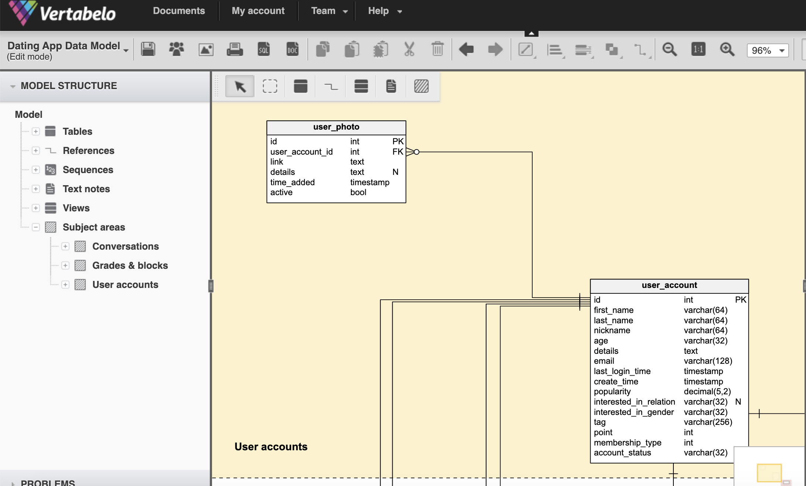

# Schema 架構設計

## 實用工具

[https://my.vertabelo.com/](https://my.vertabelo.com/)

## Messaging APP

> User: 存入 conversation Id List（參與的對話列表）
>
> Messages: 存入每個對話的細節以及 conversation Id
>
> Conversations: Key 為 conversation Id，存入該對話最後的傳輸人與時間與最後傳輸的訊息內容
>
> 使用：對話列表為查詢 User conversation Id List 對應出的 Conversations Table 內容

> ，點進去則查詢 conversation Id 對應的所有 messages





[https://stackoverflow.com/questions/6541302/thread-messaging-system-database-schema-design](https://stackoverflow.com/questions/6541302/thread-messaging-system-database-schema-design)

