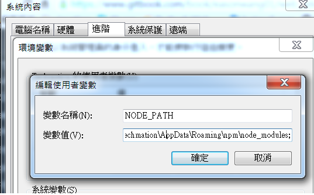

# 使用NPM

* 
先安裝Node.js

* 以下為基本指令

npm install 

npm install  -g (使用後可在cmd的任何路徑輸入package名稱執行，但如果是想在js檔內直接使用require的話，要再把環境變數加上才行)(如此即可不用在每個專案資料夾個別安裝package))
(記得名稱要是NODE_PATH)

所以共有兩個環境變數:
一個是node_modules  =>給require用

一個是`C:\Users\Jason\AppData\Roaming\npm`給在cmd直接輸入module名稱用

npm install  --save

npm uninstall

npm search

npm ls -g

npm ls -gl

npm ls -l

npm update -g

npm update
##為了避免部屬後環境module過大，可不必安裝dev用的module
一開始開發時將套件安裝到devDependencies
```
npm install --save-dev  //記得save跟dev要用-連再一起

```
部屬時安裝
```
npm install --production 
```


>當npm install出現一些版本錯誤，而無法安裝，這是記得先更新本地端`npm install -g`(更新global的package)
更多可參考
https://docs.npmjs.com/


#package.json教學

```
"scripts": {
  "start": "node index.js"
},
```


