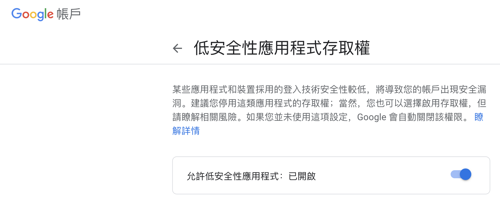

# SMTP、POP、IMAP

這三個都是郵件相關協定。

> * SMTP is the industry standard protocol for sending email. If you’re looking to send email, then you’ll use SMTP instead of IMAP. An [SMTP relay service](https://www.socketlabs.com/smtp-relay-service/) can help you send email without having to build your own SMTP server.
> * IMAP is one of the most common protocols for receiving email. IMAP syncs messages across all devices.
> * POP3 is another protocol for receiving email on a single device. Using POP3 means that your email will be accessible offline and deleted from the server.


## SMTP

Gmail為例:

```text
smtp.gmail.com
需要安全資料傳輸層 (SSL)：是
需要傳輸層安全性 (TLS)：是 (如果可用)
需要驗證：是
安全資料傳輸層 (SSL) 通訊埠：465
傳輸層安全性 (TLS)/STARTTLS 通訊埠：587
```

可以用Gmail 提供的服務然後搭配相關模組來傳送郵件。

```javascript
const nodemailer = require('nodemailer');

var transporter = nodemailer.createTransport({
  service: 'gmail',
  host: 'smtp.gmail.com',
  auth: {
    user: 'somerealemail@gmail.com',
    pass: 'realpasswordforaboveaccount'
  }
});

const mailOptions = {
  from: 'somerealemail@gmail.com',
  to: 'friendsgmailacc@gmail.com',
  subject: 'Sending Email using Node.js[nodemailer]',
  text: 'That was easy!'
};

transporter.sendMail(mailOptions, function(error, info){
  if (error) {
    console.log(error);
  } else {
    console.log('Email sent: ' + info.response);
  }
});  
```

如果用 Gmail 無法送信記得去設定以下

> 沒設定會說 credential 錯誤



## POP

Gmail 為例：

```text
pop.gmail.com
需要安全資料傳輸層 (SSL)：是
通訊埠：995
```

[https://support.google.com/mail/answer/7104828?hl=zh-Hant](https://support.google.com/mail/answer/7104828?hl=zh-Hant)

## IMAP

可以用來讀取郵件

Gmail 為例:

```text
imap.gmail.com
需要安全資料傳輸層 (SSL)：是
通訊埠：993
```

[https://support.google.com/mail/answer/7126229?hl=zh-Hant](https://support.google.com/mail/answer/7126229?hl=zh-Hant)



## DKIM



## 發送大量 Email



## Gmail 傳送 html 技巧

因為 gmail 現在 無法插入html，所以要用開啟網站後 ctrl + c 複製，之後直接貼在mail 內文。

如果改變貼上去的大小，可以先把網頁縮小成你要的樣子（例如手機的比例）然後再複製

