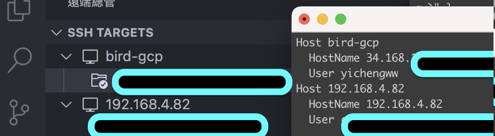

# VSCode 外掛 Plugin

#### 1.Preview on Web Server yuichinukiyama

方便在VSCode 上查看網頁。

&#x20;開啟 html 後點選 ctrl+shift+v

#### 2. GitLens

查看相關 GIt 記錄，並且會直接顯示在行旁邊。

#### 3. Hex Editor

方便查看 binary 的檔案

#### 4. Path Intellisense

輸入路徑時會自動建議

#### 5. Vscode Google Translate

選取後快速翻譯，點選 plugin setting 設定要翻譯哪個語言

選擇字後按 shift+option+t

#### 6. Remote ssh

編輯 .ssh/config 檔案後會自動出現在列表中

