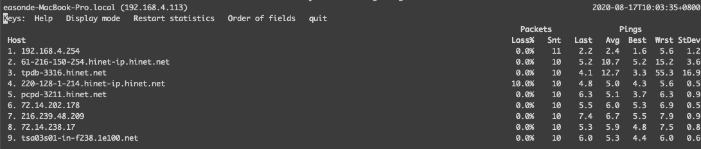

# 網路診斷工具

## MTR

結合了 ping 與 routetrace

> sudo mtr google.com



[http://www.bitwizard.nl/mtr/](http://www.bitwizard.nl/mtr/)



## TCPDUMP

監聽相關封包

#### TCP localhost 

```text
sudo tcpdump -i lo0
```

> 可先用 ifconfig 看有哪些網路介面

#### UDP

```text
tcpdump -n udp port 14550
```

[https://www.tcpdump.org/manpages/tcpdump.1.html](https://www.tcpdump.org/manpages/tcpdump.1.html)

[https://askubuntu.com/questions/913393/sniff-udp-packets-on-a-local-port](https://askubuntu.com/questions/913393/sniff-udp-packets-on-a-local-port)

