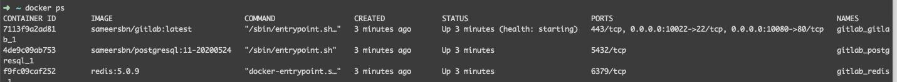
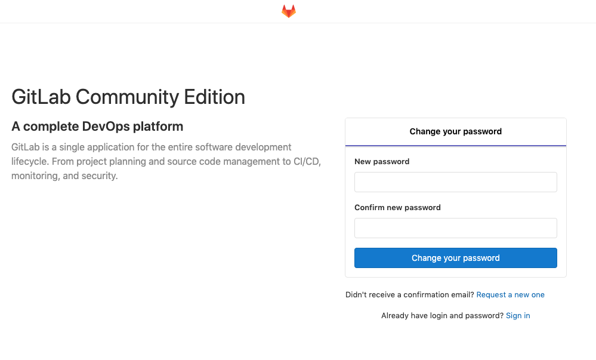
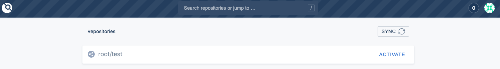

# 自動化部屬

安裝 GitLab

```text
mkdir GitLab && cd GitLab
curl https://raw.githubusercontent.com/sameersbn/docker-gitlab/master/docker-compose.yml -O
docker-compose up
```

> 如果出現 ERROR: manifest for sameersbn/gitlab:13.0.7 not found:
>
>  把 docker-compose.yml 的gitlab image 版本改為 
>
> > sameersbn/gitlab:latest

安裝好輸入 docker ps 確認



進入 `localhost:10080`



預設會先請你輸入密碼，使用者名稱為 root

> 之後也可輸入 email 創建 user，不過不會收到 email

如果想要忘記密碼等傳送email功能需要設定 SMTP server



## 安裝 Drone CI

> 這邊如果還沒綁定 domain，建議先把 localhost 的 GitLab 與等下會用的 drone 的 port 都用 ngrok 產生 domain ，這樣才能正常使用



1.先去新增 OAuth Application : [http://localhost:10080/profile/applications](http://localhost:10080/profile/applications)

> callback url 記得在最後面加上 /login

2.然後產生 share secret `openssl rand -hex 16`

3.新增 docker-compose.yml

> 這邊如果 GitLab 或 Drone 用 localhost ，之後再 gitLab 連結 drone 時會產生錯誤

```text
version: '2.3'

services:
  drone-server:
    image: drone/drone:1
    ports:
      - 10081:80
    volumes:
      - ./:/data
    restart: always
    environment:
      - DRONE_SERVER_HOST=66934108131d.ngrok.io
      - DRONE_SERVER_PROTO=https
      - DRONE_RPC_SECRET=131f7e1a919158e42dfdfc74d5552ec3
      - DRONE_AGENTS_ENABLED=true
      # Gitlab Config
      - DRONE_GITLAB_SERVER=http://1ee9b44b230d.ngrok.io
      - DRONE_GITLAB_CLIENT_ID=7f71d69fe5dab5d770a7cf1a56c876e3b6a366ba0b6036c4e320382714e5c84e
      - DRONE_GITLAB_CLIENT_SECRET=9b7e8f676137598590efbbf4081e0bedb949c6df6b2ca29be40b3bfb56bb419a
      - DRONE_LOGS_PRETTY=true
      - DRONE_LOGS_COLOR=true
```

之後連入 drone url 會自動導到 gitLab 連結 drone 畫面，點選 authorize 即會導入到 drone 頁面




